# MoEStream — Design Document

> **A low-memory SSD-streaming inference runtime, specifically for MoE models**
> Design Document v0.1 (Draft for RFC) — 2026-08
>
> *"specifically for MoE" is one of the decisions this document got wrong. Dense
> models are supported as of 2026-08-23 — see NG-4 below and
> [`findings/S27-dense-streaming-impl.md`](findings/S27-dense-streaming-impl.md).*

> ## ⚠ What this document is (as of 2026-08-06)
>
> **This was written before implementation and does not describe the current
> implementation.** After building and measuring it, **15 of the design
> decisions here have been overturned** — including the scope itself: NG-4 ruled
> dense models out on the grounds that streaming "cannot work in principle" for
> them, and dense FFN streaming now ships.
>
> | What you want | Where to look |
> |---|---|
> | **how the current implementation works** | [`HOW-IT-WORKS.md`](HOW-IT-WORKS.md) |
> | **measurements — what helped and what did not** | [`RESULTS.md`](RESULTS.md) |
> | **running and configuring it** | [`USAGE.md`](USAGE.md) |
> | primary sources per experiment | `findings/` |
> | **why the design was the way it was (the thinking at the time)** | this document |
>
> It is kept because **the overturned decisions and the reasons behind them are
> reusable information**. "Why io_uring seemed essential" and "why predictive
> prefetch seemed to be the key" have value to anyone tackling the same problem,
> so they do not have to walk the same road. Overturned items are struck through
> in the ADR index (appendix) with the evidence against them.

| Item | Value |
|---|---|
| Project | MoEStream |
| Status | **implemented (M1 / M1.5). This document is a record of the design phase** |
| Licence | **MIT** (Apache-2.0 was planned initially, then changed) |
| Primary target | 30B–70B class MoE (3B–12B active) |
| PoC target | Qwen3.6-35B-A3B (40L / 256E / top-8 + shared1 / hybrid GDN) |
| Primary OS | Linux (Ubuntu 24.04+), NVMe PCIe 4.0+ |
| Primary GPU backend | Vulkan (first class) → CUDA / ROCm / Metal |
| First design goal | **a deterministic ceiling on RAM (22 GB → 10 GB)** |
| Second design goal | **within 20% of full-RAM speed** |

---

## Contents

1. [Project overview](#1-project-overview)
2. [Background](#2-background)
3. [How this differs from Colibri](#3-how-this-differs-from-colibri)
4. [Requirements](#4-requirements)
5. [Non-requirements](#5-non-requirements)
6. [Design philosophy](#6-design-philosophy)
7. [System architecture](#7-system-architecture)
8. [Component design](#8-component-design)
9. [Model Adapter](#9-model-adapter)
10. [Runtime Core](#10-runtime-core)
11. [Expert Manager](#11-expert-manager)
12. [Cache Manager](#12-cache-manager)
13. [Storage Backend](#13-storage-backend)
14. [GPU Backend](#14-gpu-backend)
15. [Thread model](#15-thread-model)
16. [Scheduler](#16-scheduler)
17. [Memory layout](#17-memory-layout)
18. [SSD layout](#18-ssd-layout)
19. [Metadata](#19-metadata)
20. [Inference sequence](#20-inference-sequence)
21. [Cache strategy](#21-cache-strategy)
22. [Prefetch strategy](#22-prefetch-strategy)
23. [Asynchronous I/O](#23-asynchronous-io)
24. [GPU transfer](#24-gpu-transfer)
25. [API design](#25-api-design)
26. [Multi-agent support](#26-multi-agent-support)
27. [Error handling](#27-error-handling)
28. [Logging and metrics](#28-logging-and-metrics)
29. [Directory structure](#29-directory-structure)
30. [Class design](#30-class-design)
31. [Future extensions](#31-future-extensions)
32. [Technical risks](#32-technical-risks)
33. [Benchmark design](#33-benchmark-design)
34. [Development roadmap](#34-development-roadmap)
35. [Designing for open-source release](#35-designing-for-open-source-release)
- [Appendix A: symbols and the analytical model](#appendix-a-symbols-and-the-analytical-model)
- [Appendix B: Qwen3.6-35B-A3B measured figures](#appendix-b-measured-figures-for-qwen36-35b-a3b)
- [Appendix C: glossary](#appendix-c-glossary)
- [Appendix D: ADR index](#appendix-d-adr-index)
- [Appendix E: UMA / integrated GPU profile and specific design](#appendix-e-uma--integrated-gpu-profile-and-specific-design) ★measured
- [Appendix F: container / Docker requirements](#appendix-f-container--docker-requirements)

---

## 1. Project overview

### 1.1 In one sentence

**MoEStream is an MoE-specific runtime that keeps Mixture-of-Experts weights on
an NVMe SSD and hides the I/O entirely behind computation, holding RAM to a
declared ceiling while staying close to full-RAM inference speed.**

### 1.2 What it does

In a typical MoE model, over 90% of the parameters sit in the expert FFNs. For
Qwen3.6-35B-A3B, computed from the measured configuration:

| Class | Parameters | Q4_K_M size | Share |
|---|---:|---:|---:|
| routed experts (40 layers × 256) | 32.21 B | **19.45 GiB** | 90.5% |
| shared experts (40 layers × 1) | 0.126 B | 76 MiB | 0.3% |
| embedding (in) | 0.508 B | 546 MiB | 2.5% |
| LM head (out, untied) | 0.508 B | 636 MiB (Q6_K) | 2.9% |
| attention / GatedDeltaNet | ≈0.70 B | ≈470 MiB | 2.1% |
| router / norm (kept FP16) | 0.021 B | 42 MiB | 0.2% |
| **total** | **≈34.1 B** | **≈21.3 GiB** | 100% |

Meanwhile, generating one token needs only `40 layers × 8 = 320` routed experts
= **622 MiB**, or 3.1% of them.

MoEStream maps that MoE-specific property — **required residency ≠ total size** —
faithfully onto the storage hierarchy.

```
              conventional (llama.cpp, all resident)   MoEStream
        +----------------------------+      +----------------------------+
RAM     | 21.3 GiB weights + KV + rt |      | 1.05 GiB dense resident    |
        |                            |      | 7.65 GiB expert cache (var)|
        |        ~ 22 GB             |      | 1.30 GiB KV/state/scratch  |
        +----------------------------+      |        <= 10.0 GiB (declared)|
                                            +----------------------------+
SSD     | (mmapped source / page cache) |    | 21.3 GiB .msp container    |
                                            | 0.27 GiB/token read        |
```

### 1.3 Intended use cases

| # | Use case | Why MoEStream is needed |
|---|---|---|
| U1 | keeping a 35B MoE running on a 32 GB mini PC or laptop | 22 GB resident cannot coexist with a browser and an IDE. 10 GB can |
| U2 | several autonomous agents against the same model | 22 GB per process is impossible. One daemon plus a shared expert cache serves N agents |
| U3 | integrated GPUs (Radeon 780M / Arc / Apple) | on UMA, VRAM is RAM. Reducing resident weights directly increases the GPU budget |
| U4 | running as a service (systemd / container) | being able to **promise a ceiling** against the host's memory budget is an operational requirement |
| U5 | holding several MoE models on one machine | 2 × 10 GB is possible; 2 × 22 GB is not |

### 1.4 Stating the non-goal up front

MoEStream is **not a project for making the unrunnable run**. A 35B-class model
already runs in 22 GB. Its value is in **turning "runs, but takes the whole
machine" into "runs, and coexists"**. That difference in position is the root of
every design divergence from the Colibri family discussed below.

> **[Note added 2026-08-08]** Measurement changed this. Three of the four models
> tested (36.5 / 54.7 / 58.5 GiB) **do not start at all** on the verification
> machine, and MoEStream runs them. "Making the unrunnable run" turned out to
> matter at least as much as coexistence (`RESULTS.md` §12.5).

---

## 2. Background

### 2.1 The structural property of MoE

In a dense model, total parameters equal the bytes read per token. In MoE the
two diverge by one to two orders of magnitude. That is the only physical basis
on which streaming works.

| Model | Total params | Active params | Total expert bytes (Q4) | **active expert bytes / token** |
|---|---:|---:|---:|---:|
| Mixtral-8x7B | 46.7 B | 12.9 B | 22.5 GiB | 5.6 GiB (top-2 / 8) |
| Qwen3-30B-A3B | 30.5 B | 3.3 B | 17.0 GiB | 1.06 GiB (top-8 / 128) |
| **Qwen3.6-35B-A3B** | **35 B** | **3 B** | **19.45 GiB** | **0.61 GiB (top-8 / 256)** |
| GLM-4.5-Air-106B-A12B | 106 B | 12 B | ≈57 GiB | ≈2.6 GiB |
| DeepSeek-V3-671B-A37B | 671 B | 37 B | ≈370 GiB | ≈11 GiB |
| GLM-5.2-744B-A40B | 744 B | 40 B | ≈370 GiB | ≈11 GiB |

That last column — **active expert bytes per token, `B_act`** — is the single
governing variable in an SSD streaming design.

### 2.2 The governing equation — two regimes

Let `BW` be SSD bandwidth, `t_c` the per-token compute time with full RAM, and
`h` the expert cache hit rate. In an ideal system where I/O and compute overlap
completely, one token takes:

```
t_step = max( t_c ,  B_act · (1 − h) / BW )
```

Two fundamentally different regimes fall out of that.

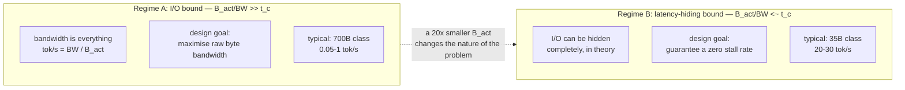
```mermaid
graph LR
    subgraph RegimeA["Regime A: I/O bound — B_act/BW >> t_c"]
        A1["bandwidth is everything<br/>tok/s = BW / B_act"]
        A2["design goal:<br/>maximise raw byte bandwidth"]
        A3["typical: 700B class<br/>0.05-1 tok/s"]
    end
    subgraph RegimeB["Regime B: latency-hiding bound — B_act/BW <~ t_c"]
        B1["I/O can be hidden<br/>completely, in theory"]
        B2["design goal:<br/>guarantee a zero stall rate"]
        B3["typical: 35B class<br/>20-30 tok/s"]
    end
    RegimeA -.->|"a 20x smaller B_act<br/>changes the nature of the problem"| RegimeB
```

**For Qwen3.6-35B-A3B on Gen4 NVMe (6 GB/s) with t_c = 40 ms:**

```
B_act / BW = 0.61 GiB / 6 GB/s = 109 ms      (h = 0, fully cold)
                                              -> regime A only while cold
B_act·(1−h)/BW <= t_c  <=>  h >= 1 − (6 GB/s × 40 ms)/0.652 GB
                       <=>  h >= 63.2%        -> regime B the moment it exceeds this
```

So **the 35B-A3B class undergoes a phase transition from I/O bound to compute
bound at a hit rate of 63%**. And under a 10 GiB budget that keeps 39% of the
experts resident, 63% is **comfortably reachable** (§21 gives the basis).

That is what makes this project viable, and equally why **the design goal is not
maximising bandwidth but controlling tail latency and stall rate.**

### 2.3 The hit rate required to hit the target (quantified)

Conditions satisfying `t_step ≤ 1.2 · t_c` (within a 20% slowdown):

| SSD bandwidth | Generation | Permitted I/O per token | Required hit rate `h` | Experts to keep resident (of 10,240) |
|---|---|---:|---:|---:|
| 2.0 GB/s | SATA SSD | 96 MB | **85.3%** | hard to reach (needs a Q2 tier) |
| 3.5 GB/s | PCIe 3.0 x4 | 168 MB | **74.3%** | ≈6,000 (11.4 GiB) |
| 6.0 GB/s | **PCIe 4.0 x4** | 288 MB | **55.9%** | ≈4,000 (7.6 GiB) ✅ |
| 12.0 GB/s | PCIe 5.0 x4 | 576 MB | **11.7%** | ≈1,000 (1.9 GiB) |
| 14.0 GB/s | PCIe 5.0 (high end) | 672 MB | **0%** (met even cold) | — |

> **The important design consequence**: PCIe 4.0 NVMe plus a 7.6 GiB expert
> cache is the sweet spot for the "10 GB budget / 20% slowdown" target. On PCIe
> 5.0 the cache becomes nearly unnecessary and **the RAM budget could instead go
> down to about 4 GB** (§31.6's ultra-low-RAM mode).

### 2.4 Does batching amortise the I/O?

For `B` concurrent sequences, the number of **distinct** experts needed in one
layer is `d(B) = E·(1 − (1 − k/E)^B)` under uniform routing. With E=256, k=8:

| B (concurrent tokens) | d(B) | I/O per layer | **I/O per token** | vs B=1 |
|---:|---:|---:|---:|---:|
| 1 | 8.0 | 15.6 MiB | 15.6 MiB | 1.00 |
| 2 | 15.8 | 30.7 MiB | 15.4 MiB | 0.98 |
| 4 | 30.5 | 59.3 MiB | 14.8 MiB | 0.95 |
| 8 | 58.0 | 112.8 MiB | 14.1 MiB | 0.90 |
| 16 | 105.0 | 204.3 MiB | 12.8 MiB | 0.82 |
| 32 | 176.2 | 342.8 MiB | 10.7 MiB | 0.69 |
| 64 | 231.4 | 450.2 MiB | 7.0 MiB | 0.45 |

**An important finding**: for **fine-grained MoE** like 256 experts at top-8,
**batching buys almost nothing at small batch sizes** (10% at B=8). Contrast
Mixtral (E=8, k=2), which saves 60% at B=8.

> **Consequence 1**: the intuition that batching dilutes I/O does not apply to
> fine-grained MoE. **Caching and prediction are therefore the only weapons.**
> **Consequence 2**: conversely, fine expert granularity (1.94 MiB) is
> **extremely favourable** for cache efficiency and scheduling freedom (§2.5).
> **Consequence 3**: speculative decoding (§31.1) verifies several tokens from
> the same residual, raising B without raising `d(B)` — the only effective way to
> amortise I/O in fine-grained MoE.

> **[Note added 2026-08-06]** Consequence 3 was measured and is wrong. Acceptance
> is 34.6%, so I/O per token roughly quadruples and decode is 35–79% worse
> (finding S13). Speculation assumes compute is in surplus; here it is not.

### 2.5 The discontinuities that make the 35B class optimal

| Property | 35B-A3B (E=256, 1.94 MiB/expert) | 700B class (E=160, 30–60 MiB/expert) | Design consequence |
|---|---|---|---|
| number of expert objects | 10,240 | ≈8,000, but each is huge | **10,240 × 64 B = 640 KiB holds complete statistics** → no approximate sketches (CM-Sketch); exact LFU is possible |
| expert size | 1.94 MiB | 30–60 MiB | above NVMe's efficient read unit (≥128 KiB) while still **fine as a cache granularity** — the ideal band |
| co-activation matrix | 256² × 40 × u16 = 5.1 MiB | holdable, but of little use | **a per-layer co-activation graph can be held permanently**, enabling group prefetch |
| whole model on SSD | 21 GiB (unremarkable) | 370 GiB (pressures SSD capacity) | **holding and hot-swapping several models is realistic** |
| `B_act/BW` | 0.10 s | 1.8 s | regime B is reachable ⇒ **the goal becomes jitter control, not speed** |
| KV cache | hybrid, only 10 layers = 10 KiB/token | all layers = hundreds of KiB/token | **almost the entire RAM budget can go to the expert cache** |

Every row here becomes the basis for a design decision in §11–§22.

---

## 3. How this differs from Colibri

> **A note on sources**: the Colibri figures in this chapter come from public
> information as of July–August 2026 (the project page and third-party benchmark
> articles). Internal implementation details involve inference, so the comparison
> is confined to **design goals and observed behaviour**, avoiding assertions
> about internals. Update this chapter if the implementation changes (tracked in
> `docs/adr/0003-positioning.md`).

> **[Note added 2026-08-08]** The published README no longer compares against
> Colibri. Without having measured it ourselves, a comparison would not be
> honest. This chapter is kept as a record of the design-phase positioning.

### 3.1 Where Colibri sits (summarising public information)

| Item | Value |
|---|---|
| implementation | pure C, ~2,400 lines, no dependencies |
| licence | ~~Apache-2.0~~ → **MIT** (changed 2026-08-06) |
| target | GLM-5.2 744B-A40B and other frontier MoE |
| RAM resident | ≈9.9 GB (dense int4) |
| SSD checkpoint | ≈370 GB |
| observed speed | 0.05–0.1 tok/s (external / cold) to 0.8 tok/s (internal NVMe) |
| read per token | ≈11 GB |

Colibri realises **making the otherwise unrunnable run** to a very high standard.
A 2,400-line implementation shows that its minimalism is a deliberate design
philosophy.

### 3.2 These are not the same problem at different scales

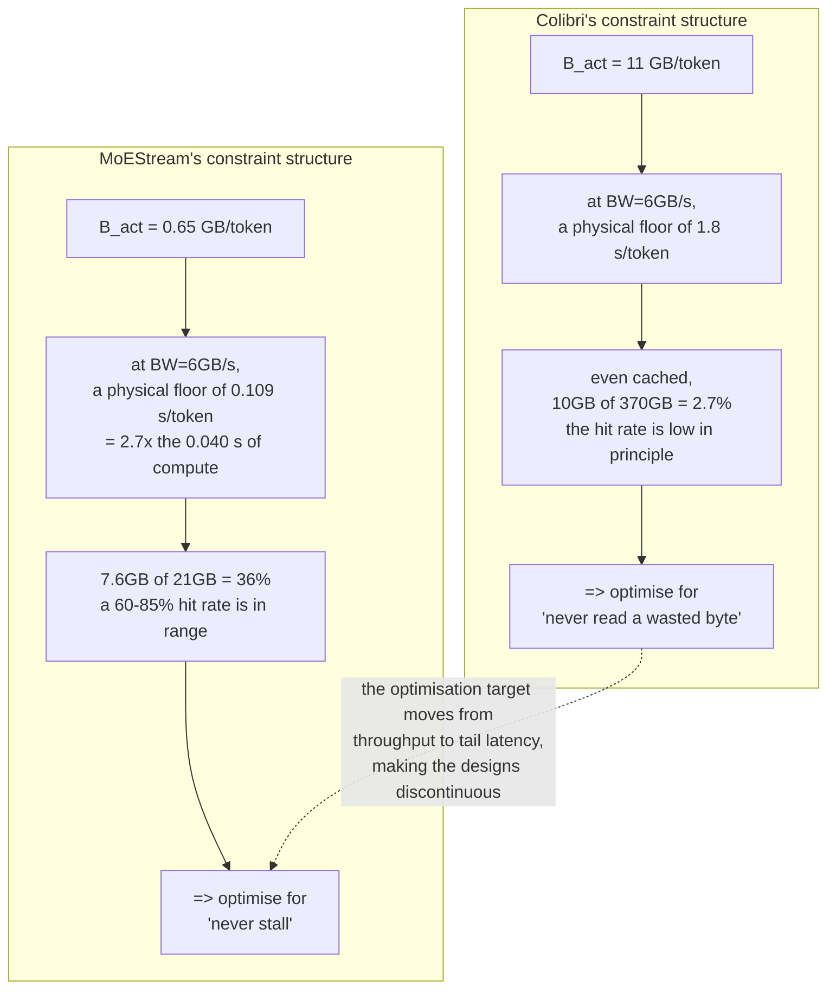
```mermaid
graph TB
    subgraph C["Colibri's constraint structure"]
        C1["B_act = 11 GB/token"] --> C2["at BW=6GB/s,<br/>a physical floor of 1.8 s/token"]
        C2 --> C3["even cached,<br/>10GB of 370GB = 2.7%<br/>the hit rate is low in principle"]
        C3 --> C4["=> optimise for<br/>'never read a wasted byte'"]
    end
    subgraph M["MoEStream's constraint structure"]
        M1["B_act = 0.65 GB/token"] --> M2["at BW=6GB/s,<br/>a physical floor of 0.109 s/token<br/>= 2.7x the 0.040 s of compute"]
        M2 --> M3["7.6GB of 21GB = 36%<br/>a 60-85% hit rate is in range"]
        M3 --> M4["=> optimise for<br/>'never stall'"]
    end
    C4 -.->|"the optimisation target moves from<br/>throughput to tail latency,<br/>making the designs discontinuous"| M4
```

**Conclusion: tuning Colibri for 35B does not produce MoEStream.** The target
moves from average bandwidth to p99 stalls, so the components required
(predictors, arrival-order execution, a deadline scheduler, a shared daemon) do
not exist in Colibri's problem statement at all.

### 3.3 Comparing design decisions

| Axis | Colibri family (very large models) | **MoEStream** | Reason |
|---|---|---|---|
| first goal | **feasibility** (that it runs) | **a deterministic RAM ceiling** | 35B already runs; coexistence is the value |
| second goal | average throughput | **p99 inter-token latency** | for agents, the latency distribution is the UX |
| memory control | largely left to the OS, plus its own dense residency | **every allocation under budget management** | a contract to honour `--mem-budget` |
| I/O | efficient sequential reads | **io_uring + O_DIRECT + predictive prefetch** | avoiding stalls is the point |
| execution order | by layer, by expert | **by expert arrival (out-of-order accumulate)** | exploits commutativity of the sum to remove head-of-line blocking |
| process model | single-process CLI | **a resident daemon with multiple sessions** | N agents share one cache |
| model support | per-model handling for major models | **declarative model specs plus adapters** | DeepSeek/GLM/Mixtral/hybrid absorbed as data |
| compute kernels | own implementation (pure C) | **reuse GGML unmodified** | the differentiation is the memory/IO layer; no kernel race |
| expected code size | ≈2.4 kLoC | ≈25–35 kLoC | different goals; minimalism is a non-goal |
| expected tok/s | 0.05–0.8 | **20–30** | a different regime |

### 3.4 Stating the complementarity explicitly (politically important for OSS)

MoEStream is not a competitor to Colibri but **a sibling project covering a
different range**. The README, papers and talks should always say:

> - want to run 700B class in 32 GB → **use Colibri**
> - want 30–70B class in 10 GB **at a usable speed** → **MoEStream**
> - have enough RAM → **just use llama.cpp / vLLM**

Put those three branches at the top of the README and make **actively sending
users to other projects** a project norm (§35.6).

### 3.5 Position relative to other systems

| System | Relationship | How MoEStream differs |
|---|---|---|
| **llama.cpp** (`--n-cpu-moe`, `--override-tensor`) | depended on as the compute backend | llama.cpp does a static split of which tensors go to CPU/GPU. MoEStream is **dynamic, prediction-driven, with a guaranteed ceiling** |
| **llama.cpp mmap + page cache** | the closest existing alternative | page cache cannot guarantee a RAM ceiling and thrashes unpredictably under pressure. MoEStream avoids page cache with O_DIRECT and **enforces its own ceiling** |
| **KTransformers** | philosophically close (CPU/GPU hybrid MoE) | KTransformers assumes DRAM residency; MoEStream's ground is the SSD tier |
| **Mixtral-offloading** (Eliseev & Mazur) | prior work on LRU plus speculative expert loading | one predictor, one session. MoEStream adds **multi-predictor fusion, multi-session and deadline control** |
| **MoE-Infinity** | prior work on per-sequence expert activation matrices | the EAM idea is taken in as predictor P4 (§22.5), plus arrival-order execution and a strict memory budget |
| **ProMoE / Klotski / LayerScope / FineMoE** | prior work on predictive prefetch and pipeline optimization | a meta-design where each method **coexists as a predictor plugin whose weight is learned from measurement** (§22.6) |
| **vLLM / SGLang** | continuous batching and PagedAttention designs are adopted | datacentre oriented. MoEStream specialises in single node, low RAM, SSD tier |
| **DeepSpeed ZeRO-Inference** | prior work on parameter offload | dense oriented, training leaning. Does not exploit MoE routing sparsity |

---

## 4. Requirements

Requirements are written only with **measurable acceptance criteria**. A
requirement whose criterion cannot be written is not adopted (the norm in
§35.3).

### 4.1 Functional requirements (FR)

| ID | Requirement | Acceptance |
|---|---|---|
| FR-1 | inference on Qwen3.6-35B-A3B (GGUF Q4_K_M) | `moestream run` completes a generation |
| FR-2 | OpenAI-compatible HTTP API | `/v1/chat/completions`, `/v1/completions`, `/v1/models`, `/v1/embeddings` usable from the OpenAI SDK, with SSE streaming |
| FR-3 | concurrent multi-session | 4 concurrent sessions sharing one expert cache, with KV/state fully separated |
| FR-4 | declarative memory budget | with `--mem-budget 10GiB`, process RSS never exceeds 10 GiB during any run |
| FR-5 | read GGUF directly | GGUF readable without conversion (performance may suffer) |
| FR-6 | `.msp` pack format | `moestream pack model.gguf` produces an optimized container |
| FR-7 | support for new MoE architectures | any model expressible with existing primitives needs **only a new model spec (TOML)**, no core change |
| FR-8 | swappable storage/GPU backends | backend chosen by run-time flag, no core rebuild |
| FR-9 | observability | Prometheus `/metrics`, and a dump of per-expert heat statistics |
| FR-10 | graceful quality modes | a `strict` / `soft` / `turbo` quality-latency contract selectable through the API |

### 4.2 Performance requirements (PR) — on the PoC reference machine

> Reference: Ryzen 8845HS (Radeon 780M, integrated) / DDR5-5600 32 GB /
> Samsung 990 PRO 2 TB (PCIe 4.0)
> Compared against: llama.cpp fully resident, same machine, same GGUF, same GGML
> Vulkan backend

| ID | Metric | Target | Must not miss |
|---|---|---|---|
| PR-1 | peak RSS (bs=1, ctx 8K) | **≤ 10.0 GiB** | ≤ 10.0 GiB (a hard constraint) |
| PR-2 | decode tok/s (bs=1, ctx 4K, warm) | ≥ **80%** of baseline | ≥ 70% |
| PR-3 | TTFT (2K prompt, cold) | ≤ `model size / measured sequential bandwidth × 1.3` | ≤ 8 s |
| PR-4 | TTFT (2K prompt, warm) | ≤ baseline × 1.5 | ≤ baseline × 2.0 |
| PR-5 | p99 / median inter-token latency | ≤ **2.0** | ≤ 3.0 |
| PR-6 | total tok/s across 4 sessions | ≥ single session × 2.5 | ≥ × 2.0 |
| PR-7 | expert cache hit rate (warm, bs=1) | ≥ **70%** | ≥ 60% |
| PR-8 | stall rate (time compute waited on I/O / total) | ≤ **5%** | ≤ 15% |
| PR-9 | operating under a 16 GiB budget | RSS ≤ 6 GiB, tok/s ≥ baseline × 0.5 | that it runs |

### 4.3 Correctness requirements (QR)

| ID | Requirement | Acceptance |
|---|---|---|
| QR-1 | numerical identity in `strict` mode | with **the same backend**, quantization and seed, logits from full-residency and from MoEStream's streaming execution are **bit-exact**. Verified over 256 tokens in CI |
| QR-2 | quality ceiling for `soft` mode | WikiText-2 perplexity degradation ≤ **1.0%**, MMLU degradation ≤ **0.5 pt** |
| QR-3 | quality ceiling for `turbo` mode | perplexity degradation ≤ 3.0%, and the degradation must always be logged |
| QR-4 | corruption detection | per-expert checksum verification of `.msp` available via `--verify` |

> **A note on QR-1 (finding S0b)**: across different backends, bit-exactness is
> unachievable in principle because of fp16 accumulation and reduction order
> (Vulkan vs CPU measured a relative RMS of 0.0038 on Q4_K). What QR-1
> guarantees is **that MoEStream introduces zero non-determinism**, already
> demonstrated by S0/S0b's permutation invariance tests and S1's real-model MoE
> FFN match.

> **QR-1 is this project's single biggest differentiator.** Refusing to let
> "saving memory changed the answer" happen is the foundation of trust for agent
> use. `soft`/`turbo` are enabled only by explicit opt-in.

### 4.4 Portability and operational requirements (OR)

| ID | Requirement |
|---|---|
| OR-1 | Linux x86-64 / aarch64 as first class. glibc 2.35+ / kernel 5.15+ (io_uring); kernel 6.1+ recommended |
| OR-2 | automatic fallback to a `pread + threadpool` backend where io_uring is unavailable |
| OR-3 | distributed as a single static binary (including a musl build). The only run-time dependency is the Vulkan loader |
| OR-4 | no root required. HugePages used if available, falling back to THP |
| OR-5 | runs in containers (reconciling cgroup v2 memory limits with `--mem-budget`) |
| OR-6 | configuration via CLI flags / environment / TOML, in that order of precedence |

---

## 5. Non-requirements

What is explicitly frozen as out of scope. Changing any of these later requires
an ADR.

### 5.1 Out of scope (for v1.0)

| ID | Non-goal | Reason |
|---|---|---|
| NG-1 | **training and fine-tuning** | stay strictly an inference runtime. Being read-only simplifies the I/O design |
| NG-2 | **multi-node distribution** | the goal is reducing RAM on one node. Distribution does not solve it and only adds complexity |
| NG-3 | **optimizing models above 100B** | they run, but land in regime A where this design's premise breaks. Send users to Colibri |
| NG-4 | ~~**optimizing dense models**~~ → **overturned 2026-08-23** | The reason given — `B_act = total size` — is true per *pass*, not per *token*, and a prefill pass carries a thousand tokens. Dense FFN streaming is implemented and measured at **−56% memory with byte-identical output and free prompt processing** (findings S18/S21/S27/S29/S30). What does hold is that single-token generation costs 3.2x |
| NG-5 | **writing our own GEMM kernels** | we would lose to GGML/BLAS. Not a differentiator |
| NG-6 | **inventing a quantization format** | use GGUF's Q4_K/Q6_K/IQ families as they are. No requantization |
| NG-7 | **PyTorch → GGUF conversion** | use llama.cpp's `convert_hf_to_gguf.py` |
| NG-8 | **first-class native Windows** | v1 goes through WSL2. Native is v2 (§31.8) |
| NG-9 | **competing on datacentre-scale throughput** | that is vLLM/SGLang's ground. Assume concurrency ≤ 16 |
| NG-10 | **a dynamically loadable binary plugin ABI** | v1 has a static registry only. Reasons in §9.6 |
| NG-11 | **multimodal (image/audio)** | v2 and later. The adapter design does not preclude non-text input |
| NG-12 | **GPUDirect Storage in v1** | meaningless in principle on integrated GPUs / UMA, and P2P DMA availability is poor on consumer hardware (§13.7) |

### 5.2 Designs deliberately not adopted

| Not adopted | Reason |
|---|---|
| **mmap + OS page cache as the primary mechanism** | cannot guarantee a RAM ceiling. The kernel can evict our hot experts at any time. Incompatible with FR-4 (detailed analysis in §13.2) |
| **plain LRU** | expert access has a strongly skewed reuse distribution and LRU has no scan resistance. W-TinyLFU / S3-FIFO families are clearly better |
| **caching at layer granularity** | one layer = 486 MiB. Far too coarse; it would read 256 experts to get the 8 needed |
| **caching at tensor granularity (gate/up/down separately)** | the three are always needed together. No point paying 3x the metadata and 3x the I/O issue cost. **The expert is the only correct granularity** |
| **skipping experts by default (compromising quality)** | breaks QR-1. Explicit opt-in only |
| **including a prompt (inference result) cache in v1** | an orthogonal feature. KV reuse is handled in v1.1 |

---

## 6. Design philosophy

The ten principles below are the highest-level norms for every implementation
decision. They are written at a granularity where a PR review can ask "which
principle is this based on".

### P1. Memory is a budget, not an outcome

> RAM usage is not something to be measured and reported. It is **given as
> input, and honoured.**

Every allocation goes through the `MemoryGovernor`. No `malloc` outside the
budget happens inside the core. The expert cache does not "use what is left
over"; it uses exactly what it was given. This principle is the direct reason
page cache dependence is excluded.

### P2. `bytes/token` is the one master metric

tok/s depends on the environment, but **effective SSD bytes read per generated
token** directly expresses algorithmic quality. Every optimization must be
explicable as a reduction in that number. It goes at the top of the dashboard
(§28.3).

### P3. I/O must never block computation

Both a synchronous page fault and a wait caused by ordering constraints are
treated as design defects. The only permitted wait is a demand fetch when a
prediction misses, and its frequency (the stall rate) is managed as PR-8.

### P4. Order independence is a resource

An MoE FFN's output is `Σ_i w_i · E_i(x)`, which **does not depend on the order
of the sum**. That means experts may be **processed in I/O completion order**.
This single mathematical fact makes it possible to eliminate head-of-line
blocking entirely (§11.5). It is the most valuable single insight in this
design.

### P5. Prediction beats reaction

By the time a demand fetch happens, we have already lost. Fetch ahead
probabilistically from several independent predictors before the router's output
is known (§22). Predictors are **pluggable** and weighted dynamically by their
measured contribution to hits.

> **[Note added 2026-08-04]** Measurement rejected this. All three predictors are
> net-negative; even P2 at 81.4% accuracy is slower (finding N2). The principle
> is not wrong in general, but it does not hold in this regime.

### P6. Borrow the computation, own the memory

GEMM, quantization kernels and attention are borrowed from GGML **unmodified**.
The differentiation is in cache, I/O and scheduling, and all the effort goes
there. The **Slot Table + ID Remap** (§11.4) that lets GGML's `mul_mat_id` be
used unmodified is this principle made concrete.

### P7. Model knowledge belongs in data, not code

Facts like "Qwen3.6 is a 3:1 hybrid" or "DeepSeek uses group-limited routing"
all go into declarative model specs. Not one line of `if (model == qwen)` in the
core. This is checked mechanically in CI (§9.7).

### P8. Observability is a feature

For every expert it must be possible to trace when it was referenced, how often,
when it was loaded and when it was dropped. Trace output for cache research is
provided as a **first-class deliverable**. That is a contribution to the MoE
research community and part of the project's gravity as OSS.

### P9. Deterministic by default, approximate explicitly

By default, results are bit-exact against the baseline. Approximations (expert
skipping, low-precision tiers) are always opt-in and **report their estimated
quality impact in a response header**.

### P10. One process, many agents

Make "several processes each holding a model" impossible from the start. The
daemon is canonical, and library use is treated as multi-session within one
process. Sharing is one of MoEStream's main value propositions (§26).

### 6.1 Resolving conflicts between principles

Priority when they collide:

```
P1 (memory budget)  >  P9 (determinism)  >  P3 (non-blocking)  >  P2 (bytes/token)  >  the rest
```

Example: shrinking the cache to honour the budget increases stalls (P1 vs P3) →
**P1 wins**.
Example: not skipping experts to preserve quality causes a stall (P9 vs P3) →
**P9 wins**.

---

## 7. System architecture

### 7.1 Layers

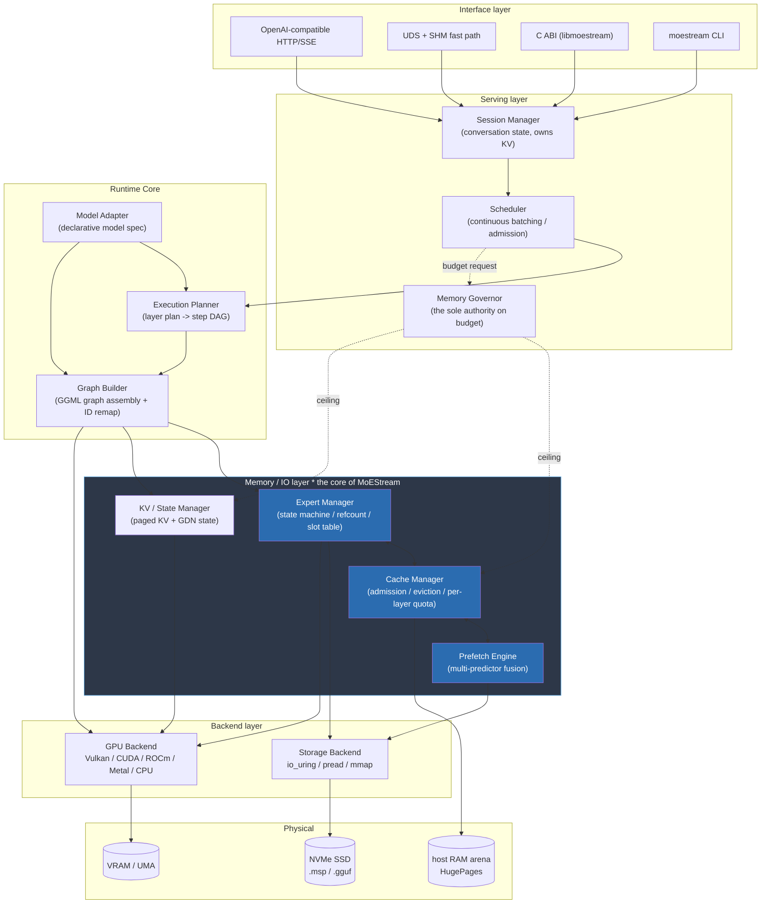
```mermaid
graph TB
    subgraph L5["Interface layer"]
        HTTP["OpenAI-compatible HTTP/SSE"]
        IPC["UDS + SHM fast path"]
        CAPI["C ABI (libmoestream)"]
        CLI["moestream CLI"]
    end
    subgraph L4["Serving layer"]
        SESS["Session Manager<br/>(conversation state, owns KV)"]
        SCHED["Scheduler<br/>(continuous batching / admission)"]
        GOV["Memory Governor<br/>(the sole authority on budget)"]
    end
    subgraph L3["Runtime Core"]
        PLAN["Execution Planner<br/>(layer plan -> step DAG)"]
        GRAPH["Graph Builder<br/>(GGML graph assembly + ID remap)"]
        ADPT["Model Adapter<br/>(declarative model spec)"]
    end
    subgraph L2["Memory / IO layer  * the core of MoEStream"]
        EM["Expert Manager<br/>(state machine / refcount / slot table)"]
        CM["Cache Manager<br/>(admission / eviction / per-layer quota)"]
        PF["Prefetch Engine<br/>(multi-predictor fusion)"]
        KVM["KV / State Manager<br/>(paged KV + GDN state)"]
    end
    subgraph L1["Backend layer"]
        SB["Storage Backend<br/>io_uring / pread / mmap"]
        GB["GPU Backend<br/>Vulkan / CUDA / ROCm / Metal / CPU"]
    end
    subgraph L0["Physical"]
        NVME[("NVMe SSD<br/>.msp / .gguf")]
        RAM[("host RAM arena<br/>HugePages")]
        VRAM[("VRAM / UMA")]
    end

    HTTP --> SESS
    IPC --> SESS
    CAPI --> SESS
    CLI --> SESS
    SESS --> SCHED
    SCHED --> PLAN
    SCHED -.budget request.-> GOV
    GOV -.ceiling.-> CM
    GOV -.ceiling.-> KVM
    PLAN --> GRAPH
    ADPT --> PLAN
    ADPT --> GRAPH
    GRAPH --> EM
    GRAPH --> KVM
    EM <--> CM
    CM <--> PF
    PF --> SB
    EM --> SB
    EM --> GB
    GRAPH --> GB
    KVM --> GB
    SB --> NVME
    CM --> RAM
    GB --> VRAM

    style L2 fill:#2d3748,stroke:#63b3ed,color:#fff
    style EM fill:#2b6cb0,color:#fff
    style CM fill:#2b6cb0,color:#fff
    style PF fill:#2b6cb0,color:#fff
```

### 7.2 The hot data path

```
                     +--------------- prediction (ahead, several layers) ----+
                     v                                                       |
 router output --> Prefetch Engine --> Cache Manager --> Storage Backend     |
   (layer L)         (assign priority)   (admission)      (io_uring SQE)     |
                                            |                 |             |
                                            |                 v             |
                                            |        readv -> 3 slabs       |
                                            |        (gate/up/down)         |
                                            v                 |             |
 execute (layer L) <-- Expert Manager <-- slot table <---- CQE completion ---+
   accumulate in                        (expert_id -> slot_id)
   arrival order                              |
                                              v
                                       GGML mul_mat_id
                                       (ids substituted, kernel unmodified)
```

### 7.3 Process model

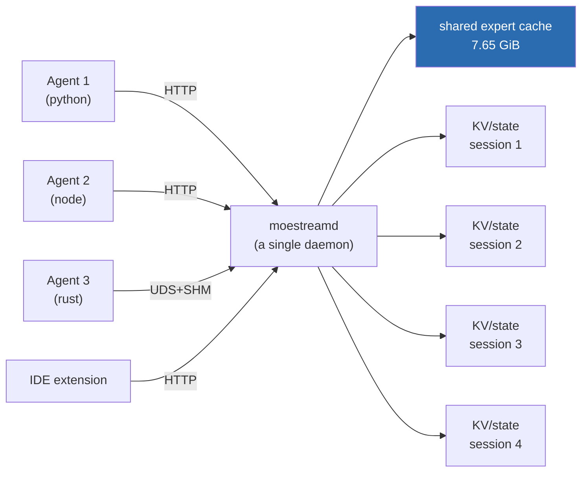
```mermaid
graph LR
    A1["Agent 1<br/>(python)"] -->|HTTP| D
    A2["Agent 2<br/>(node)"] -->|HTTP| D
    A3["Agent 3<br/>(rust)"] -->|UDS+SHM| D
    A4["IDE extension"] -->|HTTP| D
    D["moestreamd<br/>(a single daemon)"]
    D --> EC["shared expert cache<br/>7.65 GiB"]
    D --> K1["KV/state<br/>session 1"]
    D --> K2["KV/state<br/>session 2"]
    D --> K3["KV/state<br/>session 3"]
    D --> K4["KV/state<br/>session 4"]
    style EC fill:#2b6cb0,color:#fff
```

**Design decision**: the library (`libmoestream`) is always implemented as "the
daemon, embedded". That is, **the same code that supports multiple sessions in
one process** is what the daemon uses. Even the CLI is internally a daemon with
one session. Keeping to a single path prevents the multi-session path from
rotting untested.

---

## 8. Component design

### 8.1 The components

| # | Component | Responsibility | Depends on | Stateful | Thread safety |
|---|---|---|---|---|---|
| C1 | **Session Manager** | conversation state, token sequences, sampling settings, owning KV handles | KV Manager | yes | per-session lock |
| C2 | **Scheduler** | choosing runnable sessions, batch composition, admission control, deadlines | Session Mgr, Memory Governor | yes | single thread (event loop) |
| C3 | **Memory Governor** | the sole authority allocating the memory budget; dynamically adjusts the boundaries between expert cache / KV / scratch | — | yes | atomics plus rare locks |
| C4 | **Execution Planner** | generates a step execution plan (layer DAG) from the model spec; sets the prefetch horizon | Model Adapter | no (pure) | immutable data |
| C5 | **Graph Builder** | builds the GGML compute graph, inserting the ID remap to slot ids | Model Adapter, Expert Mgr, GPU Backend | transient | owned by the executing thread |
| C6 | **Model Adapter** | interprets the declarative model spec, resolves tensor names, describes layout | — | immutable | read only |
| C7 | **Expert Manager** | the expert state machine, refcounts, slot table, arrival-order dispatch | Cache Mgr, Storage, GPU | yes | lock-free (atomic state) |
| C8 | **Cache Manager** | admission/eviction policy, per-layer quotas, statistics, ghost lists | Memory Governor | yes | sharded locks |
| C9 | **Prefetch Engine** | predictor fusion, priority queue, bandwidth budgeting | Expert Mgr, Cache Mgr | yes | single planner thread |
| C10 | **KV/State Manager** | paged KV block allocation, GDN recurrent state, SSD swap | Memory Governor, Storage | yes | per session |
| C11 | **Storage Backend** | the asynchronous read abstraction; io_uring/pread/mmap implementations | — | yes | completion thread |
| C12 | **GPU Backend** | device management, buffer allocation, transfer queues, wrapping the GGML backend | — | yes | submitting thread |
| C13 | **Telemetry** | metrics, traces, expert heatmap output | everything (observation only) | yes | lock-free ring |
| C14 | **API Server** | HTTP/SSE, UDS, admin | Session Mgr | yes | async runtime |

### 8.2 Dependency discipline

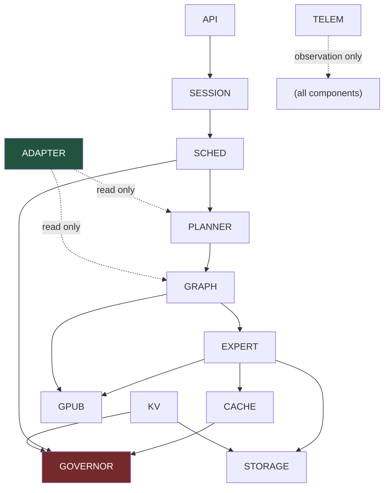
```mermaid
graph TD
    API --> SESSION --> SCHED --> PLANNER --> GRAPH
    GRAPH --> EXPERT --> CACHE --> GOVERNOR
    EXPERT --> STORAGE
    EXPERT --> GPUB
    GRAPH --> GPUB
    SCHED --> GOVERNOR
    KV --> GOVERNOR
    KV --> STORAGE
    ADAPTER -.read only.-> PLANNER
    ADAPTER -.read only.-> GRAPH
    TELEM -.observation only.-> ALL[" (all components) "]

    style GOVERNOR fill:#742a2a,color:#fff
    style ADAPTER fill:#22543d,color:#fff
```

**Invariants (checked in CI):**
- dependencies always go downward. A cycle is a build error (`cargo-deny` plus
  module boundary tests).
- the `Model Adapter` depends on nobody. Pure data plus referentially transparent
  queries.
- the `Memory Governor` is a leaf. It calls nobody; everybody calls it.
- `Telemetry` never changes another component's behaviour (if observation
  changes behaviour, that is a bug).

### 8.3 Principles for component boundaries

| Principle | Concretely |
|---|---|
| **no virtual calls on the hot path** | storage and GPU backends are monomorphised at startup (Rust: enum dispatch / static dispatch). Do not pay abstraction cost per token |
| **make ownership explicit** | only the Cache Manager owns an expert's bytes. Everyone else holds a `SlotRef` (a refcounted borrow) |
| **errors change type at boundaries** | storage produces `IoError`, cache `AdmissionRejected`, core `StepError`. Only the top maps them to HTTP errors |
| **configuration freezes at startup** | never read configuration on the hot path. Changes are an atomic swap of a new immutable configuration object |

---

## 9. Model Adapter

### 9.1 The problem

Enumerating what varies between MoE models:

| Axis | Qwen3.6-35B-A3B | DeepSeek-V3 | Mixtral-8x22B | GLM-4.5-Air |
|---|---|---|---|---|
| layers | 40 | 61 | 56 | 46 |
| experts per layer | 256 | 256 | 8 | 128 |
| top-k | 8 | 8 | 2 | 8 |
| shared expert | 1 | 1 | none | 1 |
| leading dense layers | 0 | 3 | 0 | 1 |
| router activation | sigmoid | sigmoid + bias | softmax | sigmoid |
| top-k normalisation | yes | yes (within group) | yes | yes |
| group-limited routing | no | yes (node-limited) | no | no |
| attention | GQA (16/2, hd=256) | **MLA** | GQA | GQA + partial RoPE |
| mixed layer types | **GDN×3 : Attn×1** | uniform | uniform | uniform |
| MTP head | no | yes | no | yes |

**Handling every cell of that table with code branches would be unmaintainable.**
So the adapter is designed not as a collection of code but as **a declarative
description plus a finite set of primitives**.

### 9.2 The model spec (declarative)

```toml
# specs/qwen3_6_moe.toml   - describes an architecture family, not one model
[spec]
family        = "qwen3.6-moe"
spec_version  = 1
gguf_arch     = "qwen3next"          # maps to GGUF general.architecture
min_runtime   = "0.1.0"

# -- rules for generating the layer plan ---------------------------------
# The concrete layer and expert counts are read from GGUF/HF config.
# Only the *rules* live here.
[layer_plan]
kind    = "cyclic"                    # cyclic | uniform | prefix_dense | explicit
cycle   = ["linear_attn", "linear_attn", "linear_attn", "full_attn"]
# every layer is MoE (dense_prefix = 0)
moe_layers = "all"

[mixer.full_attn]
primitive     = "gqa"
rope          = "yarn"
qk_norm       = "rms"
kv_layout     = "paged_gqa"

[mixer.linear_attn]
primitive     = "gated_delta_net"
state_layout  = "recurrent_matrix"    # fixed-size state [n_v_head, k_dim, v_dim]
conv          = { kernel = 4 }
# has no KV cache -> a hint to the KV Manager
kv_layout     = "none"

# -- describing the MoE --------------------------------------------------
[moe]
router_activation = "sigmoid"
router_bias       = false             # true for DeepSeek-V3's aux-loss-free bias
norm_topk_prob    = true
grouping          = "none"            # deepseek: { kind="group_limited", n_group=8, topk_group=4 }
shared_experts    = 1
expert_ffn        = "swiglu"          # gate/up/down
combine           = "weighted_sum"    # declares order independence (the premise of §11.5)

# -- tensor classification for streaming ---------------------------------
# The most important section, and the one specific to MoEStream.
[residency]
resident   = ["attn.*", "linear_attn.*", "*_norm", "router.*", "shared_expert.*", "output.weight"]
streamed   = ["ffn_gate_exps.weight", "ffn_up_exps.weight", "ffn_down_exps.weight"]
row_lookup = ["token_embd.weight"]    # random access by row (not resident) - §17.4

[expert_object]
# what one "expert" groups together
members = ["ffn_gate_exps", "ffn_up_exps", "ffn_down_exps"]
# the expert axis of the 3D GGUF tensor [n_embd, n_ff_exp, n_expert]
expert_axis = 2
```

**Facts about an individual model** (40 layers, 256 experts, hidden 2048 and so
on) are read from GGUF metadata; the spec holds only rules. That lets
Qwen3.6-35B and a future Qwen3.6-70B share one spec.

### 9.3 The interface the adapter provides (conceptually)

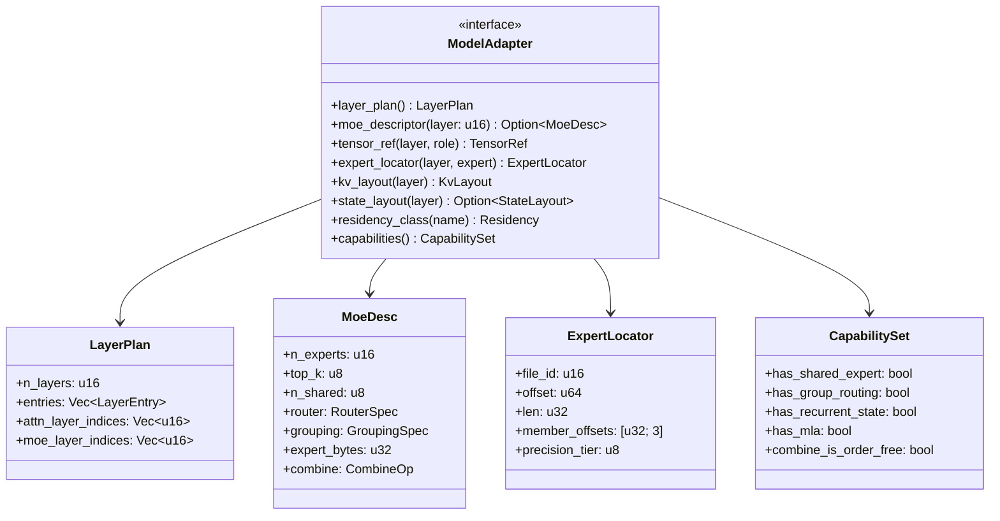
```mermaid
classDiagram
    class ModelAdapter {
        <<interface>>
        +layer_plan() LayerPlan
        +moe_descriptor(layer: u16) Option~MoeDesc~
        +tensor_ref(layer, role) TensorRef
        +expert_locator(layer, expert) ExpertLocator
        +kv_layout(layer) KvLayout
        +state_layout(layer) Option~StateLayout~
        +residency_class(name) Residency
        +capabilities() CapabilitySet
    }
    class LayerPlan {
        +n_layers: u16
        +entries: Vec~LayerEntry~
        +attn_layer_indices: Vec~u16~
        +moe_layer_indices: Vec~u16~
    }
    class MoeDesc {
        +n_experts: u16
        +top_k: u8
        +n_shared: u8
        +router: RouterSpec
        +grouping: GroupingSpec
        +expert_bytes: u32
        +combine: CombineOp
    }
    class ExpertLocator {
        +file_id: u16
        +offset: u64
        +len: u32
        +member_offsets: [u32; 3]
        +precision_tier: u8
    }
    class CapabilitySet {
        +has_shared_expert: bool
        +has_group_routing: bool
        +has_recurrent_state: bool
        +has_mla: bool
        +combine_is_order_free: bool
    }
    ModelAdapter --> LayerPlan
    ModelAdapter --> MoeDesc
    ModelAdapter --> ExpertLocator
    ModelAdapter --> CapabilitySet
```

`capabilities()` is **the only place the core is allowed to branch**.
`if model == "qwen"` is forbidden; `if caps.has_shared_expert` is permitted.
Capabilities are fixed at a finite count (currently 8), and adding one requires
an ADR.

### 9.4 Applying it to specific models

| Model | Expression in the spec | Core change |
|---|---|---|
| Qwen3.6-35B-A3B | `cycle=[LA,LA,LA,FA]`, `shared=1`, `sigmoid` | none |
| Qwen3-30B-A3B | `kind=uniform`, `mixer=gqa`, `shared=0` | none |
| Mixtral-8x7B | `n_experts=8, top_k=2, softmax, shared=0` | none |
| DeepSeek-V3 | `prefix_dense=3`, `grouping=group_limited`, `router_bias=true`, `mixer=mla` | **needs the MLA primitive added** (once) |
| GLM-4.5-Air | `prefix_dense=1`, `partial_rope` | none |
| an unknown new MoE | spec only, if it composes existing primitives | none |

**The adapter's success criterion (FR-7)**: the four families Mixtral / Qwen3 /
Qwen3.6 / GLM run from **spec files alone**. Only a genuinely new mixer
primitive like DeepSeek's MLA requires adding one primitive under
`core/mixer/`. That is expected growth, and **what matters is that it does not
leak into the adapter** (MLA is a KV layout problem, not an MoE problem).

### 9.5 Residency classification — an abstraction specific to MoEStream

The adapter's most important job is classifying each tensor into one of four
**residency classes**.

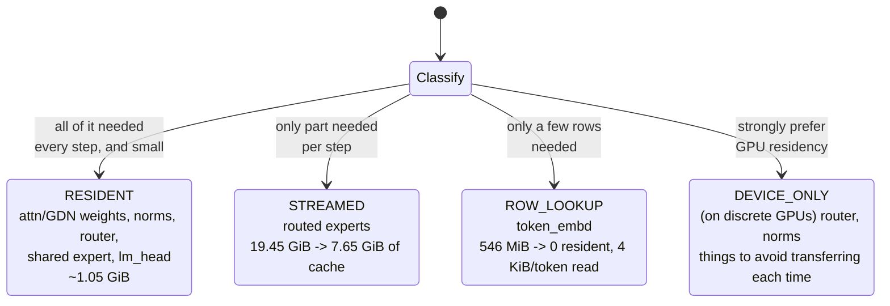
```mermaid
stateDiagram-v2
    [*] --> Classify
    Classify --> RESIDENT: all of it needed<br/>every step, and small
    Classify --> STREAMED: only part needed<br/>per step
    Classify --> ROW_LOOKUP: only a few rows<br/>needed
    Classify --> DEVICE_ONLY: strongly prefer<br/>GPU residency

    RESIDENT: RESIDENT<br/>attn/GDN weights, norms, router,<br/>shared expert, lm_head<br/>~1.05 GiB
    STREAMED: STREAMED<br/>routed experts<br/>19.45 GiB -> 7.65 GiB of cache
    ROW_LOOKUP: ROW_LOOKUP<br/>token_embd<br/>546 MiB -> 0 resident, 4 KiB/token read
    DEVICE_ONLY: DEVICE_ONLY<br/>(on discrete GPUs) router, norms<br/>things to avoid transferring each time
```

**`ROW_LOOKUP` is specific to this design.** Qwen3.6 has a huge vocabulary of
248,320, so the input embedding alone is 546 MiB. Yet one step needs at most
`batch_tokens` rows (1,152 B each). Replacing that with **a single 4 KiB read**
removes 546 MiB of resident RAM. It is a generalised optimization that applies to
large-vocabulary models broadly (Gemma, Qwen, Llama-4).

> The output side, `lm_head`, needs every row each step and stays RESIDENT.
> §31.5 records a future optimization by vocabulary partitioning.

### 9.6 Whether to support plugins (ADR-0007)

**Decision: v1 provides no dynamic binary plugin ABI.**

| Option | Advantages | Disadvantages | Verdict |
|---|---|---|---|
| A. declarative spec (TOML) only | safe, verifiable, no code, every spec regression-testable in CI | cannot express new primitives | ✅ **adopted for v1** |
| B. static registry (compile-time registration) | type safe, inlinable, easy to debug | additions require a rebuild | ✅ **also v1** (for new mixers) |
| C. dynamic C ABI plugins (`.so`) | no rebuild, third-party extension | ABI stabilisation cost, hard crash isolation, indirect calls on the hot path, security | ❌ **not in v1** |
| D. WASM plugins | sandboxed safety | performance characteristics unsuitable for the hot path | ❌ (perhaps later for the control plane) |

**Reasoning**: MoE architectural diversity is not infinite; it is
**combinations of a finite set of primitives**. The six models in the table above
are covered by three mixers (`gqa / mla / gated_delta_net`) and one FFN
(`swiglu`). Introducing indirect calls on the hot path in anticipation of
unlimited extensibility means **sacrificing PR-2 for a requirement that does not
exist** (P6, P7).

Stating the condition for reconsidering a C ABI in v2: "when three or more
external contributors ask for an extension the static registry cannot handle".

### 9.7 A CI check preventing model knowledge from leaking into the core

```
tests/architecture/no_model_names.rs:
  scan every source file under crates/moestream-core/ and fail the build
  if a model-name string such as "qwen" | "deepseek" | "mixtral" | "glm" |
  "llama" appears.
  (crates/moestream-spec/ and tests/ are excluded)
```

This enforces P7 mechanically, rather than trusting reviewers' goodwill to
uphold a norm written in a design document.

---

## 10. Runtime Core

### 10.1 The hierarchy of execution units

```
Request      : one generation request from a user (prompt + sampling params)
  |- Sequence : one autoregressive sequence (several under speculative decoding)
       |- Step : what the scheduler executes as one forward pass
            |- LayerStep : executing one layer
                 |- ExpertTask : the GEMM for one (layer, expert)
```

### 10.2 The structure of a step

One step is a "continuous batch" bundling tokens from several sessions.

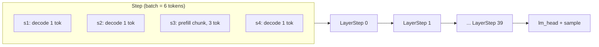
```mermaid
graph LR
    subgraph Step["Step (batch = 6 tokens)"]
        T1["s1: decode 1 tok"]
        T2["s2: decode 1 tok"]
        T3["s3: prefill chunk, 3 tok"]
        T4["s4: decode 1 tok"]
    end
    Step --> LS0["LayerStep 0"] --> LS1["LayerStep 1"] --> LSN["... LayerStep 39"] --> HEAD["lm_head + sample"]
```

**Integrating chunked prefill**: prefill and decode are mixed into one step, as
in vLLM/SGLang. But MoEStream has a specific constraint — **a prefill chunk
widens the expert union sharply** (§2.4's `d(B)`). So the scheduler derives the
prefill chunk size **backwards from the I/O budget** (§16.4).

### 10.3 The phases of a LayerStep

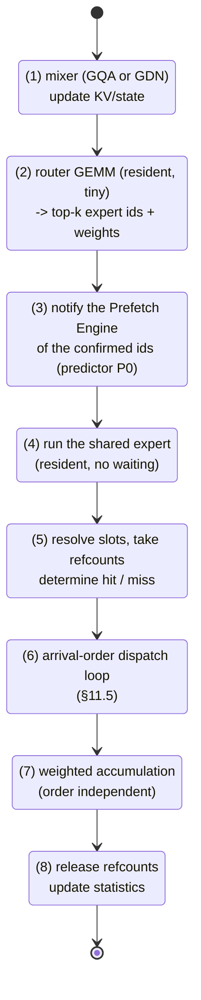
```mermaid
stateDiagram-v2
    [*] --> Mixer
    Mixer: (1) mixer (GQA or GDN)<br/>update KV/state
    Mixer --> Router
    Router: (2) router GEMM (resident, tiny)<br/>-> top-k expert ids + weights
    Router --> Notify
    Notify: (3) notify the Prefetch Engine<br/>of the confirmed ids (predictor P0)
    Notify --> Shared
    Shared: (4) run the shared expert<br/>(resident, no waiting)
    Shared --> Gather
    Gather: (5) resolve slots, take refcounts<br/>determine hit / miss
    Gather --> Wait
    Wait: (6) arrival-order dispatch loop<br/>(§11.5)
    Wait --> Accum
    Accum: (7) weighted accumulation<br/>(order independent)
    Accum --> Release
    Release: (8) release refcounts<br/>update statistics
    Release --> [*]
```

**The position of (3) matters**: the Prefetch Engine is notified the moment the
router's result exists, without waiting for expert execution. That makes even
**the shared expert's compute time in (4), about 0.1 ms**, usable for hiding
I/O. Small, but it applies across 40 layers on every step.

### 10.4 Graph Builder and ID Remap

GGML's MoE kernel `ggml_mul_mat_id(as, b, ids)` takes `as` as a 3D tensor
bundling every expert, and `ids` as expert indices.

MoEStream substitutes **a table of cache slots** for `as`:

```
  normal (llama.cpp):
    as   = ffn_gate_exps  [2048, 512, 256]   <- all 256 experts resident, contiguous
    ids  = [37, 91, 12, ...]                 <- expert_id

  MoEStream:
    as   = gate_slab      [2048, 512, S]     <- S = slot count (e.g. 4027)
    ids  = [1804, 22, 3311, ...]             <- slot_id (mapped through the slot table)
```

**That single level of indirection is enough to run MoE on a dynamic cache
without changing one line of GGML's kernel.** (P6 made concrete.)

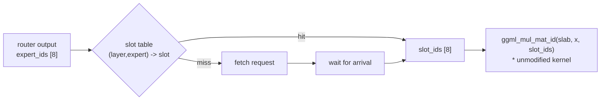
```mermaid
graph LR
    R["router output<br/>expert_ids [8]"] --> M{"slot table<br/>(layer,expert) -> slot"}
    M -->|hit| S["slot_ids [8]"]
    M -->|miss| F["fetch request"] --> W["wait for arrival"] --> S
    S --> G["ggml_mul_mat_id(slab, x, slot_ids)<br/>* unmodified kernel"]
```

**Constraint**: every slot in a slab must share a shape and a quantization type.
That is what forces §18.6's design of separate slabs per precision tier.

### 10.5 Managing graph reconstruction cost

Rebuilding the GGML graph every step costs hundreds of microseconds across
40 layers and dozens of nodes, which is not negligible against a 1 ms/layer
budget.

**A three-part mitigation**:
1. **cache graph templates**: reuse the graph skeleton per batch shape (token
   count) and rewrite only the `ids` tensor and the input/output pointers.
2. **bucket the shapes**: round batch sizes to
   `{1,2,4,8,16,32,64,128,256,512}`, capping graph reconstruction at ten
   variants. (The padding is wasted, but it is cheaper than reconstruction.)
3. **CUDA Graph / pre-recorded Vulkan command buffers** (v1.1): eliminate command
   re-recording on the fixed-shape decode path.

### 10.6 Guaranteeing determinism (QR-1)

| Potential source of non-determinism | Mitigation |
|---|---|
| accumulating experts in arrival order changes floating-point addition order | **accumulation always happens in logical expert order.** GEMMs are *issued* in arrival order, but results are written to per-`expert_rank` buffers and reduced in a fixed order at the end. The GEMMs themselves are independent, so their order is free |
| the computation changes with cache state | in `strict` mode it does not (it only waits). Only `soft`/`turbo` change it, and say so in a header |
| a different batch composition changes GEMM partitioning | GGML's `mul_mat_id` is independent per row; a token is unaffected by others in the batch |
| reduce order varying with thread count | match GGML's settings to the baseline. Fixed in CI |

> Issuing in arrival order and reducing in fixed order gives **both the freedom
> of ordering for performance and numerical determinism**. The only extra cost is
> a temporary buffer of `top_k × hidden × 4 B = 8 × 2048 × 4 = 64 KiB`.

---

## 11. Expert Manager

### 11.1 Defining the expert object

```
ExpertKey  = (layer_id: u16, expert_id: u16)     -> packed into u32
ExpertId   = layer_id * n_experts + expert_id    -> a dense id in 0..10,239
```

Dense ids let every statistic live in **arrays** (no hashing, cache friendly).
That is the core of the "possible because there are 10,240" design from §2.5.

| Data | Size | Purpose |
|---|---|---|
| `state: AtomicU8` × 10,240 | 10 KiB | the state machine |
| `slot: AtomicU16` × 10,240 | 20 KiB | the slot table |
| `refcount: AtomicU16` × 10,240 | 20 KiB | protecting in-use entries |
| `freq_ema: f32` × 10,240 | 40 KiB | exact frequency statistics |
| `last_used: u32` × 10,240 | 40 KiB | reuse distance |
| `weight_mass: f32` × 10,240 | 40 KiB | accumulated router weight |
| **total** | **≈170 KiB** | **fits in L2 cache** |

### 11.2 The expert state machine

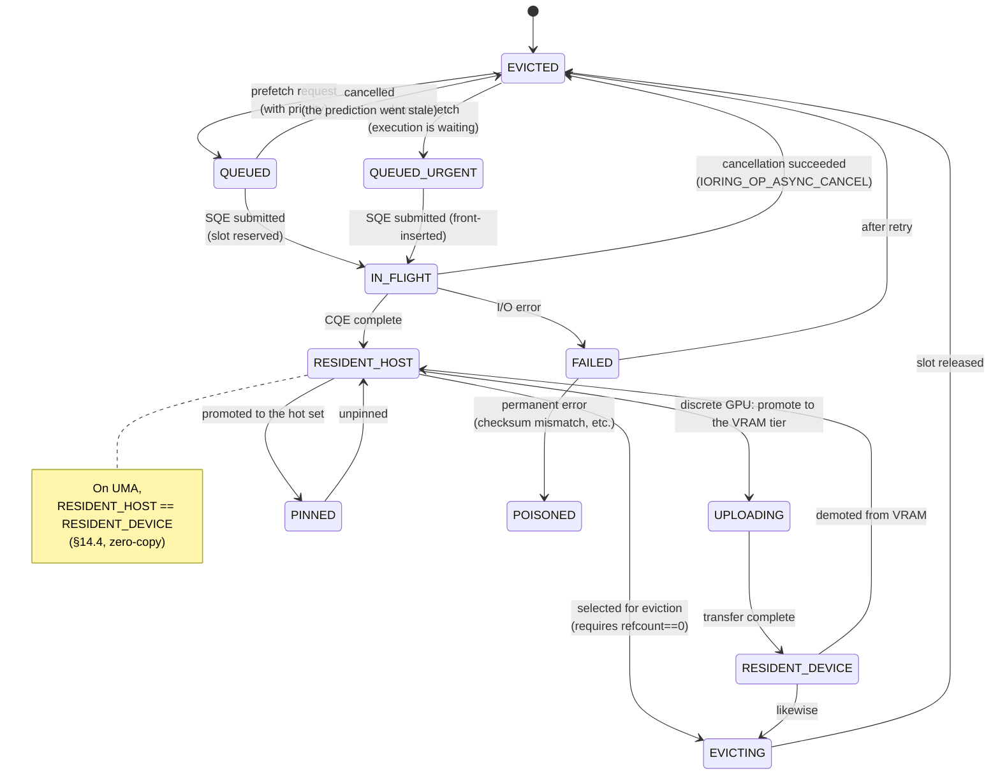
```mermaid
stateDiagram-v2
    [*] --> EVICTED

    EVICTED --> QUEUED: prefetch request<br/>(with priority)
    EVICTED --> QUEUED_URGENT: demand fetch<br/>(execution is waiting)

    QUEUED --> IN_FLIGHT: SQE submitted<br/>(slot reserved)
    QUEUED_URGENT --> IN_FLIGHT: SQE submitted (front-inserted)
    QUEUED --> EVICTED: cancelled<br/>(the prediction went stale)

    IN_FLIGHT --> RESIDENT_HOST: CQE complete
    IN_FLIGHT --> FAILED: I/O error
    IN_FLIGHT --> EVICTED: cancellation succeeded<br/>(IORING_OP_ASYNC_CANCEL)

    RESIDENT_HOST --> UPLOADING: discrete GPU: promote to the VRAM tier
    UPLOADING --> RESIDENT_DEVICE: transfer complete
    RESIDENT_DEVICE --> RESIDENT_HOST: demoted from VRAM

    RESIDENT_HOST --> EVICTING: selected for eviction<br/>(requires refcount==0)
    RESIDENT_DEVICE --> EVICTING: likewise
    EVICTING --> EVICTED: slot released

    RESIDENT_HOST --> PINNED: promoted to the hot set
    PINNED --> RESIDENT_HOST: unpinned

    FAILED --> EVICTED: after retry
    FAILED --> POISONED: permanent error<br/>(checksum mismatch, etc.)

    note right of RESIDENT_HOST
        On UMA,
        RESIDENT_HOST == RESIDENT_DEVICE
        (§14.4, zero-copy)
    end note
```

**Refcount discipline**: an expert that is `RESIDENT_*` with `refcount > 0` is
never evicted. The refcount is taken when the Graph Builder fixes `ids` and
released after the GGML graph completes (fence/semaphore).

### 11.3 Slot table and slabs

```
Host arena (HugePages, 2 MiB pages)
+-------------------------------------------------------------+
| gate_slab : S x 576 KiB   = 2,264 MiB  (S=4027)             |
| up_slab   : S x 576 KiB   = 2,264 MiB                       |
| down_slab : S x 840 KiB   = 3,303 MiB                       |
+-------------------------------------------------------------+
                     total 7,831 MiB ~= 7.65 GiB

Slot i's three members sit at the same index in their respective slabs.
 -> GGML sees three independent 3D tensors, so mul_mat_id works unmodified.
 -> On SSD one expert is a contiguous 1,992 KiB, so a single readv
    (three iovecs) can DMA-scatter directly into the three slabs. (§13.4)
```

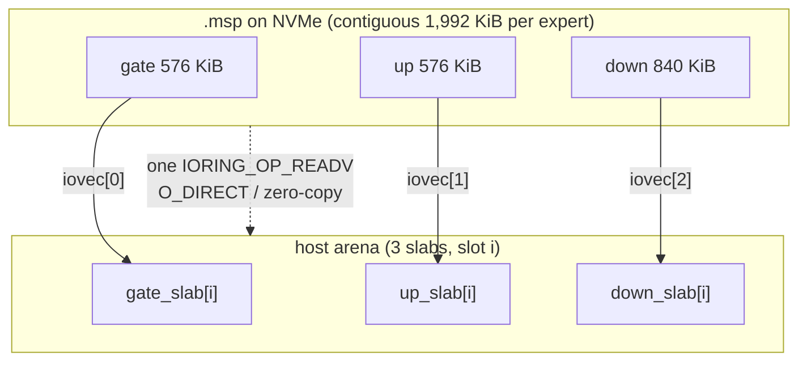
```mermaid
graph TB
    subgraph DISK[".msp on NVMe (contiguous 1,992 KiB per expert)"]
        D1["gate 576 KiB"]
        D2["up 576 KiB"]
        D3["down 840 KiB"]
    end
    subgraph RAM["host arena (3 slabs, slot i)"]
        R1["gate_slab[i]"]
        R2["up_slab[i]"]
        R3["down_slab[i]"]
    end
    D1 -->|"iovec[0]"| R1
    D2 -->|"iovec[1]"| R2
    D3 -->|"iovec[2]"| R3
    DISK -.->|"one IORING_OP_READV<br/>O_DIRECT / zero-copy"| RAM
```

**This is the main reason for introducing the `.msp` format.** In GGUF, gate/up/
down are separate tensors at distant offsets, so one expert needs **three
independent I/Os** — 3x the IOPS — and 4 KiB boundaries are not guaranteed, so
O_DIRECT cannot be used (§13.6).

### 11.4 Slot allocation policy

```
allocate: pop from the free list  ->  if empty, ask the Cache Manager to evict
       ->  if eviction is impossible (all refcount>0 or PINNED):
             demand:   block the executing thread (rare; a design-level alert)
             prefetch: discard the request (its priority is low, so of course)
```

**Fragmentation cannot occur**: every slot is the same size, so a free list gives
zero fragmentation. Another side benefit of a fixed expert-sized granularity.
(With precision tiers, each tier gets its own slab and free list.)

### 11.5 Arrival-order dispatch (out-of-order expert execution) ★

**The central idea of this design.** An MoE FFN's output is

```
y = Σ_{i ∈ topk(x)} w_i · Expert_i(x)
```

and **the sum is commutative**. So there is no need whatsoever to process
experts in expert_id order.

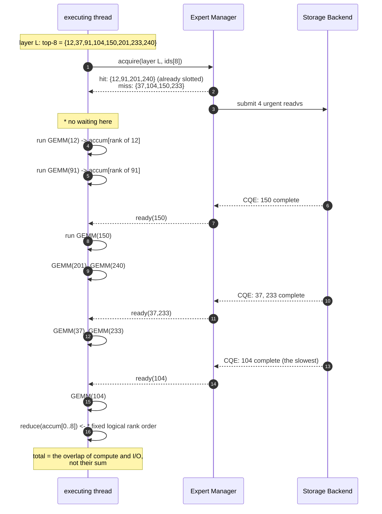
```mermaid
sequenceDiagram
    autonumber
    participant EX as executing thread
    participant EM as Expert Manager
    participant IO as Storage Backend

    Note over EX: layer L: top-8 = {12,37,91,104,150,201,233,240}
    EX->>EM: acquire(layer L, ids[8])
    EM-->>EX: hit: {12,91,201,240} (already slotted)<br/>miss: {37,104,150,233}
    EM->>IO: submit 4 urgent readvs

    Note over EX: * no waiting here
    EX->>EX: run GEMM(12) -> accum[rank of 12]
    EX->>EX: run GEMM(91) -> accum[rank of 91]
    IO-->>EM: CQE: 150 complete
    EM-->>EX: ready(150)
    EX->>EX: run GEMM(150)
    EX->>EX: GEMM(201), GEMM(240)
    IO-->>EM: CQE: 37, 233 complete
    EM-->>EX: ready(37,233)
    EX->>EX: GEMM(37), GEMM(233)
    IO-->>EM: CQE: 104 complete (the slowest)
    EM-->>EX: ready(104)
    EX->>EX: GEMM(104)
    EX->>EX: reduce(accum[0..8]) <- * fixed logical rank order
    Note over EX: total = the overlap of compute and I/O,<br/>not their sum
```

**What this buys**:
- head-of-line blocking is eliminated entirely. Expert 37 being slow does not
  stop expert 91's compute.
- I/O jitter (NVMe tail latency can be 10x the mean) is absorbed by other
  experts' compute time.
- the primary means of meeting PR-5 (p99/median ≤ 2.0).

**Implementation notes**:
- completion notification is a lock-free MPSC ring (CQE thread → executing
  thread).
- the executing thread runs a simple loop: consume all hits first, then consume
  the rest in completion order.
- `accum` is `top_k` independent buffers (64 KiB), reduced in fixed order at the
  end (§10.6).

**Declaring its applicability**: this optimization is valid only when
`MoeDesc.combine == weighted_sum`, guarded by the adapter's
`capabilities().combine_is_order_free`. (So it can be disabled safely if an
architecture with an order-dependent combine appears.)

### 11.6 Demand fetch and quality modes

How a missed expert is handled depends on the quality mode and the router
weight.

| Mode | Behaviour | Quality guarantee |
|---|---|---|
| `strict` (default) | always wait for every miss | bit-exact (QR-1) |
| `soft` | skip only when the router weight `w_i < τ_soft` (default 0.02) **and** the deadline is exceeded, renormalising the rest | PPL degradation ≤ 1% (QR-2) |
| `turbo` | skip at `w_i < τ_turbo` (default 0.06), and allow substitute reads from a lower-precision tier | PPL degradation ≤ 3% (QR-3) |

**Why a router weight threshold works**: the top-8 weight distribution is
strongly skewed, and the bottom two or three weights often sum to less than a
few percent. And because Qwen3.6 always has **a shared expert contributing**,
it is structurally robust to losing some routed experts.

> **[Corrected by finding M0-2]** The bottom two weights actually sum to about
> **15%**, so "less than a few percent" was optimistic. Also, `τ = 0.02` skips
> only 0.1% of selections and is effectively inert.

```
renormalising after a skip:  y = ( Σ_{i∈kept} w_i·E_i(x) ) / ( Σ_{i∈kept} w_i )  + shared(x)
```

**Important**: a skip happens only when both "it missed" and "the deadline was
exceeded" hold. In a warm steady state it essentially never happens, and the
rate is always published as `moestream_expert_skipped_total` (P9).

### 11.7 Handling the shared expert

The shared expert in Qwen3.6 / DeepSeek / GLM is **used on every token**. At
40 layers × 1.945 MiB = 76 MiB it is **unconditionally PINNED**. One of the few
places that branches on the adapter's `capabilities().has_shared_expert`.

That also matters for quality: it is the basis on which §11.6's skipping is
acceptable at all.

---

## 12. Cache Manager

### 12.1 Cache tiers

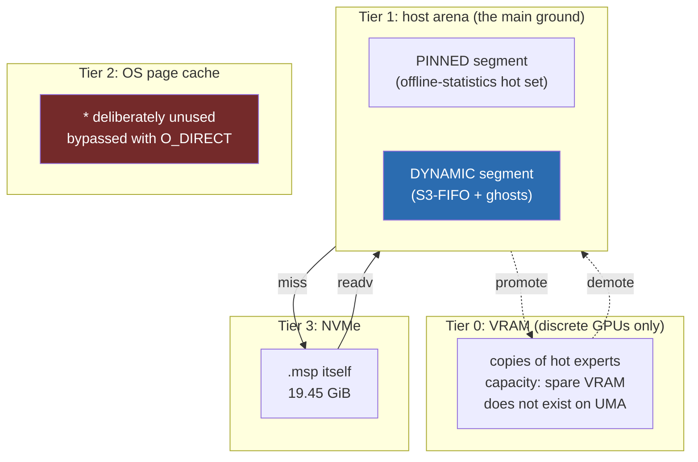
```mermaid
graph TB
    subgraph T0["Tier 0: VRAM (discrete GPUs only)"]
        V["copies of hot experts<br/>capacity: spare VRAM<br/>does not exist on UMA"]
    end
    subgraph T1["Tier 1: host arena (the main ground)"]
        P["PINNED segment<br/>(offline-statistics hot set)"]
        DY["DYNAMIC segment<br/>(S3-FIFO + ghosts)"]
    end
    subgraph T2["Tier 2: OS page cache"]
        PC["* deliberately unused<br/>bypassed with O_DIRECT"]
    end
    subgraph T3["Tier 3: NVMe"]
        N[".msp itself<br/>19.45 GiB"]
    end
    V -.demote.-> T1
    T1 -.promote.-> V
    T1 -->|miss| N
    N -->|readv| T1
    style PC fill:#742a2a,color:#fff
    style DY fill:#2b6cb0,color:#fff
```

### 12.2 Why not plain LRU

| Policy | Problem with the expert workload |
|---|---|
| LRU | prefill's full expert sweep (§20.2) **pollutes the entire cache in one pass**. Zero scan resistance |
| LFU (pure) | cannot follow a session changing topic (no ageing) |
| ARC | adaptive but heavy to implement, and excessive for a space of only 10,240 |
| **W-TinyLFU** | scan resistance plus frequency awareness. **The basis for the choice** |
| **S3-FIFO** | beats LRU/ARC in measurements from 2024 onward. Simple to implement with less lock contention |

### 12.3 The chosen policy: three segments

```
+--------------------------------------------------------------+
| Expert cache (S slots)                                       |
|                                                              |
|  +--------------+ +--------------------------------------+   |
|  | PINNED       | | DYNAMIC (S3-FIFO)                    |   |
|  | alpha*S (20%)| | (1-alpha)*S                          |   |
|  |              | | +--------+ +----------------------+  |   |
|  | a global hot | | | SMALL  | | MAIN                 |  |   |
|  | set from     | | | (10%)  | | (90%)                |  |   |
|  | offline      | | | new    | | promoted on a second |  |   |
|  | statistics   | | | entries| | reference            |  |   |
|  |              | | +---+----+ +----------------------+  |   |
|  | not evictable| |     |  promote at freq>=1           |   |
|  +--------------+ |     v                               |   |
|                   |  +--------------------------------+ |   |
|                   |  | GHOST (metadata only, no data) | |   |
|                   |  | records evicted ids -> on a    | |   |
|                   |  | re-reference, promote straight | |   |
|                   |  | to MAIN and adjust the quota   | |   |
|                   |  +--------------------------------+ |   |
|                   +--------------------------------------+   |
+--------------------------------------------------------------+
```

**Why S3-FIFO**:
- the SMALL queue quickly discards objects used only once → resistant to
  pollution from the prefill sweep or from mistaken speculative prefetch.
- being FIFO-based, lock contention is lower than LRU (no list relinking).
- the ghost queue tells us "would a slightly larger cache have hit?" — used in
  §12.5.

### 12.4 Admission policy

"Cache everything you read" is wrong.

| Source | Admission decision |
|---|---|
| demand fetch (execution waited) | **always admit** (into SMALL). There is proof it was actually needed |
| high-confidence prefetch (P0/P1) | admit (into SMALL) |
| low-confidence prefetch (lower ranks of P2/P3) | **admit, but at the tail of SMALL**. Discarded quickly if wrong |
| the prefill sweep (§20.2) | **do not admit** (bypass read). Statistics are still recorded, for later hot-set reconstruction |

**Not admitting the prefill sweep is decisive.** A 2K-token prefill touches all
10,240 experts, so admitting it naively would destroy the cache warmed for
decode.

### 12.5 Dynamically adjusting per-layer quotas

Distributing slots evenly across layers is not optimal. Routing concentration
(entropy) differs by layer, so the marginal utility of cache differs.

**Method: estimating marginal hit rate from ghost lists**

```
for each layer L:
  ghost_hits[L] = the number of times an id in the ghost list was re-referenced
                = an estimate of "how many more hits a few more slots would give"

periodically (say every 512 steps):
  quota[L] <- quota[L] + eta * ( ghost_hits[L] - mean(ghost_hits) )
  subject to: sum quota[L] = S_dynamic,  quota[L] >= quota_min
```

This amounts to estimating the gradient of the miss ratio curve online at
essentially zero cost — ARC's adaptive mechanism extended into the layer
dimension.

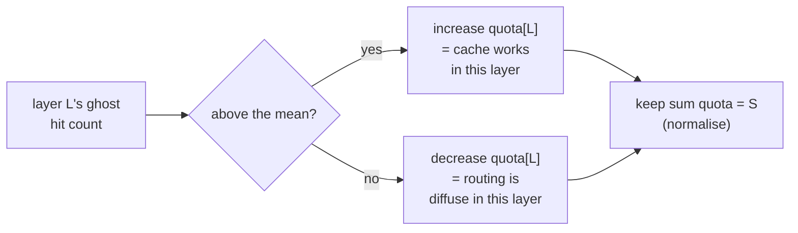
```mermaid
graph LR
    A["layer L's ghost<br/>hit count"] --> B{"above the mean?"}
    B -->|yes| C["increase quota[L]<br/>= cache works<br/>in this layer"]
    B -->|no| D["decrease quota[L]<br/>= routing is<br/>diffuse in this layer"]
    C --> E["keep sum quota = S<br/>(normalise)"]
    D --> E
```

> **★ Measured (finding N1)**: this works, giving **+0.65–0.91 pt** of hit rate.
> But **it converges opposite to the prediction.**
>
> ```
> converged quotas (en): L0=186  L10=107  L20=71  L30=87  L39=93
> ```
>
> The prediction was that deep (specialised) layers would get more; in practice
> **the high-entropy shallow layers did**. Ghost hits are frequent in layers with
> a large working set, and the marginal utility there is genuinely higher.
> **The rule is right; the predicted direction was wrong.**

### 12.6 Building the PINNED set (hot set)

`moestream pack --calibrate` runs a calibration corpus, measures activation
frequency for every expert, and stores it in the `.msp` metadata.

**An important caveat**: Qwen3.6's training includes an expert load-balancing
auxiliary loss (coefficient 0.001), explicitly training **all 256 experts to be
used nearly uniformly across a batch**. Therefore:

> **Global frequency skew is likely to be weak. Per-sequence and per-domain skew,
> however, is expected to be strong.**

Which is consistent with observations from the MoE-Infinity line of work. Hence:

| Setting | Default | Basis |
|---|---|---|
| PINNED ratio α | ~~0.20~~ → ~~0.05~~ → **0.00 (off by default)** | **revised by measurement (M0-2).** A static hot set proved worse than dynamic LRU, so PINNED is for start-up warm-up only |
| `--pin-strategy` | `auto` | `global` (global statistics) / `domain:<name>` (for coding, etc.) / `off` |
| per-domain hot sets | provided | several hot sets (for code, for Japanese, …) bundled into the `.msp` and selected at startup |

> ### ★ Measured (finding M0-2, 2026-08-03)
>
> **The hypothesis in this section was verified against real data and held.**
>
> | Observation | Value |
> |---|---|
> | Zipf exponent `s` | code 0.473 / ja 0.340 / en 0.283 → **the skew is indeed weak** |
> | static oracle hot set, h(38%) | 87.7 / 87.9 / 82.1% |
> | **dynamic LRU, h(38%)** | **88.7 / 91.5 / 90.2%** ← beats the static set |
>
> Global frequency is flat but **temporal locality is strong**. So **devoting a
> large fraction to a PINNED set is harmful**, and α is revised to 0.05.
> Detail: `docs/findings/M0-2-expert-distribution.md`

**This uncertainty is not a weakness in the design; it is the subject of a
measurement plan.** §33.4 makes "measuring expert activation distribution" a
first-class benchmark item. The measurement may change α's default, but
**the architecture does not change** (the PINNED ratio is a parameter, not
structure).

### 12.7 Coexisting with the KV cache — the Memory Governor

The expert cache and KV compete for the same RAM budget. The Memory Governor
arbitrates.

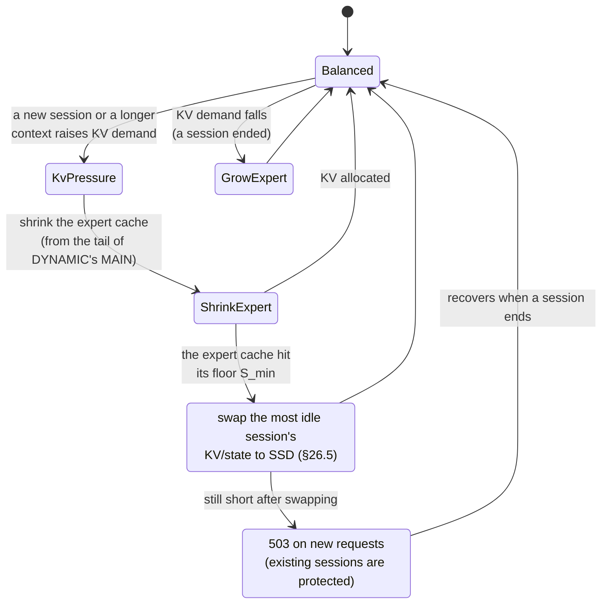
```mermaid
stateDiagram-v2
    [*] --> Balanced
    Balanced --> KvPressure: a new session or a longer<br/>context raises KV demand
    KvPressure --> ShrinkExpert: shrink the expert cache<br/>(from the tail of DYNAMIC's MAIN)
    ShrinkExpert --> Balanced: KV allocated
    ShrinkExpert --> KvSwap: the expert cache hit<br/>its floor S_min
    KvSwap: swap the most idle session's<br/>KV/state to SSD (§26.5)
    KvSwap --> Balanced
    KvSwap --> Reject: still short after swapping
    Reject: 503 on new requests<br/>(existing sessions are protected)
    Reject --> Balanced: recovers when a session ends
    Balanced --> GrowExpert: KV demand falls<br/>(a session ended)
    GrowExpert --> Balanced
```

**Policy: KV takes priority over the expert cache.** Losing KV breaks a session
(recovering costs a full prefill), whereas losing expert cache only makes things
slower. Follow the asymmetry in recoverability.

**The floor `S_min`**: the expert cache has a floor (default: 5% of all experts
= 512 slots ≈ 1 GiB). Below it the stall rate jumps and protecting KV becomes
pointless, so new sessions are refused once `S_min` is reached (admission
control, §16.5).

### 12.8 The benefit of sharing the cache across sessions

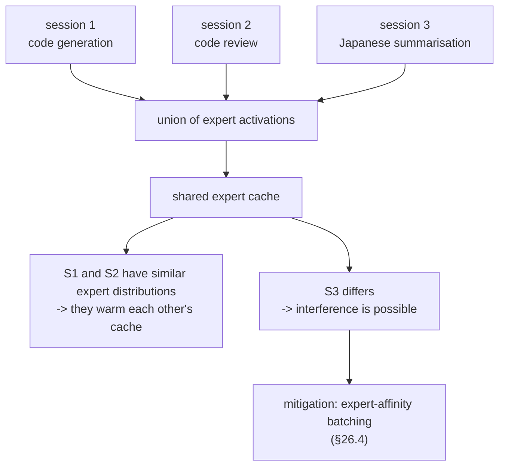
```mermaid
graph TB
    S1["session 1<br/>code generation"] --> U["union of expert activations"]
    S2["session 2<br/>code review"] --> U
    S3["session 3<br/>Japanese summarisation"] --> U
    U --> C["shared expert cache"]
    C --> R1["S1 and S2 have similar expert distributions<br/>-> they warm each other's cache"]
    C --> R2["S3 differs<br/>-> interference is possible"]
    R2 --> AF["mitigation: expert-affinity batching<br/>(§26.4)"]
```

With several agents running similar tasks, a shared cache is **simply a win**.
With mixed tasks, interference (cache thrashing) is possible, so §26.4
introduces scheduling that "preferentially batches sessions with similar expert
profiles".

---

## 13. Storage Backend

### 13.1 The abstract interface

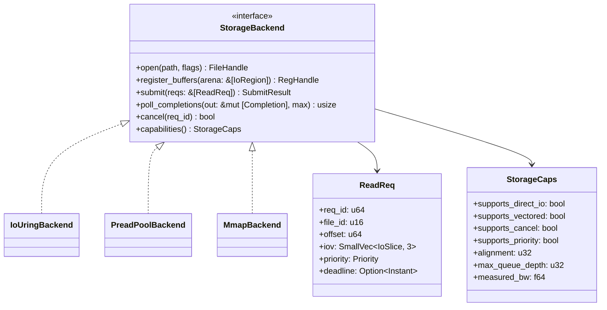
```mermaid
classDiagram
    class StorageBackend {
        <<interface>>
        +open(path, flags) FileHandle
        +register_buffers(arena: &[IoRegion]) RegHandle
        +submit(reqs: &[ReadReq]) SubmitResult
        +poll_completions(out: &mut [Completion], max) usize
        +cancel(req_id) bool
        +capabilities() StorageCaps
    }
    class ReadReq {
        +req_id: u64
        +file_id: u16
        +offset: u64
        +iov: SmallVec~IoSlice, 3~
        +priority: Priority
        +deadline: Option~Instant~
    }
    class StorageCaps {
        +supports_direct_io: bool
        +supports_vectored: bool
        +supports_cancel: bool
        +supports_priority: bool
        +alignment: u32
        +max_queue_depth: u32
        +measured_bw: f64
    }
    StorageBackend <|.. IoUringBackend
    StorageBackend <|.. PreadPoolBackend
    StorageBackend <|.. MmapBackend
    StorageBackend --> ReadReq
    StorageBackend --> StorageCaps
```

The interface is **entirely asynchronous, with submission separated from
completion**. Having no synchronous API forces even the mmap backend into the
shape of "touch it on another thread and signal completion", guaranteeing that
upper layers never branch on the I/O method.

### 13.2 Why mmap is not the primary mechanism (ADR-0004)

This is the most contentious decision in the design, so the reasoning is given
in detail.

| Point | mmap + page cache | io_uring + O_DIRECT + our own cache |
|---|---|---|
| **guaranteeing a RAM ceiling** | ❌ **impossible**. Page cache uses whatever is available; constraining it with cgroups makes eviction unpredictable instead | ✅ the allocated arena is all there is. FR-4 is satisfiable |
| knowing which experts are resident | ❌ only guessable via `mincore(2)`. The kernel's decisions are invisible | ✅ known exactly. P8's observability holds |
| controlling the eviction policy | ❌ only the kernel's LRU approximation. The prefill sweep blows away the hot set | ✅ S3-FIFO / PINNED implementable freely |
| asynchrony | ❌ a page fault **stops the thread synchronously**. Directly opposed to P3 | ✅ fully asynchronous |
| read granularity | ❌ 4 KiB pages. `MADV_WILLNEED` is best-effort and uncancellable | ✅ 1,992 KiB in one go, cancellable |
| memory copies | ✅ zero-copy (page cache is directly visible) | ✅ zero-copy (DMA straight into the arena) |
| implementation simplicity | ✅ overwhelmingly simpler | ❌ complex |
| sharing across processes | ✅ several processes share page cache | ❌ not possible (but §10's daemon model substitutes) |
| portability | ✅ works anywhere | ❌ Linux 5.15+ only |

**Conclusion**: mmap's only essential advantage is cross-process sharing, which
MoEStream makes unnecessary through **P10 (one process, many agents)**. Whereas
FR-4 (a RAM ceiling) and P3 (non-blocking) cannot be satisfied with mmap in
principle.

**The mmap backend is nevertheless kept for:**
- a reference implementation for development and debugging (simplest, and a
  correctness baseline)
- environments without io_uring (older kernels, macOS, WSL1)
- **the initial load of resident tensors (the RESIDENT class)** — a one-off,
  where mmap is fine

### 13.3 The io_uring backend

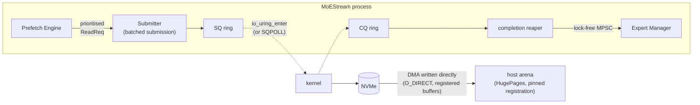
```mermaid
graph LR
    subgraph APP["MoEStream process"]
        PF["Prefetch Engine"] -->|"prioritised<br/>ReadReq"| SUB["Submitter<br/>(batched submission)"]
        SUB --> SQ["SQ ring"]
        CQ["CQ ring"] --> COMP["completion reaper"]
        COMP -->|"lock-free MPSC"| EM["Expert Manager"]
    end
    SQ -.->|"io_uring_enter<br/>(or SQPOLL)"| K["kernel"]
    K -.-> CQ
    K --> NVME[("NVMe")]
    NVME -->|"DMA written directly<br/>(O_DIRECT, registered buffers)"| ARENA["host arena<br/>(HugePages, pinned registration)"]
```

**Settings (assuming Linux 6.1+)**:

| Setting | Value | Reason |
|---|---|---|
| `IORING_SETUP_SQPOLL` | conditionally on | removes syscalls but consumes a dedicated core. Only with ≥8 cores and `--io-sqpoll` |
| `IORING_SETUP_SINGLE_ISSUER` | on | restricting submission to one thread reduces kernel-side locking |
| `IORING_SETUP_DEFER_TASKRUN` | on | batches completion handling at `io_uring_enter`, improving CPU efficiency |
| `IORING_SETUP_COOP_TASKRUN` | on | reduces IPIs |
| `IORING_REGISTER_BUFFERS` | required | registers the whole arena, eliminating `get_user_pages` per submission. **The precondition for zero-copy** |
| `IORING_REGISTER_FILES` | on | eliminates fd refcount operations |
| queue depth | 128 | derived in §13.5 |
| `O_DIRECT` | on where possible | bypasses page cache entirely, removing double buffering and protecting FR-4 |

### 13.4 Filling three slabs at once with a vectored read

```
IORING_OP_READV, fd=msp, offset = expert_record_offset
iov[0] = { base: gate_slab + slot*576KiB, len: 576 KiB }
iov[1] = { base: up_slab   + slot*576KiB, len: 576 KiB }
iov[2] = { base: down_slab + slot*840KiB, len: 840 KiB }
                                            ---------
                                    total 1,992 KiB = 498 x 4 KiB  * aligned
```

- one expert = **one SQE**, cutting IOPS to a third.
- every segment is on a 4 KiB boundary with a 4 KiB multiple length →
  **satisfying O_DIRECT's constraints**.
- the kernel can issue it to NVMe as a single contiguous read (maximum
  bandwidth).

> One Q4_K row = 2048 weights = 8 superblocks × 144 B = 1,152 B.
> 512 rows × 1,152 B = 589,824 B = exactly 576 KiB. A coincidence, but a
> convenient one. **In general, padding each member to a 4 KiB boundary when
> packing `.msp`** makes it always hold.

### 13.5 Designing queue depth and in-flight bytes

The in-flight bytes needed follow from "prefetch lead time × bandwidth".

```
t_layer         = t_c / L = 40 ms / 40 = 1.0 ms
prefetch depth D = 4 layers (decided in §22.7)
inventory time   = D x t_layer = 4 ms
in-flight needed = BW x inventory time = 6 GB/s x 4 ms = 24 MB
QD (count)       = 24 MB / 1.992 MiB ~= 12

With safety margin and burst headroom, QD = 64 and a ring capacity of 128.
```

> **Corrected by measurement (2026-08-02, finding S1)**
> QD=64 above was wrong. Measuring O_DIRECT random reads (~0.5 MiB) on a real
> Crucial P310 (PCIe4, DRAM-less/HMB):
>
> | Parallelism | Bandwidth |
> |---:|---:|
> | QD=1 | 1.55 GB/s |
> | QD=2 | 2.85 GB/s |
> | QD=4 | 4.28 GB/s |
> | **QD=8** | **4.42 GB/s ← saturated** |
> | QD=16 | 4.20 GB/s |
> | QD=32 | 4.46 GB/s |
>
> **It saturates at QD=8; beyond that bandwidth does not grow.**
>
> **Revised again by io_uring measurements (finding S2, 2026-08-03):**
> it actually **saturates at QD=2** (4.48 GB/s), and at QD=128 the bandwidth is
> the same while p99 degrades from 1.19 ms to 95.02 ms — **80x worse**.
> io_uring's bandwidth advantage over parallel pthread pread is **only +1.5%**,
> so **the reason to choose io_uring is control and CPU efficiency, not
> bandwidth.**
>
> → **Separate "software queue depth (256 entries)" from "device queue depth
> (2–4)".** `IoGovernor` controls only the latter; deep prefetching is the
> former's job. That achieves deep prefetch and low p99 simultaneously.
> So `IoGovernor` starts at **QD=8** with a ceiling of **32** (the "QD = 64"
> above is discarded).
> The adaptive-control mechanism was designed correctly; the search range was
> wrong.
> Detail: `docs/findings/S1-real-expert-stream.md`

**NVMe-side considerations**: consumer NVMe optima are roughly QD 8–32. Too
large a QD increases queuing delay inside the SSD and **degrades p99 latency**
(hitting PR-5 directly). So the **QD ceiling is adaptively controlled**:

```
observed_p99 > target_p99  ->  reduce in_flight_limit (AIMD style)
observed_bw  < target_bw   ->  raise  in_flight_limit
```

This is the equivalent of TCP congestion control, implemented as `IoGovernor`.

### 13.6 Reading GGUF directly: design and limits

| Item | `.msp` mode | direct GGUF mode |
|---|---|---|
| I/Os per expert | **1** (readv) | **3** (gate/up/down are separate tensors) |
| O_DIRECT | ✅ usable | ❌ GGUF's tensor alignment defaults to 32 B and does not guarantee 4 KiB boundaries |
| extra copy | none | yes (bounce buffer → slab) |
| page cache pollution | none | yes (buffered I/O) |
| RAM ceiling guarantee | ✅ strict | ⚠️ overshoots by the page cache (mitigated with `posix_fadvise(DONTNEED)`) |
| layout optimization | ✅ clustering by popularity | ❌ the source file's order |
| startup time | immediate | immediate |
| conversion effort | `moestream pack` (minutes) | none |
| intended use | **production** | trying it out, checking compatibility |

**Decision: support both. But label GGUF mode explicitly as "compatibility mode"
and encourage conversion to `.msp` at startup.** Measure the performance
difference and print it in the startup log.

### 13.7 Evaluating GPUDirect Storage (ADR-0009)

**Conclusion: not adopted in v1.**

| Aspect | Assessment |
|---|---|
| integrated GPU / UMA | ❌ **meaningless in principle**. VRAM *is* RAM, so "DMA directly to the GPU" means nothing. Zero effect on the primary target |
| consumer discrete GPUs | ⚠️ NVIDIA cuFile has limited support on consumer GPUs and general NVMe. P2P DMA depends on BIOS/IOMMU settings |
| Vulkan | ❌ no standard GDS equivalent exists (`VK_EXT_external_memory_dma_buf` + p2pdma is experimental) |
| gain available | removes one hop from a 1.992 MiB transfer. §24's asynchronous transfer already hides it, so **the gain is nearly zero** |
| cost | library dependence, environment-dependent failure modes, hard to test |

**Condition for re-evaluating**: "when measurement shows that a tier-0 cache for
discrete GPUs with large VRAM is PCIe-bandwidth bound". Until then §24's pinned
staging plus asynchronous copy is sufficient.

---

## 14. GPU Backend

### 14.1 Strategy: write no compute kernels (P6)

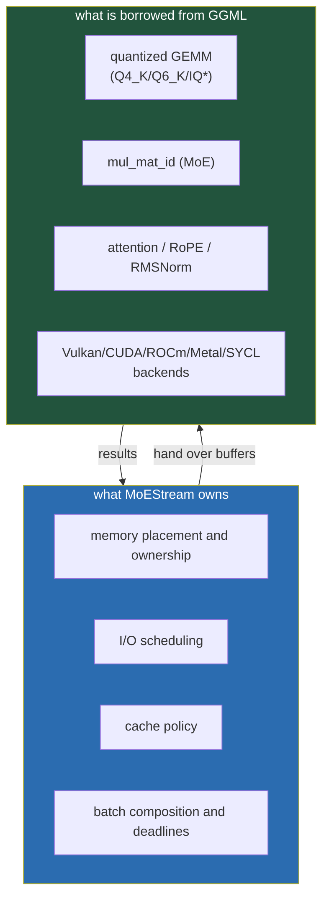
```mermaid
graph TB
    subgraph MS["what MoEStream owns"]
        A["memory placement and ownership"]
        B["I/O scheduling"]
        C["cache policy"]
        D["batch composition and deadlines"]
    end
    subgraph GG["what is borrowed from GGML"]
        E["quantized GEMM<br/>(Q4_K/Q6_K/IQ*)"]
        F["mul_mat_id (MoE)"]
        G["attention / RoPE / RMSNorm"]
        H["Vulkan/CUDA/ROCm/Metal/SYCL<br/>backends"]
    end
    MS -->|"hand over buffers"| GG
    GG -->|"results"| MS
    style MS fill:#2b6cb0,color:#fff
    style GG fill:#22543d,color:#fff
```

Why GGML:
- its Vulkan backend is mature with a track record on integrated GPUs
  (RADV/ANV) — exactly the primary target
- quantization kernels for Q4_K/Q6_K/IQ families exist on every backend
- `mul_mat_id` already exists and **can be used unmodified via the Slot Table +
  ID Remap (§10.4)**
- MIT licensed, compatible with MoEStream's own MIT

**Risk and mitigation**: GGML's API moves with llama.cpp's internal evolution.
→ Interpose one thin wrapper in a `moestream-ggml` crate and pin the version by
vendoring. Keeping up is planned quarterly work (§32.4).

### 14.2 The abstract interface

```mermaid
classDiagram
    class GpuBackend {
        <<interface>>
        +device_info() DeviceInfo
        +alloc_device(size, usage) DeviceBuffer
        +import_host_ptr(ptr, size) Option~DeviceBuffer~
        +upload_async(dst, src, stream) TransferToken
        +is_transfer_done(token) bool
        +submit_graph(graph, deps) SubmitToken
        +wait(token, timeout) Result
        +memory_type() MemoryTopology
    }
    class MemoryTopology {
        <<enumeration>>
        UNIFIED
        DISCRETE
        DISCRETE_RESIZABLE_BAR
    }
    class DeviceInfo {
        +name: String
        +vram_total: u64
        +vram_free: u64
        +supports_host_ptr_import: bool
        +transfer_queue_count: u8
        +measured_h2d_bw: f64
    }
    GpuBackend <|.. VulkanBackend
    GpuBackend <|.. CudaBackend
    GpuBackend <|.. RocmBackend
    GpuBackend <|.. MetalBackend
    GpuBackend <|.. CpuBackend
    GpuBackend --> MemoryTopology
    GpuBackend --> DeviceInfo
```

### 14.3 Three operating modes by memory topology

```mermaid
graph TB
    subgraph UNI["UNIFIED (integrated GPU / Apple / APU) - the primary target"]
        U1["the host arena is read<br/>directly by the GPU"]
        U2["import the host pointer with<br/>VK_EXT_external_memory_host"]
        U3["there is no tier 0<br/>copies = 0"]
        U1 --> U2 --> U3
    end
    subgraph DIS["DISCRETE (discrete GPU, small BAR)"]
        D1["host arena (pinned)"] --> D2["staging ring"] --> D3["VRAM tier 0"]
        D4["whatever does not fit in tier 0<br/>is transferred every step"]
    end
    subgraph BAR["DISCRETE + resizable BAR"]
        B1["host arena"] --> B2["the GPU reads directly<br/>(over BAR)"]
        B3["small experts can skip<br/>the transfer"]
    end
```

### 14.4 Zero-copy on UMA (the most important case)

On integrated GPUs — the primary target — the following makes **SSD → GPU
entirely zero-copy**:

```
1. allocate the host arena with HugePages
2. register it with io_uring via IORING_REGISTER_BUFFERS
   -> NVMe DMAs directly into the arena (zero copies)
3. import the same arena as VkDeviceMemory with
   VK_EXT_external_memory_host
   -> GPU shaders read the arena directly (zero copies)

  NVMe --DMA--> [ host arena ] <--direct read-- integrated GPU shaders
```

**Constraints and mitigations**:
| Constraint | Mitigation |
|---|---|
| `VK_EXT_external_memory_host`'s `minImportedHostPointerAlignment` (typically 4 KiB) | HugePages allocation satisfies it automatically |
| drivers without the extension | fallback: allocate the arena from a `HOST_VISIBLE \| DEVICE_LOCAL` heap and have io_uring write into it (also effectively zero-copy) |
| neither available | fall back to a staging copy path. Warn in the startup log and revise the expected performance downward |

**These three fallback levels are detected automatically at startup and shown by
`moestream doctor`.**

> **Verified on hardware**: `VK_EXT_external_memory_host` support was confirmed
> on a Radeon 780M (RADV PHOENIX / Mesa 25.2.8). Detail in **Appendix E.2**.
> Also, on UMA **the BIOS's UMA carve-out directly squeezes the expert cache
> capacity** — an important factor not covered in this chapter. **See Appendix
> E.3.**

> **[Overturned by finding S7]** Host pointer import turned out to be unusable.
> An imported 498 MiB BO took decode from 53.8 to 1023 ms/token **even when
> never used**, apparently because amdgpu revalidates userptr BOs on every
> command submission. The fix was the second row of the table above — let
> ggml-vulkan allocate normally, which on UMA returns
> `DEVICE_LOCAL|HOST_VISIBLE|HOST_COHERENT` and is both zero-copy and 2.6x
> faster for the GPU to read. ADR-0016 is rejected.

### 14.5 A tier-0 (VRAM) cache on discrete GPUs

Where VRAM is spare, replicate a subset of the host arena into VRAM.

| Decision | Content |
|---|---|
| policy | S3-FIFO **independent** of host tier 1, except that tier 1's PINNED is also prioritised in tier 0 |
| promotion trigger | asynchronously promote the highest `freq_ema` among experts that hit on the host |
| transfer timing | overlapped with compute on a **dedicated transfer queue** (§24) |
| coherence | experts are read-only, so there is no coherence problem. Demotion is simply discarding |
| VRAM budget | `--vram-budget`, defaulting to `vram_free × 0.8 − KV allocation` |

### 14.6 The CPU backend

For environments with no usable GPU, using GGML's CPU backend (AVX2/AVX-512/
NEON). On CPU, `t_c` is larger, which **ironically makes streaming easier** (more
I/O time can be hidden). §33 always includes CPU-only measurements.

### 14.7 Backend selection and automatic diagnosis

```
moestream doctor
--------------------------------------------------------------
GPU        : AMD Radeon 780M (UNIFIED)             OK
Vulkan     : 1.3.280 / RADV                        OK
host ptr   : VK_EXT_external_memory_host           OK  zero-copy possible
Storage    : /dev/nvme0n1 (Samsung 990 PRO)
io_uring   : kernel 6.8 / SQPOLL yes / DEFER_TASKRUN yes  OK
O_DIRECT   : OK  (ext4, alignment 512)
HugePages  : THP=madvise OK / explicit=0 pages  WARN
measured sequential bandwidth : 6.42 GB/s  (QD=64, 2 MiB reads)
measured 4KiB QD1 latency     : 78 us (p50) / 210 us (p99)
--------------------------------------------------------------
estimated performance : 25.8 tok/s (92% of an estimated 28.1 tok/s baseline)
recommended budget    : --mem-budget 10GiB  (expert cache 7.6 GiB / 3,920 slots)
```

`doctor` is **a tool that verifies the design document's theoretical numbers on
real hardware and shows them**. Letting users understand for themselves why they
are getting the performance they are getting builds trust in an open-source
project (P8, §35.5).

---

## 15. Thread model

### 15.1 Threads

```mermaid
graph TB
    subgraph T["MoEStream process"]
        API["(1) API threads (N=cores/4)<br/>async runtime<br/>HTTP/SSE/UDS"]
        SCH["(2) scheduler thread (1)<br/>event loop<br/>batch composition, admission"]
        EXE["(3) execution thread (1)<br/>GGML graph submission<br/>arrival-order dispatch"]
        PLN["(4) prefetch planner (1)<br/>predictor fusion<br/>priority queue"]
        SUB["(5) IO submitter (1)<br/>assemble and submit SQEs"]
        RPR["(6) IO reaper (1)<br/>collect CQEs, transition states"]
        CMP["(7) compute workers (M)<br/>inside GGML (CPU backend)"]
        TEL["(8) telemetry (1)<br/>low priority"]
    end
    API -->|"MPSC: Request"| SCH
    SCH -->|"SPSC: Step"| EXE
    EXE -->|"MPSC: RouterResult"| PLN
    PLN -->|"SPSC: ReadReq batch"| SUB
    RPR -->|"MPSC: Completion"| EXE
    RPR -->|"MPSC: Completion"| PLN
    EXE -->|"SPSC: StepResult"| SCH
    SCH -->|"MPSC: Token"| API
    EXE -.->|"ring buffer"| TEL
    PLN -.->|"ring buffer"| TEL
```

### 15.2 Thread responsibilities and affinity

| # | Thread | Count | Priority | CPU affinity | May block |
|---|---|---|---|---|---|
| 1 | API | cores/4 | normal | free | yes (async) |
| 2 | scheduler | 1 | normal | free | **no** (event loop) |
| 3 | execution | 1 | **high** | pinned to the same NUMA node as GPU/NVMe | **no** (P3) |
| 4 | prefetch planner | 1 | normal | same NUMA node as 3 | no |
| 5 | IO submitter | 1 | high | pinned to NVMe's NUMA node | no |
| 6 | IO reaper | 1 | **high** | pinned to NVMe's NUMA node | no (busy-poll allowed) |
| 7 | compute workers | physical cores − 4 | normal | spread | (managed by GGML) |
| 8 | telemetry | 1 | **low** | free | yes |

**Design decision: one execution thread.** GPU submission is inherently serial,
and submitting from several threads simply takes a lock inside the driver. On the
CPU backend, GGML's internal worker pool provides the parallelism. Throughput
comes from **larger batches**, not more execution threads.

### 15.3 Inter-thread communication

| Path | Mechanism | Reason |
|---|---|---|
| 6 reaper → 3 execution | **lock-free SPSC ring** (bounded, 1024 entries) | the hot path. Must be tens of nanoseconds per completion |
| 3 execution → 4 planner | lock-free MPSC | router result notification. Infrequent (per layer) |
| 4 planner → 5 submitter | SPSC ring plus a batch flag | several SQEs submitted together in one `io_uring_enter` |
| 2 scheduler ↔ others | crossbeam channel (bounded) | the control plane; some cost is acceptable |
| everything → 8 telemetry | **lock-free multi-writer ring**, dropping on overflow | observation must not change behaviour (P8) |

**Not one mutex on the hot path.** Expert state is a CAS on `AtomicU8`, the slot
table is `AtomicU16`, and only the cache's queue operations use sharded spin
locks (16 shards distributed by `ExpertId % 16`, with negligible contention
probability).

### 15.4 Choosing whether to busy-poll for completions

| Mode | Behaviour | When |
|---|---|---|
| `eventfd` wait | the reaper blocks in `io_uring_enter(GETEVENTS)` | default. Does not waste CPU |
| busy-poll | the reaper spins (with `IORING_SETUP_IOPOLL`) | with `--io-busy-poll`. Improves p99 by tens of microseconds but dedicates a core |
| SQPOLL | a kernel thread watches the SQ | with `--io-sqpoll`. Zero syscalls |

**Why eventfd is the default**: the primary target is a small PC (4–8 cores),
where burning a core directly costs GGML compute throughput. `doctor` looks at
the core count and suggests a setting.

### 15.5 NUMA

The primary targets (mini PCs, laptops) are single-node, so this is usually
irrelevant. On workstations and servers:

```
1. read the NVMe device's NUMA node from /sys/block/nvmeXn1/device/numa_node
2. read the GPU's NUMA node
3. if they match  : allocate the arena on that node (mbind MPOL_BIND) and pin 3, 5, 6
4. if they differ : put the arena on the NVMe side (I/O dominates) and accept
                    a PCIe crossing for GPU transfers
5. --numa interleave : an option when large-batch throughput is what matters
```

`--numa auto|bind|interleave|off`, defaulting to `auto`.

### 15.6 Verifying the thread model

```
tests/concurrency/
  |- loom_expert_state.rs      : exhaustive interleaving of the expert state machine under loom
  |- loom_slot_alloc.rs        : ABA problems in slot allocate/free
  |- tsan_e2e.sh               : end-to-end under ThreadSanitizer
  |- stress_cancel.rs          : races between prefetch cancellation and completion
```

**The most dangerous race**: the execution thread acquiring the same expert
between "eviction decided → refcount checked → slot released". It is eliminated
by making the `state` CAS go `RESIDENT → EVICTING` and refusing to acquire an
expert in `EVICTING`. Verified exhaustively under loom.

---

## 16. Scheduler

### 16.1 Responsibility

The scheduler decides only what goes into the next step. MoEStream's specific
constraint is the **I/O budget**.

```mermaid
graph TB
    W["waiting queue<br/>(new requests)"] --> AD{"admission<br/>control"}
    AD -->|"memory and I/O budget OK"| R["running set"]
    AD -->|"insufficient budget"| Q["queued (429 / wait)"]
    R --> SEL["compose a step<br/>(select a batch)"]
    SEL --> BUD{"I/O budget<br/>check"}
    BUD -->|"exceeded"| TRIM["shrink the prefill chunk<br/>or drop a session"]
    TRIM --> SEL
    BUD -->|"OK"| EXE["to execution"]
    EXE --> R
    R -->|"EOS / max_tokens"| FIN["complete"]
```

### 16.2 Continuous batching

Batches are recomposed per step, as in vLLM/SGLang, with two MoEStream-specific
additions:

| Addition | Content |
|---|---|
| **I/O budget constraint** | when composing a batch, estimate the size of the expert union it will need and cap it at the step's I/O budget |
| **expert affinity** | preferentially batch sessions with similar expert profiles (§26.4) |

### 16.3 A step's I/O budget

```
I/O budget per step B_step = BW_effective x t_target_step

t_target_step = target inter-token latency (say 48 ms)
BW_effective  = doctor's measured value x 0.85 (safety factor)

estimated I/O needed:
  E_union(batch) = sum_L | union_{s in batch} topk(s, L) \ resident |
  which cannot be known exactly before decode, so it is approximated
  from the previous step's measurement plus an estimate for the prefill chunk
```

**Deciding the prefill chunk size dynamically**:

```
A prefill chunk of c tokens touches nearly every expert.
d(c) saturates toward 256 by around c >= 64, so one sweep reads
"256 experts per layer" = 486 MiB/layer x 40 = 19 GiB.

Therefore:
  for prefill, a larger chunk means less I/O per token
  -> make the chunk as large as the I/O budget allows (the opposite of decode)

  But a larger chunk delays decode interleaving and degrades other sessions'
  TBT (time between tokens).

Decision rule:
  chunk = clamp( B_step_remaining / bytes_per_prefill_token,  256,  2048 )
  and halve it when any decode session is running (fairness)
```

### 16.4 Separating prefill from decode

```mermaid
stateDiagram-v2
    [*] --> Mixed
    Mixed: MIXED mode<br/>prefill chunks and decode share a step
    Mixed --> Isolated: decode sessions >= 2<br/>and TBT p99 degradation detected
    Isolated: ISOLATED mode<br/>alternating prefill-only and decode-only steps<br/>(prefill:decode = 1:K)
    Isolated --> Mixed: load falls
```

**The MoEStream-specific reason**: the prefill sweep bypasses the expert cache
and generates a large amount of I/O, consuming the I/O budget of any decode in
the same step. Separating them protects decode's TBT (PR-5).

### 16.5 Admission control

Conditions for accepting a new request:

```
* memory for KV/state can be allocated
    needed = GDN state 60 MiB + KV(estimated max_tokens)
* the expert cache does not fall below S_min
* current I/O utilisation < 85%
* running sessions < --max-sessions

if any fails ->
  high-priority request: preempt an existing low-priority session (swap its KV to SSD)
  otherwise: queue (up to --queue-timeout), then 503 + Retry-After
```

### 16.6 Deadlines and preemption

Each step has a target completion time. The escalation on overrun:

```mermaid
graph TB
    D["deadline overrun detected"] --> L1["level 1: reduce prefetch depth<br/>(stop speculative I/O, give bandwidth to demand)"]
    L1 --> L2["level 2: shrink the batch<br/>(from the next step)"]
    L2 --> L3["level 3: in soft mode,<br/>skip low-weight experts"]
    L3 --> L4["level 4: stop admitting new requests"]
    L4 --> L5["level 5: preempt low-priority sessions"]
```

**Level 1 matters most**: speculative prefetch competes with demand fetch for
bandwidth. When latency is slipping, stopping speculation is the right move.
Doing that automatically is what the interaction with `IoGovernor` (§13.5) is
for.

### 16.7 Scheduling policies

| Policy | Behaviour | Use |
|---|---|---|
| `fcfs` | arrival order | default. Predictable |
| `fair` | equalise generated tokens across sessions | default for multi-agent |
| `priority` | the priority class given through the API | interactive UI > background agents |
| `affinity` | group by expert profile similarity | when minimising I/O matters (§26.4) |

---

## 17. Memory layout

### 17.1 Budget allocation (`--mem-budget 10GiB`, Qwen3.6-35B-A3B Q4_K_M)

| Category | Size | Note |
|---|---:|---|
| **RESIDENT weights** | | |
| - attention (10 layers) + GatedDeltaNet (30 layers) | 470 MiB | Q5_K/Q6_K |
| - LM head (output.weight) | 636 MiB | Q6_K, 248,320 × 2048 |
| - shared experts (40 × 1) | 76 MiB | PINNED |
| - router + norms | 42 MiB | kept FP16 (precision matters) |
| - **subtotal** | **1,224 MiB** | |
| **expert cache (variable)** | **7,600 MiB** | 3,908 slots of 10,240 (38.2%) |
| **KV / state** | | |
| - paged KV (4 sessions × 8K, Q8, 10 layers) | 320 MiB | 10 KiB/token |
| - GDN recurrent state (4 sessions × 30 layers × 2 MiB) | 240 MiB | **a fixed cost, independent of context length** |
| - page tables / metadata | 8 MiB | |
| - **subtotal** | **568 MiB** | |
| **run time** | | |
| - activations and scratch (batch 32) | 180 MiB | |
| - GGML graph and context | 40 MiB | |
| - IO staging (GGUF mode only) | 0 MiB | zero-copy with `.msp` |
| - expert metadata (§11.1) | 1 MiB | |
| - calibration statistics, co-activation matrix | 6 MiB | |
| - server, allocator, fragmentation | 220 MiB | |
| - **subtotal** | **447 MiB** | |
| **total** | **9,839 MiB = 9.61 GiB** | 4% of headroom against a 10 GiB budget |

**Against the baseline**: llama.cpp fully resident 21.3 GiB + KV 0.57 + run time
0.45 ≈ **22.3 GiB** → MoEStream **9.61 GiB** = **57% less**. The target
(22 → 10 GB) is met.

> **An important caveat on UMA (integrated GPU)**: the table assumes "RAM as the
> OS sees it". On UMA machines the BIOS's fixed carve-out for the integrated GPU
> is subtracted from OS-visible RAM, so less is actually available. One measured
> case had 8 GiB carved out. **See Appendices E.3 / E.4.**

### 17.2 Arena layout

```
+----------------------------------------------------------------+
| Host arena (HugePages 2 MiB, a single contiguous mmap)          |
+----------------------------------------------------------------+
| [0]      RESIDENT weights              1,224 MiB   read-only    |
|          |- attn/gdn weights                                    |
|          |- lm_head                                             |
|          |- shared experts (PINNED)                             |
|          |- router / norms                                      |
+----------------------------------------------------------------+
| [1]      gate_slab      S x 576 KiB    2,198 MiB   <- io_uring   |
| [2]      up_slab        S x 576 KiB    2,198 MiB   <- registered |
| [3]      down_slab      S x 840 KiB    3,204 MiB   <- (direct DMA)|
+----------------------------------------------------------------+
| [4]      KV page pool                  320 MiB     block alloc  |
| [5]      GDN state pool                240 MiB     fixed per session |
+----------------------------------------------------------------+
| [6]      activations / scratch         180 MiB     reused per step |
| [7]      metadata / statistics           7 MiB                  |
+----------------------------------------------------------------+
   ^ [1][2][3] are what IORING_REGISTER_BUFFERS covers
   ^ the whole arena is what VK_EXT_external_memory_host imports (on UMA)
```

**Why a single contiguous mmap**:
- io_uring buffer registration happens once (registration is expensive)
- Vulkan host pointer import happens once
- exceeding the budget becomes structurally impossible (allocation fails past
  the arena)
- measuring RSS becomes trivial

### 17.3 HugePages strategy

| Method | Advantage | Adopted |
|---|---|---|
| explicit HugePages (`MAP_HUGETLB`) | guaranteed 2 MiB pages, never swapped | ⚠️ requires pre-reservation (`vm.nr_hugepages`), effectively root. **Contradicts OR-4** |
| THP (`madvise(MADV_HUGEPAGE)`) | no privileges, automatic | ✅ **default** |
| 4 KiB pages | always works | fallback |

**Why HugePages help**: one expert at 1,992 KiB is 498 pages at 4 KiB. GEMM
sweeps all of it, causing TLB misses. At 2 MiB, one expert fits in roughly one
page and TLB pressure falls by a factor of 500. A 3–8% throughput difference is
expected (verified in §33).

Whether to round `slot_size` up to 2 MiB or pack it at 1,992 KiB is a trade-off:
- rounding to 2 MiB: 0.4% memory lost, maximum TLB efficiency, simpler address
  arithmetic
- **Decision: round up to 2 MiB.** 0.4% is noise, and the TLB and alignment gains
  outweigh it.

### 17.4 ROW_LOOKUP: streaming the embedding

```
input embedding (248,320 x 2048, Q4_K) = 546 MiB

rows needed per step = batch tokens (typically 1-32)
one row = 2048 weights = 8 superblocks x 144 B = 1,152 B

how it is read:
  offset of row r = base + r x 1,152
  -> round down to a 4 KiB boundary and read 8 KiB (covers a row crossing a boundary)
  -> a batch of 32 is 32 SQEs, 256 KiB total
  -> 0.09% of a step's I/O budget (288 MB). Negligible

Additionally: keep recently used embedding rows in a small LRU (1,024 rows = 1.1 MiB)
  -> in conversation the same tokens recur, so the hit rate is high
```

**546 MiB replaced by 1.1 MiB.** Applies to large-vocabulary models generally.

### 17.5 Eliminating fragmentation

| Region | Fragmentation risk | Mitigation |
|---|---|---|
| expert slab | none | fixed-size slots plus a free list |
| KV pages | none | fixed-size blocks (PagedAttention style, 16 tokens/block) |
| GDN state | none | fixed size per session (2 MiB × 30 layers) |
| activations | low | reset per step with a bump allocator |
| metadata / strings | low | an ordinary allocator, but small and outside the budget |

**Every large region is fixed-size blocks**, which is what guarantees RSS
stability in a long-running daemon. CI verifies that RSS does not increase
monotonically over a 72-hour soak test (§33.7).

---

## 18. SSD layout

### 18.1 The `.msp` (MoEStream Pack) container format

```
+-----------------------------------------------------------------+
| HEADER (4 KiB)                                                  |
|   magic "MSPK", format_version, flags                           |
|   model_uuid, source_gguf_sha256                                |
|   section_table_offset, section_count                           |
|   alignment (default 4096), expert_record_align (default 2 MiB) |
+-----------------------------------------------------------------+
| SECTION TABLE                                                   |
|   [0] MANIFEST      (JSON: model shape, spec reference)         |
|   [1] DENSE         (tensors in the RESIDENT class)             |
|   [2] EMBED         (the ROW_LOOKUP class, row aligned)         |
|   [3] EXPERT_INDEX  (10,240 entries)                            |
|   [4] EXPERT_DATA   (the data, laid out by popularity)          |
|   [5] CALIB         (calibration statistics, co-activation, hot set) |
|   [6] PREDICTOR     (trained predictor weights, optional)       |
|   [7] CHECKSUM      (per-expert CRC32C / BLAKE3)                |
+-----------------------------------------------------------------+
| ... the sections themselves ...                                 |
+-----------------------------------------------------------------+
```

### 18.2 An EXPERT_INDEX entry (32 B per expert)

| Field | Type | Description |
|---|---|---|
| `offset` | u64 | absolute offset within EXPERT_DATA (2 MiB aligned) |
| `len` | u32 | record length |
| `member_len[3]` | u32×3 | lengths of gate/up/down (used directly as readv iovec lengths) |
| `tier` | u8 | precision tier (0=primary, 1=low-precision substitute) |
| `layer` | u16 | redundant, for verification |
| `expert` | u16 | likewise |
| `popularity_rank` | u16 | rank from calibration |
| `_pad` | — | padded to 32 B |

**10,240 × 32 B = 320 KiB, read entirely at startup.** No hashing; a dense
array.

### 18.3 Physical layout of EXPERT_DATA

```
order = ascending popularity_rank (when calibration data exists)

+--------------------------------------------------------+
| rank 0..511     : hottest (PINNED candidates)           |  <- clustered
| rank 512..2047  : hot                                   |     physically
| rank 2048..6143 : middling                              |     at the front
| rank 6144..10239: cold                                  |
+--------------------------------------------------------+
```

**Why order by popularity**:
1. **it suits SSD readahead and internal prefetch** — hot experts being
   physically close makes the SSD's internal channel/plane parallelism work
   better.
2. **startup warm-up becomes a sequential read** — loading the hot set becomes
   **fully sequential (≈7 GB/s)** rather than random 2 MiB reads (≈4 GB/s).
   Warming 7.6 GiB drops from 1.9 s to 1.1 s.
3. **less filesystem extent fragmentation**.

**Why not block by layer**: the prefill sweep (§20.2) walks every expert layer
by layer, which makes layer clustering look better. But prefill reads everything,
so order is irrelevant (either way it is a 19 GiB sequential read). For decode's
hot-set reads, popularity order is clearly better. So **popularity order wins**.

> **Considered and rejected**: a two-dimensional Z-order layout of
> "layer × popularity". The gain is hard to measure and packing gets more
> complex. §33 compares them simply and adopts it if the difference is
> significant (tracked in ADR-0011).

### 18.4 Alignment

| Boundary | Value | Reason |
|---|---|---|
| expert record start | **2 MiB** | matches the HugePage boundary and avoids straddling the NVMe's internal indirection unit |
| each member (gate/up/down) | **4 KiB** | the minimum requirement for O_DIRECT. Padded when packing |
| section | 4 KiB | |
| EMBED rows | packed (1,152 B) | absorbed by an 8 KiB read, so no alignment needed |

Qwen3.6's actual values:
```
gate: 589,824 B = 144 x 4 KiB   * no padding
up  : 589,824 B = 144 x 4 KiB   * no padding
down: 860,160 B = 210 x 4 KiB   * no padding (Q6_K)
--------------------------------
total 2,039,808 B = 498 x 4 KiB
rounded up to 2 MiB (2,097,152 B) -> 57,344 B of padding (2.7%)

total on disk = 10,240 x 2 MiB = 20.0 GiB
(19.45 GiB without padding; 0.55 GiB = 2.7% more)
```

**2.7% more disk buys HugePage alignment, IU alignment and simpler address
arithmetic.** Disable with `--pack-align 4096` when capacity matters more.

> **[Overturned by finding S2]** The bandwidth argument does not hold. The
> read-around overhead of reading GGUF directly is only 0.27%, and the bandwidth
> difference is +0.1% — within noise. `.msp`'s other advantages (one readv per
> expert, zero-copy) remain valid; the alignment-for-bandwidth claim is dropped.

### 18.5 Holding several models

```
~/.cache/moestream/
  models/
    qwen3.6-35b-a3b-q4km-<uuid>.msp        20.0 GiB
    glm-4.5-air-q4km-<uuid>.msp            58.2 GiB
    index.json                              (uuid <-> path <-> metadata)
  calib/
    <uuid>-global.calib
    <uuid>-domain-code.calib
```

When several models are held in one process, **the expert cache is allocated as
an independent arena segment per model** (slot sizes differ, so they cannot be
shared). The Memory Governor manages the budget between them (§31.4).

### 18.6 Precision tiers (an optional feature)

Based on calibrated popularity, **additionally store cold experts at lower
precision**.

```
tier 0 (primary)     : every expert at Q4_K_M        20.0 GiB
tier 1 (substitute)  : experts with rank >= 4096 at Q2_K   6,144 x 1.0 MiB = 6.0 GiB
```

| Effect | Explanation |
|---|---|
| **lower miss cost** | on a cold expert miss, reading tier 1 halves the I/O |
| **small quality impact** | degrading rarely used experts contributes little to the output overall |
| **`turbo` mode only** | unused in `strict`/`soft` (protecting QR-1) |
| cost | +6 GiB of disk, and a separate slab per tier (the constraint in §10.4) |

**Decision: an optional feature for v1.1.** The default is decided after
measuring the effect in §33.6. In theory it amounts to "30–40% fewer miss bytes
= 1.5x effective bandwidth", which could rescue slow-SSD environments (the
3.5 GB/s row of PR-1).

### 18.7 Choosing a filesystem

| FS | Assessment |
|---|---|
| **ext4** | ✅ recommended. Straightforward O_DIRECT, low extent fragmentation |
| **XFS** | ✅ recommended. Strong on large files and parallel I/O |
| Btrfs (CoW on) | ⚠️ fragments easily. Disabling CoW with `chattr +C` is recommended (attempted automatically at pack time) |
| ZFS | ⚠️ its ARC consumes RAM separately from page cache. `primarycache=metadata` recommended |
| overlayfs (containers) | ⚠️ O_DIRECT may not work. A volume mount is recommended for `.msp` |
| LUKS encryption | ⚠️ CPU cost can lower bandwidth by 20–40%. Detected and warned about by `doctor` |

`moestream doctor` detects these and suggests remedies.

---

## 19. Metadata

### 19.1 Three layers of metadata

```mermaid
graph TB
    A["(1) model spec (TOML)<br/>rules for an architecture family<br/>shipped in the repo, written by hand"]
    B["(2) model manifest (JSON inside .msp)<br/>one model's shape and tensor layout<br/>generated by pack"]
    C["(3) calibration profile (.calib)<br/>expert statistics, co-activation, hot set<br/>generated by calibrate, updated over time"]
    A --> B --> C
    D["(4) runtime profile (~/.cache)<br/>measured bandwidth and optimal QD on this machine<br/>updated by doctor and at run time"]
    C --> D
```

### 19.2 The model manifest (excerpt)

```json
{
  "manifest_version": 1,
  "model_uuid": "018f2c...",
  "spec": { "family": "qwen3.6-moe", "spec_version": 1 },
  "source": {
    "gguf_sha256": "9a3f...",
    "gguf_arch": "qwen3next",
    "quantization": "Q4_K_M"
  },
  "shape": {
    "n_layer": 40, "n_embd": 2048, "n_vocab": 248320,
    "n_head": 16, "n_head_kv": 2, "head_dim": 256,
    "n_expert": 256, "n_expert_used": 8, "n_expert_shared": 1,
    "n_ff_exp": 512,
    "layer_types": ["linear_attn","linear_attn","linear_attn","full_attn", "..."],
    "linear_attn": { "n_v_head": 32, "n_k_head": 16, "k_dim": 128, "v_dim": 128, "conv_k": 4 }
  },
  "residency": {
    "resident_bytes": 1283457024,
    "streamed_bytes": 20883701760,
    "row_lookup_bytes": 572522496
  },
  "expert_object": {
    "count": 10240,
    "record_bytes": 2097152,
    "member_bytes": [589824, 589824, 860160],
    "member_types": ["Q4_K", "Q4_K", "Q6_K"]
  },
  "derived": {
    "active_expert_bytes_per_token": 652738560,
    "estimated_regime": "B",
    "required_hit_rate_at_6GBps_for_20pct": 0.559
  }
}
```

**The `derived` section matters**: baking §2's analytical results into the
manifest makes it possible to decide immediately at startup whether a model
suits this runtime. If `estimated_regime == "A"`, warn at startup:

```
!  This model has active expert bytes/token = 11.2 GB, placing it in regime A.
   That is outside MoEStream's design premise (that I/O can be hidden behind
   compute), and the expected speed is around 0.5 tok/s.
   For 700B-class models we recommend Colibri
   (https://github.com/JustVugg/colibri).
   Pass --allow-regime-a to continue.
```

**Directing users correctly to other projects** is done at the implementation
level (§3.4, P8).

### 19.3 The calibration profile

```
CALIB section:
  |- header: corpus_id, token_count, timestamp, domain_tag
  |- freq[10240]         : u32   activation counts          40 KiB
  |- weight_mass[10240]  : f32   accumulated router weight  40 KiB
  |- seq_entropy[40]     : f32   routing dispersion by layer 160 B
  |- hot_set[]           : u16   the recommended PINNED list
  |- coact[40]           : co-activation per layer (sparse form)
        the top 16 co-activation partners for each expert
        10240 x 16 x (u16 + u16) = 640 KiB
```

**Sparse co-activation**: a dense matrix is 256² × 40 × 4 B = 10.5 MiB, but
keeping only the top 16 partners is 640 KiB. The top entries are enough for
prefetching (§22.4).

**Bundling several domains**:
```
moestream calibrate model.msp --corpus code.txt      --tag code
moestream calibrate model.msp --corpus japanese.txt  --tag ja
moestream calibrate model.msp --corpus general.txt   --tag general
-> three CALIB sections stored in the .msp, selected at startup with --calib-tag
-> or selected automatically from the session's profile at run time (v1.2)
```

### 19.4 The runtime profile (calibrated on the machine)

```
~/.cache/moestream/runtime-<machine-id>.json
{
  "storage": {
    "device": "nvme0n1",
    "seq_read_bw": 6.42e9,
    "rand_2mib_bw": 5.81e9,
    "lat_p50_us": 78, "lat_p99_us": 210,
    "optimal_qd": 48,
    "supports_odirect": true
  },
  "gpu": { "h2d_bw": 12.1e9, "topology": "UNIFIED", "host_ptr_import": true },
  "compute": { "baseline_tok_s_est": 28.1, "prefill_tok_s_est": 940 },
  "measured_at": "2026-08-02T10:00:00Z"
}
```

This speeds up subsequent startups and lets §16.3's I/O budget calculation use
measured values.

### 19.5 Versioning and compatibility

| Subject | Scheme | On incompatibility |
|---|---|---|
| `.msp` format_version | an integer; the runtime declares a supported range | a clear error plus instructions to re-pack |
| model spec spec_version | an integer | older specs remain readable (forward compatibility maintained) |
| calibration | optional; works without it | starts with no PINNED set |
| predictor weights | optional | falls back to heuristic predictors only |

**Principle: calibration data and predictors are always optional.** It works
correctly without them and gets faster with them. That matters for protecting the
"just try running it" experience.

---

## 20. Inference sequence

### 20.1 Startup

```mermaid
sequenceDiagram
    autonumber
    participant U as user
    participant M as main
    participant D as Doctor
    participant G as MemoryGovernor
    participant S as Storage
    participant C as CacheMgr
    participant GB as GpuBackend

    U->>M: moestream serve --model x.msp --mem-budget 10GiB
    M->>S: open(.msp), read HEADER + SECTION TABLE
    M->>M: validate MANIFEST (regime check, §19.2)
    M->>D: get the machine profile (cached or measured)
    D-->>M: bw=6.42GB/s, qd=48, UMA, host_ptr_import=ok
    M->>G: declare a 10GiB budget
    G->>G: compute the allocation (§17.1)
    G->>M: arena size = 9.61GiB
    M->>M: single mmap of the arena with HugePages
    M->>S: IORING_REGISTER_BUFFERS(slab regions)
    M->>GB: import the arena via VK_EXT_external_memory_host
    GB-->>M: zero-copy path established
    M->>S: read the DENSE section into RESIDENT (1.2 GiB, sequential)
    M->>C: read CALIB, decide the hot set
    C->>S: read the hot set sequentially (fast, being laid out by popularity)
    S-->>C: 2,048 experts (4.0 GiB) filled in 0.62 s
    M->>M: start HTTP listening
    M-->>U: ready (2.4 s total)
```

**Target breakdown of startup**: metadata 0.05 s + DENSE 0.2 s + hot set 1.1 s
+ initialisation 0.3 s ≈ **1.7 s**. With `--warm-cache=none` it is ready in
0.6 s (warming on the first request).

### 20.2 Prefill — the "expert sweep" strategy ★

```mermaid
sequenceDiagram
    autonumber
    participant SC as Scheduler
    participant EX as Execution
    participant EM as ExpertMgr
    participant IO as Storage
    participant C as CacheMgr

    Note over SC: a 2,048-token prompt<br/>chunk = 2,048 (one chunk)
    SC->>EX: prefill step (2048 tok)

    loop layer L = 0..39
        EX->>EX: mixer (GQA/GDN) -> router
        EX->>EM: layer L needs all 256 experts (union ~= 256 at 2048 tok)
        Note over EM,IO: * not a demand fetch, but<br/>"sweep layer L's EXPERT_DATA sequentially"
        EM->>IO: readv layer L's 256 records in order (a sequential pattern)
        IO-->>EM: completing in arrival order
        EM->>EX: arrival-order dispatch (§11.5)
        EX->>EX: grouped GEMM over the tokens assigned to expert e
        EM->>C: * do not admit (bypass, §12.4)<br/>but record freq statistics
        Note over EM: a small ring buffer for the sweep<br/>(64 slots = 128 MiB), cycled
    end

    EX-->>SC: prefill complete, logits
    Note over C: build this session's expert profile<br/>from the recorded freq<br/>-> rebuild the hot set for decode
```

**Why this strategy is better**:

| Aspect | demand fetch | **expert sweep** |
|---|---|---|
| I/O pattern | random 2 MiB | **fully sequential** |
| effective bandwidth | ≈5.8 GB/s | **≈7.0 GB/s** (+20%) |
| cache pollution | total loss | **none** (bypassed) |
| buffer needed | the whole expert cache | **a 128 MiB ring** |
| total I/O | 20 GiB | 20 GiB (the same) |
| time | 3.4 s | **2.9 s** |

**And prefill has the side effect of warming the cache for decode.** The
"expert frequencies actually used in this session" recorded during prefill are
the best predictive information available at the start of decode (the equivalent
of MoE-Infinity's EAM). The hot set is rebuilt from it when prefill ends.

**For short prompts**: if `union(topk) < 256`, an ordinary demand fetch is
better. Threshold: switch modes below `prompt_tokens < 64` (where the union is
under about 200).

### 20.3 Decode (steady state)

```mermaid
sequenceDiagram
    autonumber
    participant EX as Execution
    participant PF as PrefetchEngine
    participant EM as ExpertMgr
    participant IO as Storage

    Note over EX,IO: the pipeline for layers L-4 to L+4 runs continuously

    EX->>EX: layer L: run the mixer (0.4 ms)
    EX->>EX: layer L: router GEMM (0.02 ms)
    EX->>PF: * notify the confirmed ids[8] immediately (P0)
    PF->>PF: predictor fusion: update candidates for layers L+1..L+4
    PF->>IO: submit prioritised ReadReqs in a batch

    EX->>EM: acquire(L, ids[8])
    EM-->>EX: 6 hits / 2 misses (75% hit rate)
    EM->>IO: submit 2 as URGENT (inserted at the queue head)

    EX->>EX: run the shared expert (0.05 ms) <- also used to hide I/O
    EX->>EX: GEMM the 6 hits (0.42 ms)
    IO-->>EM: CQEs for the 2 misses (0.33 ms later)
    EM-->>EX: ready
    EX->>EX: GEMM the remaining 2 (0.14 ms)
    EX->>EX: fixed-order reduce + residual add

    Note over EX: layer L measured at 1.03 ms<br/>(theoretical floor 1.00 ms, 0.03 ms of stall)
    EX->>EX: on to layer L+1
```

**Timing analysis (per layer)**:
```
compute       : 1.00 ms  (mixer 0.40 + router 0.02 + shared 0.05 + expert GEMM 0.53)
miss I/O      : 2 x 1.992 MiB / 6.0 GB/s = 0.66 ms
               ^ but URGENT is submitted right after the router, 0.60 ms of compute earlier
effective stall: 0.66 - 0.60 = 0.06 ms  (zero if prefetch hits)
```

**If prefetching works four layers ahead, a miss was already submitted 4 ms
earlier and the stall is zero.** That is §22's design goal.

### 20.4 A multi-session step

```mermaid
sequenceDiagram
    autonumber
    participant S1 as session 1
    participant S2 as session 2
    participant S3 as session 3
    participant SC as Scheduler
    participant EX as Execution

    S1->>SC: decode request (ready)
    S2->>SC: decode request (ready)
    S3->>SC: prefill 1,024 tok (ready)
    SC->>SC: compute the I/O budget: 2 decode tokens + a prefill chunk
    SC->>SC: prefill would eat the budget, so shrink the chunk to 512
    SC->>EX: Step(batch = [s1:1, s2:1, s3:512])
    loop layers 0..39
        EX->>EX: concatenate all three sessions' tokens through the mixer
        EX->>EX: router -> union of experts
        Note over EX: s1,s2 give 8+8 -> union 14 (2 shared)<br/>s3 at 512 tok gives a union of ~250<br/>total union ~= 252
        EX->>EX: grouped GEMM per expert<br/>(all tokens that chose it, together)
    end
    EX-->>SC: s1 token, s2 token, s3 prefill progress
    SC->>S1: SSE chunk
    SC->>S2: SSE chunk
```

**Observation**: mixing in prefill makes the union jump. That is why §16.4
provides an ISOLATED mode.

### 20.5 The detailed flow on a cache miss

```mermaid
stateDiagram-v2
    [*] --> Acquire
    Acquire: acquire(layer, expert)
    Acquire --> Hit: state == RESIDENT_*
    Acquire --> InFlight: state == IN_FLIGHT<br/>(being prefetched)
    Acquire --> Miss: state == EVICTED

    Hit --> Done: refcount++ -> ready to run

    InFlight --> Promote: raise priority to URGENT<br/>(already submitted, so only the queue order changes)
    Promote --> WaitCq

    Miss --> Alloc: reserve a slot
    Alloc --> NoSlot: none free
    NoSlot --> Evict: run eviction
    Evict --> Alloc
    NoSlot --> Blocked: eviction impossible<br/>(all refcount>0)
    Blocked --> Alloc: waiting for another expert to be released<br/>* a design-level alert
    Alloc --> SubmitUrgent: submit an URGENT readv
    SubmitUrgent --> WaitCq

    WaitCq: waiting for the CQE<br/>(during other experts' GEMMs)
    WaitCq --> Done: complete
    WaitCq --> Deadline: deadline exceeded
    Deadline --> Skip: soft/turbo and w_i < tau
    Deadline --> WaitCq: strict (keep waiting)
    Skip --> Done: renormalise and continue

    Done --> [*]
```

---

## 21. Cache strategy

### 21.1 The scoring function

Used to select eviction candidates in the DYNAMIC segment. S3-FIFO's base
behaviour plus MoE-specific corrections.

```
score(e) = freq_ema(e) x w_bar(e) x affinity(e) / age_penalty(e)

freq_ema(e)   : exponentially-weighted activation frequency (half-life 2,048 steps)
w_bar(e)      : mean past router weight (important experts also carry weight)
affinity(e)   : probability of appearing in the profiles of currently
                active sessions (§26.4)
age_penalty(e): 1 + log2(1 + steps_since_last_use / 256)
```

**Why include `w_bar(e)`**: at the same frequency, an expert chosen with a
router weight of 0.35 is worth more to cache than one chosen at 0.02. The latter
can be skipped in `soft` mode even on a miss. The formulation is
**"cache value = usage frequency × contribution to the output"**.

### 21.2 Summary of the policy hierarchy

```mermaid
graph TB
    R["expert referenced"] --> P{"PINNED?"}
    P -->|yes| H1["immediate hit, update statistics only"]
    P -->|no| D{"in DYNAMIC?"}
    D -->|"in SMALL"| PR["freq++ -> promote to MAIN<br/>(the second reference)"]
    D -->|"in MAIN"| H2["hit, update freq_ema"]
    D -->|"in GHOST"| G["* insert straight into MAIN<br/>(having been there is evidence of value)<br/>+ a layer quota adjustment signal"]
    D -->|"absent"| M["miss -> fetch"]
    M --> AD{"admission<br/>decision (§12.4)"}
    AD -->|"demand / high-confidence prefetch"| S["head of SMALL"]
    AD -->|"low-confidence prefetch"| S2["tail of SMALL"]
    AD -->|"prefill sweep"| BY["bypass (not admitted)"]
```

### 21.3 Rebuilding the hot set dynamically

The PINNED set is not static; it is rebuilt on these triggers:

| Trigger | Action |
|---|---|
| startup | built from the `.msp`'s CALIB (the selected domain) |
| **prefill completion** | reflect that session's expert profile (§20.2) |
| periodically (every 8,192 steps) | replace by measured `freq_ema` rank, swapping at most 5% at a time (to prevent oscillation) |
| session end | decay that session's contribution |
| detected domain change | rebuild when the distribution's KL divergence exceeds a threshold |

**Preventing thrashing**: PINNED replacement has hysteresis. A swap happens only
when "an expert not currently PINNED exceeds the bottom 10% of PINNED by **1.5x
or more**".

### 21.4 Why this composition — summarising the decisions

| Decision | Choice | Rejected alternatives | Reason |
|---|---|---|---|
| cache granularity | **the expert (1.99 MiB)** | layer / tensor / page | a layer is too coarse (486 MiB), a tensor means 3x the I/O, a page is not a semantic unit |
| replacement algorithm | **S3-FIFO + PINNED** | LRU / ARC / W-TinyLFU alone | scan resistance, low lock contention, implementation simplicity |
| frequency tracking | **exact counters (arrays)** | Count-Min Sketch | with 10,240 entries exact is feasible, so there is no reason to introduce approximation error |
| admission | **differentiated by source** | admit everything | prevents the total loss caused by the prefill sweep |
| per-layer allocation | **adaptive, via ghosts** | even / static profile | measuring marginal utility and allocating accordingly is theoretically sounder and cheap to implement |
| persisting statistics | **saved in `.calib`** | memory only | losing warm-up time on every restart is a serious UX problem |

### 21.5 A theoretical estimate of hit rate

Without calibration data at the time of writing, an estimate assuming a Zipf
distribution (replacing it with measurement is §33.4's purpose).

```
Under a Zipf distribution with parameter s, caching the top f fraction gives
  h(f) ~= f^(1-s) / 1     (for s < 1, ignoring the normalisation constant)

cache ratio f = 3,908/10,240 = 38.2%

s = 0.3 (weak skew, load-balancing loss dominant) -> h ~= 51%
s = 0.5 (moderate)                               -> h ~= 62%
s = 0.7 (strong, sequence locality dominant)     -> h ~= 74%
s = 0.9 (very strong)                            -> h ~= 87%
```

The required hit rate from §2.3 is **55.9%** (6 GB/s, 20% slowdown), so the
target is met **if `s ≳ 0.45`**.

> ### ★ This model was rejected by measurement (finding M0-2)
>
> The Zipf approximation above **ignores temporal locality entirely and is far
> too pessimistic.**
>
> | | Zipf model's prediction | **measured (LRU)** |
> |---|---:|---:|
> | en (s=0.283) | ≈ 51% | **90.2%** |
> | ja (s=0.340) | ≈ 55% | **91.5%** |
> | code (s=0.473) | ≈ 63% | **88.7%** |
>
> **Do not predict an MRC from a static frequency distribution.** Use a measured
> MRC. This section is kept as a historical record of early-stage orientation.

---

---

## 22. Prefetch strategy

> **[Overturned by findings N2/N3/S11]** Every predictor described in this
> chapter was implemented and measured, and all were net-negative. P1 never
> issues anything (what it predicts is already cached), P2 reaches 81.4%
> accuracy but the synchronization needed to fetch its inputs costs more than
> the I/O it hides, and P5 carries no information at all on some models. See
> `RESULTS.md` §7 and §10.14. The chapter is kept as a record of the reasoning.

### 22.1 Overview

```mermaid
graph TB
    subgraph PRED["predictors (running in parallel)"]
        P0["P0: certain<br/>this layer's router output<br/>100% confidence"]
        P1["P1: temporal locality<br/>the previous token's experts in this layer<br/>40-70%"]
        P2["P2: layer lookahead<br/>apply layer L+d's router<br/>to the current residual<br/>50-85%"]
        P3["P3: learned predictor<br/>a small MLP head<br/>70-90% (hoped)"]
        P4["P4: session profile<br/>frequency distribution from prefill and history<br/>(a prior)"]
        P5["P5: co-activation<br/>the co-activation partners<br/>of the chosen experts"]
    end
    P0 --> F["fusion<br/>score = sum w_i * p_i(e)"]
    P1 --> F
    P2 --> F
    P3 --> F
    P4 --> F
    P5 --> F
    F --> PQ["priority queue<br/>(bucketed by layer x prediction time)"]
    PQ --> BG["bandwidth governor<br/>(§22.8)"]
    BG --> IO["submit to storage"]
    IO -.->|"measured contribution to hits"| LRN["online update<br/>of the weights w_i"]
    LRN -.-> F
```

### 22.2 P0: immediate notification of certain information

The instant layer L's router resolves, those 8 are *certainly* needed. Promote
to URGENT if already IN_FLIGHT; submit immediately if EVICTED.

**Optimising submission timing**: the router GEMM is tiny (2048×256), so
**could the router run during the mixer's computation?** No (the mixer's output
is the router's input). But running the router **immediately after the mixer's
output is available, before the residual add**, submits 0.05–0.1 ms earlier.
Graph construction enforces that order.

### 22.3 P1: temporal locality (reuse from the previous token)

```
prev_experts[L] = the 8 the previous token chose in layer L
-> empirically 40-70% chance of being chosen again for this token

cost  : essentially zero (an array lookup)
effect: can be submitted far earlier than layer L executes (at the previous token)
        = 40 ms of lead time. The "earliest" predictor
```

**The cheapest and earliest predictor**, always enabled as a baseline.

> **[Overturned by finding N2]** It issued nothing. Whatever P1 predicts is by
> definition already in the cache; the actual misses are the 62% newly selected,
> which P1 cannot predict in principle.

### 22.4 P5: the co-activation graph

Use the "top 16 experts likely to be chosen alongside expert e" obtained from
calibration.

```
expert e resolved in layer L (P0) -> same-layer partners are already resolved, so unneeded
                              |
actual use: estimate layer L+1's candidates from layer L's choices
  cross_layer_coact[L->L+1][e] = experts likely to be chosen in L+1
                                 when e was chosen in L
```

**Cross-layer co-activation** is what is genuinely useful. Calibration records
the co-occurrence of `(layer L's choices, layer L+1's choices)` and stores the
top 16 partners. The size is 640 KiB, as in §19.3.

### 22.5 P4: a session expert profile (the EAM equivalent)

```
For each session, maintain a histogram H_s[10240] of expert activations over
the last W tokens (default 512), as u16 = 20 KiB per session

prediction: P4(e) = H_s[e] / sum H_s
use: multiply the other predictors' scores by it, as a prior
```

Implements **MoE-Infinity's Expert Activation Matrix idea** as a per-session,
online-updated version. The profile from prefill (§20.2) is the initial value.

### 22.6 P2 / P3: layer lookahead predictors

**P2 (no parameters)**: apply layer `L+d`'s router weights `W_{L+d}` to layer
L's hidden state `h_L` and take the top-k.

```
pred_{L+d} = topk( sigma( W_{L+d} · h_L ) )
```

A Transformer's residual stream changes only gradually across layers, so this
works for small `d` (a technique demonstrated in Mixtral-offloading). Cost:
`2048 × 256 × 4 layers = 2.1 M MAC` — negligible.

**P3 (learned)**: a small MLP predicting layer `L+d`'s expert set from `h_L`.

```
predictor_{d}: h_L (2048) -> hidden (256) -> logits (256)
parameters: 2048x256 + 256x256 = 590 K x 4 layers x 40 = 94 M ... far too large

improved: share across layers, add a layer embedding
predictor: [h_L (2048) + layer_emb(64) + d_emb(16)] -> 256 -> 256
parameters: 2128x256 + 256x256 = 610 K  (1.2 MiB in FP16)
```

**Decision: P3 is an optional feature for v1.2.** Stored in the `.msp`'s
PREDICTOR section; P2 substitutes when absent. Training completes in minutes with
`moestream train-predictor` (labels generated automatically from forward passes
over the calibration corpus).

**Evaluating a predictor**: not by accuracy but by **effective lead time**.

```
effective_lead_time(e) = (when e was actually needed) - (when the prefetch was submitted)
a useful prefetch = effective_lead_time > I/O latency, and it was actually used
```

### 22.7 Choosing the prefetch depth D

```
too deep:    accuracy falls, wasted I/O grows, and the cache is polluted
too shallow: I/O latency is not hidden and it stalls

requirement: D x t_layer >= I/O latency + queue wait
             D x 1.0 ms  >= 0.33 ms (a 2 MiB read) + 0.2 ms (queue)
             D >= 0.53   -> D = 1 suffices in theory

but in practice:
  - p99 I/O latency is 3x p50 (1.0 ms)
  - several experts are needed at once (3 misses of 8 = 2.0 ms)
  -> D = 4 gives 4 ms of headroom

ceiling: reduce D if accuracy drops below 60% at D=4
```

**Adaptive control**: `D` self-adjusts from measured stall rate and prefetch hit
rate.

```
stall_rate > 3%              -> D++ (max 8)
prefetch_waste_rate > 40%    -> D-- (min 1)
```

### 22.8 The bandwidth governor — arbitrating speculation against demand

```
Three kinds of I/O compete for total bandwidth BW:
  1. demand fetch (execution is waiting)      - highest
  2. high-confidence prefetch (P0/P1, D<=2)   - medium
  3. low-confidence prefetch (P2/P3, D>=3)    - low

allocation rule:
  demand_share is reserved dynamically from the measured miss rate (at least 50%)
  the rest is split high : low = 2 : 1

* on a deadline overrun (§16.6 level 1):
  stop low-confidence prefetch immediately and give all bandwidth to demand
```

**io_uring priority**: controlling submission order **with our own priority
queue** is more reliable than `IOSQE_IO_LINK`. Kernel and device priority
mechanisms (`ioprio`) have limited effect on NVMe.

There are also **per-priority ceilings on in-flight count**:
```
urgent : no ceiling (up to the full QD)
high   : up to 60% of QD
low    : up to 25% of QD
```
preventing low-confidence prefetch from filling the queue and delaying demand.

### 22.9 Cancelling prefetches

When a prediction goes stale (the actual router output differed):

| State | Action |
|---|---|
| QUEUED (not submitted) | remove from the queue. Zero cost |
| IN_FLIGHT | **do not cancel**. `IORING_OP_ASYNC_CANCEL` has a low success rate and is pointless once DMA has started. Let it complete and admit it at the tail of SMALL (it may be useful later) |
| slot already reserved | hold until completion. Do not return it to the free list |

A simple discipline: **what has been submitted gets completed**. The complexity
of cancellation is not worth its gain.

### 22.10 Learning the predictor weights

```
For each predictor i, track online:
  hits_i   : how often it (alone) submitted something that was actually used
  issued_i : submissions
  lead_i   : mean effective lead time

weight update (every 1,024 steps):
  w_i <- w_i x (1 + eta * (precision_i - mean_precision))
  normalise: sum w_i = 1
```

**So the best combination of predictors is selected automatically per model and
workload.** Differences such as "P1 (temporal locality) is strong on
coarse-grained MoE like Mixtral, while P4 (session profile) is strong on
fine-grained models like Qwen3.6" are reflected automatically.

Observations are published through `/metrics` and
`moestream stats --predictors`, **provided as a data source for MoE caching
research** (P8).

---

## 23. Asynchronous I/O

### 23.1 The I/O path

```mermaid
sequenceDiagram
    autonumber
    participant PL as prefetch planner
    participant SU as IO submitter
    participant K as kernel (io_uring)
    participant N as NVMe
    participant A as host arena
    participant RP as IO reaper
    participant EM as Expert Manager

    PL->>SU: 12 ReadReqs (prioritised)
    SU->>SU: sort by priority, assemble SQEs
    Note over SU: fixed buffer index + registered fd<br/>-> no get_user_pages
    SU->>K: io_uring_enter(submit=12)
    K->>N: issue NVMe commands (QD=12)
    N->>A: * DMA written directly (O_DIRECT)
    Note over N,A: zero CPU copies<br/>no page cache
    N->>K: completion interrupt
    K->>RP: CQE (eventfd or busy-poll)
    RP->>RP: map req_id back to ExpertId
    RP->>EM: state: IN_FLIGHT -> RESIDENT_HOST
    RP->>EM: notify completion on the MPSC ring
```

### 23.2 Optimising SQE assembly

```
Minimise the assembly cost per SQE:
  * use a registered buffer index (no address translation)
  * use a registered file index (no fd refcounting)
  * iovecs are precomputed (straight from EXPERT_INDEX, nothing computed at run time)
  * pack (ExpertId, slot, generation) into user_data
     -> no hash lookup on completion

user_data (u64) layout:
  [63:48] generation (ABA prevention)
  [47:32] slot_id
  [31:16] expert_id
  [15: 0] layer_id
```

**The generation counter matters**: after cancelling a prefetch and reusing the
slot, a stale CQE may arrive. The generation detects and discards it.

### 23.3 Batched submission

```
The submitter accumulates before submitting:
  condition A: 8 SQEs have accumulated
  condition B: 50 us have passed since the first SQE
  condition C: any URGENT is present -> submit immediately

-> an eighth of the syscalls, without adding latency to urgent requests
```

With SQPOLL enabled, conditions B and C are unnecessary (the kernel thread picks
them up automatically).

### 23.4 Backpressure

```mermaid
graph TB
    A["in-flight count"] --> B{"at the QD ceiling?"}
    B -->|"no"| C["submit"]
    B -->|"yes"| D{"what priority?"}
    D -->|"URGENT"| E["drop an unsubmitted low-priority request<br/>to make room"]
    D -->|"high"| F["wait in the queue"]
    D -->|"low"| G["* discard the request<br/>(it is speculative, so dropping is fine)"]
```

**Low-priority prefetches being droppable** simplifies backpressure design
dramatically. When the queue overflows, silently drop and record it in a metric.

### 23.5 IoGovernor (adaptive QD control)

```
Goal: maximise bandwidth while keeping p99 latency below a threshold

  measurement window = 256 completions

  if p99_latency > target_p99 x 1.2:
      qd_limit <- max(qd_limit x 0.8, qd_min)      # multiplicative decrease
  elif p99_latency < target_p99 x 0.8 and bw_util > 0.9:
      qd_limit <- min(qd_limit + 4, qd_max)        # additive increase

  target_p99 = t_layer x D / 2 = 1.0 ms x 4 / 2 = 2.0 ms
```

Isomorphic to TCP congestion control (AIMD). **Not saturating the NVMe too far**
is the key to protecting p99.

### 23.6 Fallback backends

| Backend | Implementation | Performance (vs io_uring) | Use |
|---|---|---|---|
| `io_uring` | as above | 100% | Linux 5.15+, the default |
| `pread_pool` | N threads running `pread`/`preadv` blocking | 80–90% | where io_uring is unavailable, macOS |
| `aio` | POSIX AIO | 60–75% | reference implementation only |
| `mmap` | touch on another thread, then signal | 50–70%, no RAM ceiling guarantee | debugging, reference |

**Note how well `pread_pool` performs.** Running `preadv` in parallel across 8
threads makes syscall overhead relatively small for 2 MiB reads (1–2 µs of
syscall against 2 MiB / 6 GB/s = 330 µs). io_uring's real value is "many small
I/Os", and on this workload the difference is expected to be only 10–20%.

> **So io_uring is an optimization, not a requirement.** That is convenient for
> portability (OR-1/OR-2) and lowers the barrier to Windows (IOCP) and macOS.
> The initial implementation may start from `pread_pool` (§34's M1).

> **[Confirmed by finding S2]** Measured, the difference is only **+1.5%**.
> 4.48 GB/s is the device's limit, not the API's. This section's prediction was
> correct, and the reason to choose io_uring is control and CPU efficiency.

### 23.7 Handling I/O errors

| Error | Action |
|---|---|
| `EAGAIN` | resubmit (queue full) |
| `EINTR` | resubmit |
| short read | resubmit the remainder (rare under O_DIRECT) |
| `EIO` | retry 3 times, then mark the expert `FAILED`. In `strict` the request errors; in `soft` it is skipped with a warning |
| checksum mismatch | mark `POISONED`. That expert is skipped from then on. CRITICAL in the log. Only checked with `--verify-on-load` |
| file deleted / unmounted | error every request and leave the daemon in a degraded state (recovering on remount) |

---

## 24. GPU transfer

### 24.1 When a transfer is needed

```mermaid
graph TB
    Q{"MemoryTopology?"}
    Q -->|UNIFIED| U["* no transfer<br/>reference the arena directly<br/>(§14.4)"]
    Q -->|DISCRETE| D["host arena -> VRAM<br/>a transfer is needed"]
    Q -->|DISCRETE_BAR| B["small experts can be read<br/>directly over BAR;<br/>larger ones are transferred"]
    style U fill:#22543d,color:#fff
```

**On the primary target (integrated GPUs) no transfer exists.** This chapter is
a design for discrete GPUs.

### 24.2 Two cache tiers on a discrete GPU

```
NVMe --readv--> host arena (tier 1, pinned) --async copy--> VRAM (tier 0)
                      7.6 GiB                                 variable
```

| When | How |
|---|---|
| tier 0 miss, tier 1 hit | asynchronous copy just before execution, with a semaphore on the GEMM's dependency |
| tier 0 promotion (background) | on a dedicated transfer queue, overlapped with compute |
| tier 1 miss (from SSD) | two stages, SSD → host → VRAM, pipelined |

### 24.3 Hiding the transfer

```mermaid
sequenceDiagram
    participant CQ as compute queue
    participant TQ as transfer queue
    participant SEM as timeline semaphore

    Note over CQ,TQ: transfer layer L+1's experts while computing layer L
    par in parallel
        CQ->>CQ: run layer L's GEMMs
    and
        TQ->>TQ: H2D copy of layer L+1's 8 experts
        TQ->>SEM: signal(value = L+1)
    end
    CQ->>SEM: wait(value = L+1)
    CQ->>CQ: run layer L+1's GEMMs
```

Vulkan uses a **dedicated transfer queue family** (an independent DMA engine).
CUDA uses a dedicated stream with `cudaMemcpyAsync`.

**Estimating transfer time (discrete GPU, PCIe 4.0 x16 = 25 GB/s effective)**:
```
8 experts x 1.992 MiB = 15.9 MiB / 25 GB/s = 0.64 ms
compute per layer 1.0 ms > 0.64 ms  -> fully hidden
```

### 24.4 Batching small transfers

Copying eight experts individually makes command submission overhead matter.

```
Mitigation: if the slots are contiguous on the host arena side, merge into one copy
      -> hint slot allocation to prefer contiguous slots for experts of the same layer

Further: since the VRAM side is also a slab,
      pass several regions in vkCmdCopyBuffer's regions[] and issue one command
```

### 24.5 Pinned memory

On discrete GPUs, H2D copies need page-locked memory (otherwise the driver
bounces internally).

| Option | Assessment |
|---|---|
| pin the whole arena (7.6 GiB) | ⚠️ heavy on a 32 GB machine, but within the budget and acceptable. **The default for discrete GPUs** |
| pin only a staging ring (256 MiB) | adds one copy (arena → staging → VRAM), halving bandwidth |
| do not pin | goes through the driver's bounce buffer. The slowest |

**Decision: pin the arena on discrete GPUs.** The `mlock`-equivalent cost is
paid once at startup and stays within `--mem-budget`, so it does not squeeze
other processes. On failure (`RLIMIT_MEMLOCK`), fall back to the staging ring
with a warning.

### 24.6 A caveat on UMA

"No transfer needed" is correct, but **cache coherency** needs care.

```
io_uring (DMA) writes into the arena
  -> it is not in the CPU cache
  -> a cache flush / invalidate may be needed before the integrated GPU reads

Vulkan: automatic with VK_MEMORY_PROPERTY_HOST_COHERENT_BIT
        otherwise vkFlushMappedMemoryRanges is required

With O_DIRECT DMA plus host-coherent memory, coherency problems may appear in
practice, so the initial implementation calls vkInvalidateMappedMemoryRanges
explicitly and removes it only once measurement shows it is unnecessary
(erring toward caution).
```

**This is recorded in §32.5 as a place needing careful verification during
implementation.**

---

## 25. API design

### 25.1 The API surface

```mermaid
graph LR
    subgraph EXT["external APIs"]
        O["OpenAI-compatible HTTP<br/>(zero migration cost)"]
        N["MoEStream extensions over HTTP<br/>(streaming-specific control)"]
        A["admin API<br/>(operations and observation)"]
        U["UDS + SHM<br/>(a fast path on the same machine)"]
    end
    subgraph EMB["embedded APIs"]
        C["C ABI (libmoestream)"]
        R["Rust crate"]
        P["Python bindings"]
    end
    O --> CORE["Session Manager"]
    N --> CORE
    A --> CORE
    U --> CORE
    C --> CORE
    R --> CORE
    P --> C
```

### 25.2 The OpenAI-compatible API

| Endpoint | Support | Note |
|---|---|---|
| `POST /v1/chat/completions` | ✅ complete (including SSE) | including tools / function calling |
| `POST /v1/completions` | ✅ | |
| `GET /v1/models` | ✅ | lists loaded models |
| `POST /v1/embeddings` | ✅ | |
| `POST /v1/responses` | v1.1 | |
| `logprobs`, `n`, `stop`, `seed` | ✅ | `seed` guarantees determinism (QR-1) |

**Compatibility policy**: CI verifies that the OpenAI SDK, LangChain,
LlamaIndex, Aider, Cline and similar **work with a configuration change alone
(swapping base_url)**, with real call tests for major clients in
`tests/compat/`.

### 25.3 MoEStream extensions (per request)

Following OpenAI's extension field convention, confined to an `x_moestream`
object.

```json
{
  "model": "qwen3.6-35b-a3b",
  "messages": [...],
  "x_moestream": {
    "quality_mode": "strict",          // strict | soft | turbo
    "priority": "interactive",         // interactive | normal | batch
    "deadline_ms": 30000,              // an overall deadline
    "tbt_target_ms": 50,               // target inter-token latency
    "cache_hint": {
      "domain": "code",                // which hot set domain to use
      "affinity_group": "agent-swarm-1" // the affinity group from §26.4
    },
    "session_id": "sess_abc123",       // an explicit session, for KV reuse
    "kv_retain_sec": 300               // seconds to retain KV after generation
  }
}
```

**Response headers (implementing P9)**:

```
X-MoEStream-Quality-Mode: soft
X-MoEStream-Experts-Skipped: 3
X-MoEStream-Skipped-Weight-Mass: 0.0071      <- total weight of what was skipped
X-MoEStream-Cache-Hit-Rate: 0.782
X-MoEStream-Bytes-Read: 148372480
X-MoEStream-Stall-Ratio: 0.021
X-MoEStream-Deterministic: false             <- true in strict
```

**When `X-MoEStream-Deterministic` is false, the caller is told explicitly that
this output may not match the baseline.** That is P9 (approximation is explicit)
realised at the API level.

### 25.4 The admin API

| Endpoint | Purpose |
|---|---|
| `GET /metrics` | Prometheus format |
| `GET /v1/internal/cache/stats` | hit rate, per-segment sizes, per-layer quotas |
| `GET /v1/internal/cache/heatmap` | access statistics for every expert (for research; CSV/Parquet) |
| `POST /v1/internal/cache/pin` | manually pin an expert or layer (for experiments) |
| `POST /v1/internal/cache/flush` | clear the cache (for cold benchmark measurements) |
| `GET /v1/internal/sessions` | sessions, KV usage, priorities |
| `POST /v1/internal/sessions/{id}/evict` | swap a session's KV to SSD |
| `GET /v1/internal/predictors` | per-predictor accuracy, lead time and weight |
| `GET /healthz`, `GET /readyz` | liveness and readiness |

**Making `/cache/heatmap` a first-class API** is intended as a contribution to
MoE caching research (P8, §35.7).

### 25.5 A fast local path (UDS + shared memory)

HTTP plus JSON costs tens of microseconds per token, which is not negligible
under a demand like `tbt_target_ms = 20`.

```
control over a Unix domain socket (request start/end)
  + tokens streamed through a shared-memory ring
  + notification via eventfd

  -> per-token overhead down to ~1 us
```

**Who it is for**: agent frameworks running on the same machine. Client
libraries for Python, Rust and Node are provided. HTTP is always available and
UDS is an opt-in optimization.

### 25.6 The C ABI (`libmoestream`)

```c
/* conceptual only - the actual declarations are fixed during implementation */
ms_context*  ms_init(const ms_config*);
ms_session*  ms_session_create(ms_context*, const ms_session_config*);
int          ms_session_feed(ms_session*, const int32_t* tokens, size_t n);
int          ms_session_step(ms_session*, ms_step_result* out);
void         ms_session_destroy(ms_session*);
const ms_stats* ms_stats_get(ms_context*);
void         ms_shutdown(ms_context*);
```

**Design policy**:
- opaque pointers only; no struct internals exposed (ABI stability)
- every function returns an error code. Exceptions and panics are caught at the
  boundary
- no callbacks (a polling model) — which makes language bindings easier
- thread safety: `ms_context` is shareable, `ms_session` belongs to one thread

### 25.7 The CLI

```
moestream serve      --model x.msp --mem-budget 10GiB --port 8080
moestream run        --model x.msp --prompt "..."          # one-shot generation
moestream pack       model.gguf -o model.msp [--calibrate corpus.txt]
moestream calibrate  model.msp --corpus code.txt --tag code
moestream doctor     [--model x.msp]                        # environment diagnosis (§14.7)
moestream bench      --model x.msp --suite standard         # §33
moestream stats      --url http://localhost:8080            # observing a running instance
moestream trace      --url ... --out trace.parquet          # an expert access trace
moestream verify     model.msp                              # checksum verification
```

---

## 26. Multi-agent support

### 26.1 Why multi-agent is a first-class requirement

```
Running three agents as independent processes:
  llama.cpp x 3 = 22 GB x 3 = 66 GB   -> impossible on a 32 GB machine

One MoEStream daemon:
  RESIDENT 1.2 GB + expert cache 7.6 GB (shared)
  + per-session (KV 0.08 GB + GDN state 0.06 GB) x 3
  = 9.2 GB                             -> comfortable
```

**The daemon model's value is doing the obvious thing — share what can be
shared — across process boundaries.**

Sharing the expert cache does **more than save memory**: agents on similar
tasks use similar experts, so their accesses warm each other's cache
(constructive interference).

### 26.2 The session model

```mermaid
classDiagram
    class Session {
        +id: SessionId
        +priority: Priority
        +quality_mode: QualityMode
        +affinity_group: Option~String~
        +kv_handle: KvHandle
        +state_handle: StateHandle
        +expert_profile: [u16; 10240]
        +tokens: Vec~TokenId~
        +sampling: SamplingParams
        +deadline: Option~Instant~
        +last_active: Instant
    }
    class KvHandle {
        +blocks: Vec~BlockId~
        +n_tokens: u32
        +swapped_out: bool
    }
    class StateHandle {
        +gdn_state: ArenaRegion
        +size: usize
    }
    Session --> KvHandle
    Session --> StateHandle
```

**Per-session cost (Qwen3.6, 8K context)**:
| Item | Size |
|---|---|
| KV (10 attention layers, Q8) | 80 MiB |
| GDN state (30 layers × 2 MiB) | **60 MiB (independent of context length)** |
| expert profile | 20 KiB |
| token sequence and metadata | < 1 MiB |
| **total** | **≈141 MiB per session** |

**The fixed 60 MiB of GDN state becomes the bottleneck with many sessions** —
960 MiB at 16 sessions, which is not negligible against the budget. That is what
makes §26.5's swap-out strategy important.

### 26.3 The boundary between shared and separate

| Resource | Shared / separate | Reason |
|---|---|---|
| expert cache | **fully shared** | read only. Sharing is the source of all the value |
| RESIDENT weights | **fully shared** | likewise |
| embedding row cache | **shared** | likewise |
| KV cache | **fully separate** | per-session state |
| GDN recurrent state | **fully separate** | likewise |
| expert profile (P4) | **separate plus aggregated** | held individually; the Cache Manager decides the hot set from a weighted sum |
| calibration statistics (freq_ema) | **shared** | aggregates every session's activity |
| sampling RNG | separate | for determinism |

### 26.4 Expert-affinity batching ★

**The problem**: putting dissimilar sessions in the same batch enlarges the
expert union and increases I/O.

```
session A (code generation), layer L top-8: {12, 37, 91, 104, 150, 201, 233, 240}
session B (code completion), layer L top-8: {12, 37, 88, 104, 150, 199, 233, 251}
                                    -> union = 11 (5 shared)

session C (Japanese summary), layer L top-8: {5, 44, 76, 118, 163, 187, 210, 248}
                                    -> A union C = 16 (0 shared)
```

**The solution**: group by similarity between sessions' expert profiles.

```
similarity(s1, s2) = cosine( profile_s1, profile_s2 )

When composing a step, the scheduler:
  1. clusters runnable sessions by similarity (simple greedy)
  2. prefers to batch one cluster into a step
  3. within the fairness constraint (a waiting-time ceiling)

Explicit control: users can declare an affinity group through
                  x_moestream.cache_hint.affinity_group
```

```mermaid
graph TB
    subgraph BAD["ignoring affinity"]
        B1["step 1: A + C<br/>union = 16 experts/layer"]
        B2["step 2: B + D<br/>union = 15 experts/layer"]
        B3["total I/O: 31 x 40 x 2 MiB = 2.4 GiB"]
    end
    subgraph GOOD["affinity batching"]
        G1["step 1: A + B (code)<br/>union = 11 experts/layer"]
        G2["step 2: C + D (Japanese)<br/>union = 12 experts/layer"]
        G3["total I/O: 23 x 40 x 2 MiB = 1.8 GiB<br/>* 25% less"]
    end
    style GOOD fill:#22543d,color:#fff
```

**Separation in time as well**: separating dissimilar sessions temporally
shrinks the cache's working set and raises the hit rate. But too long a
round-robin interval degrades TBT, so the approach is **"run one cluster for at
most K consecutive steps, then switch"** (~~default K = 16~~ →
**default K = 256**).

> **Corrected by measurement (finding M0-2)**: three domains mixed, 38% cache:
>
> | K | 1 | 4 | **16** | 64 | **256** | 1024 |
> |---|---:|---:|---:|---:|---:|---:|
> | hit rate | 82.4% | 82.4% | **81.1%** | 85.7% | **89.0%** | 89.8% |
>
> **K=16 is not merely ineffective but slightly harmful**, because it switches
> before the working set has turned over. It only becomes meaningful at K=256 and
> above, and at K=1024 it nearly recovers sequential-by-domain execution (90.0%).
> But a larger K degrades other sessions' TBT, so K is forced down while an
> `interactive` session waits (linked with §26.6).

> This is a scheduling optimization specific to MoEStream, exploiting a dimension
> that conventional LLM serving does not have (expert locality). §33.5 measures
> its effect in isolation.

### 26.5 Swapping KV/state to SSD

In agent workloads, many sessions **hold a long context but say nothing for a
while**.

```mermaid
stateDiagram-v2
    [*] --> Active
    Active --> Idle: last_active > 30 s
    Idle --> SwappingOut: memory pressure or idle > 300 s
    SwappingOut: write KV + GDN state to a .swap file<br/>(io_uring write)
    SwappingOut --> SwappedOut
    SwappedOut --> SwappingIn: a request arrives
    SwappingIn: SSD -> RAM (141 MiB)
    SwappingIn --> Active
    SwappedOut --> [*]: discarded past its TTL
    Active --> [*]: explicit termination
```

**Cost analysis**:
```
swap size      : 141 MiB per session (8K ctx)
write time     : 141 MiB / 5 GB/s = 28 ms
restore time   : 141 MiB / 6 GB/s = 24 ms
versus recompute: prefill of 8K tokens = 20 GiB of reads + compute ~= 9 s

-> swapping costs 1/180 of recomputing. Overwhelmingly favourable
```

**It reuses the same io_uring infrastructure**, so the implementation cost is
small. A design synergy: the machinery built for expert streaming applies
directly to KV management.

### 26.6 Fairness and priority

| Class | Use | Scheduling |
|---|---|---|
| `interactive` | a human is waiting on the UI | highest. TBT targets honoured. Never preempted |
| `normal` | ordinary agents | fair share |
| `batch` | background processing | spare resources only. Preempted aggressively |

**The fairness metric**: track "generated tokens / elapsed time" per session and
prefer whichever is furthest behind when composing a step (deficit
round-robin style).

**Preventing priority inversion**: a `batch` session holding an expert by
refcount would block an `interactive` session from evicting it.
→ The discipline of limiting refcount hold time to "one layer's execution"
structurally prevents holding on.

### 26.7 Predicting multi-agent performance

```
Total throughput against session count n:

  where I/O is not the constraint (n <= 4):
    total tok/s ~= n x single_tok_s x 0.9   (slight batching overhead)

  where I/O starts to matter (n >= 8):
    a larger union raises bytes/token (§2.4)
    but the hit rate also rises (shared working set)
    -> the two offset and it saturates roughly sublinearly

PR-6's target: 4 sessions at 2.5x a single session or better
```

**Verifying this prediction** is done by §33.5's multi-session benchmark.

---

## 27. Error handling

### 27.1 Classifying errors

```mermaid
graph TB
    E["an error occurs"] --> C{"classify"}
    C --> T["transient"]
    C --> D["degraded"]
    C --> F["fatal (session)"]
    C --> P["fatal (process)"]
    T --> T1["retry automatically<br/>e.g. EAGAIN, EINTR"]
    D --> D1["continue with reduced function<br/>e.g. no GPU -> CPU,<br/>no io_uring -> pread"]
    F --> F1["error only that session,<br/>others continue<br/>e.g. context overflow, OOM"]
    P --> P1["stop safely<br/>e.g. the model file vanished,<br/>arena allocation failed"]
```

### 27.2 Principal errors and responses

| Error | Class | Response | What the user sees |
|---|---|---|---|
| arena allocation failed | fatal(P) | fail to start | state the required and available amounts, suggest adjusting `--mem-budget` |
| HugePages unavailable | degraded | fall back THP → 4 KiB | a warning in the startup log plus a downward revision of expected performance |
| io_uring unavailable | degraded | use `pread_pool` | a warning plus the expected performance difference |
| O_DIRECT unavailable (unsupported FS) | degraded | buffered I/O plus `fadvise(DONTNEED)` | a warning that the RAM ceiling is looser |
| `VK_EXT_external_memory_host` unavailable | degraded | the staging copy path | a warning |
| Vulkan device lost | degraded → fatal(P) | three re-initialisation attempts, then the CPU backend, then stop | |
| expert I/O error (EIO) | transient → session | three retries; a session error in `strict`, skipped in `soft` | reported in a header |
| checksum mismatch | effectively fatal(P) | mark the expert POISONED, log CRITICAL. Stop immediately with `--strict-integrity` | state the possibility of file corruption and suggest `verify` |
| KV cannot be allocated | session | refuse at admission (503) or swap an existing session out | `Retry-After` |
| context length exceeded | session | 400 | a clear message |
| deadline exceeded | session | return partial results (`finish_reason: "deadline"`) | |
| session limit reached | session | 429 + `Retry-After` | |
| model file deleted / unmounted | fatal(P) | wait in a degraded state, recovering automatically on remount | `/readyz` goes false |

### 27.3 Handling a memory budget violation

**A budget violation is not something to report when it happens; it is something
to design out** (P1).

```
Defence in depth:
  1. design: every large region is fixed-size blocks. No structure grows dynamically
  2. implementation: a type-system convention forbidding large allocations
     outside the arena (an API where large regions can only be obtained
     through the MemoryGovernor)
  3. run time: read RSS periodically; WARN above 95% of the budget,
     stop admitting new requests and log CRITICAL above 105%
  4. CI: monitor RSS over a 72-hour soak test and fail on monotonic growth
```

Item 3 detects "something that cannot happen, happening", and it is always
treated as a bug when it does (automatically emitting a GitHub issue template).

### 27.4 Information on a panic or crash

```
A diagnostic bundle generated automatically on a crash:
  - doctor's output (environment)
  - a metrics snapshot of the last 1,024 steps
  - a summary of the expert state machine (counts by state)
  - the recent I/O error history
  - the Memory Governor's allocation history
  -> ~/.cache/moestream/crash-<timestamp>.json

Displayed with "please attach this file to an issue".
```

### 27.5 Graceful shutdown

```
On SIGTERM:
  1. stop accepting new requests (/readyz -> false)
  2. wait for running sessions to finish (up to --shutdown-grace, default 30 s)
  3. write calibration statistics (freq_ema) back to .calib  *
  4. release the arena, destroy io_uring
  5. exit

* Step 3 matters: saving the expert statistics accumulated while running
  improves warm-up on the next start.
```

---

## 28. Logging and metrics

### 28.1 Log design

| Level | Purpose | Example |
|---|---|---|
| `ERROR` | needs action | I/O errors, checksum mismatches |
| `WARN` | degraded performance or a fallback | HugePages unavailable, 95% of budget reached, high stall rate |
| `INFO` | state changes | startup complete, session start/end, hot set rebuilt |
| `DEBUG` | during development | batch composition per step, cache statistics |
| `TRACE` | detailed analysis | acquire/release per expert |

**Structured logs (JSON) by default**, with `--log-format=pretty` for humans.
A span hierarchy through the `tracing` crate
(`request → step → layer → expert`).

### 28.2 Prometheus metrics

```
# -- master metrics (P2) --------------------------------
moestream_bytes_read_per_token          gauge    * the most important
moestream_stall_ratio                   gauge    * PR-8
moestream_tokens_per_second             gauge

# -- cache ----------------------------------------------
moestream_cache_hit_total{tier,segment}          counter
moestream_cache_miss_total{tier,reason}          counter
moestream_cache_slots{state}                     gauge   # resident/pinned/free/inflight
moestream_cache_evictions_total{segment}         counter
moestream_cache_layer_quota{layer}               gauge
moestream_cache_ghost_hits_total{layer}          counter

# -- prefetch -------------------------------------------
moestream_prefetch_issued_total{predictor}       counter
moestream_prefetch_useful_total{predictor}       counter
moestream_prefetch_wasted_total{predictor}       counter
moestream_prefetch_lead_time_seconds{predictor}  histogram
moestream_prefetch_depth                         gauge
moestream_predictor_weight{predictor}            gauge

# -- I/O ------------------------------------------------
moestream_io_bytes_total{priority}               counter
moestream_io_latency_seconds{priority}           histogram
moestream_io_inflight{priority}                  gauge
moestream_io_qd_limit                            gauge
moestream_io_errors_total{kind}                  counter

# -- memory ---------------------------------------------
moestream_memory_bytes{region}                   gauge   # arena breakdown
moestream_memory_budget_bytes                    gauge
moestream_rss_bytes                              gauge

# -- scheduler ------------------------------------------
moestream_sessions{state}                        gauge
moestream_batch_size                             histogram
moestream_step_duration_seconds{phase}           histogram
moestream_ttft_seconds                           histogram
moestream_tbt_seconds                            histogram  * PR-5
moestream_queue_depth                            gauge

# -- quality (P9) ---------------------------------------
moestream_experts_skipped_total{mode}            counter
moestream_skipped_weight_mass_total              counter
moestream_deterministic_requests_ratio           gauge
```

### 28.3 The standard dashboard

A Grafana dashboard JSON is shipped in the repository. The top four panels:

```
+------------------+------------------+------------------+------------------+
| bytes / token    | stall ratio      | cache hit rate   | TBT p50/p99      |
|   * P2           |   * PR-8         |   * PR-7         |   * PR-5         |
|  148 MB  v12%    |  2.1%  OK        |  78.2% OK        | 41/68 ms OK      |
+------------------+------------------+------------------+------------------+
```

**If those four are green, it is behaving as designed** — a simple criterion.

### 28.4 The expert heatmap (research output)

```
moestream trace --out trace.parquet --duration 300s

Parquet schema:
  timestamp_ns : u64
  session_id   : u32
  layer        : u16
  expert       : u16
  router_weight: f32
  event        : enum { HIT, MISS, PREFETCH_HIT, EVICT, ADMIT, SKIP }
  predictor    : u8    # for a prefetch, which predictor it came from
  lead_time_ns : i64   # effective lead time
```

**This trace is a valuable dataset for MoE caching research.** Anonymised traces
are released periodically as a public dataset, offered to the community as the
"MoEStream Expert Trace Dataset" (§35.7). That creates both gravity as an
open-source project and a point of contact with the research community.

### 28.5 Distributed tracing

OpenTelemetry (OTLP) supported optionally. Where an agent framework already uses
OTel, **the inside of an LLM call becomes visible down to the level of expert
I/O**.

```
span: chat_completion
 |- span: prefill (2048 tok)
 |   |- span: expert_sweep (20 GiB read)
 |- span: decode
     |- span: step[0]
     |   |- span: layer[0..39]
     |   |- event: cache_miss(layer=12, expert=88, wait=0.6ms)
     |- ...
```

---

## 29. Directory structure

```
moestream/
|- README.md                      # the three branches from §3.4 at the top
|- LICENSE                        # MIT
|- NOTICE
|- CONTRIBUTING.md
|- CODE_OF_CONDUCT.md
|- SECURITY.md
|- CHANGELOG.md
|- rust-toolchain.toml
|- Cargo.toml                     # workspace
|
|- crates/
|   |- moestream-core/            # * minimal dependencies, contains no model names
|   |   |- src/
|   |   |   |- runtime/           # Execution Planner, Graph Builder
|   |   |   |- expert/            # Expert Manager, state machine, slot table
|   |   |   |- cache/             # Cache Manager, S3-FIFO, ghosts, quotas
|   |   |   |- prefetch/          # the predictors and the fusion
|   |   |   |- memory/            # Memory Governor, arena, HugePages
|   |   |   |- kv/                # paged KV, recurrent state, swap
|   |   |   |- sched/             # scheduler, admission, affinity
|   |   |   |- telemetry/
|   |   |- tests/
|   |
|   |- moestream-spec/            # model spec definitions and parser (model names OK)
|   |   |- src/
|   |   |- specs/
|   |       |- qwen3_6_moe.toml
|   |       |- qwen3_moe.toml
|   |       |- mixtral.toml
|   |       |- deepseek_v3.toml
|   |       |- glm4_moe.toml
|   |
|   |- moestream-storage/         # storage backend implementations
|   |   |- src/{iouring,pread_pool,mmap,traits}.rs
|   |
|   |- moestream-gpu/             # GPU backend abstraction + GGML wrapper
|   |   |- src/{traits,vulkan,cuda,rocm,metal,cpu}.rs
|   |
|   |- moestream-ggml/            # a thin FFI wrapper over GGML (vendored)
|   |   |- vendor/ggml/           # submodule or vendoring
|   |   |- src/
|   |
|   |- moestream-format/          # reading/writing .msp, the GGUF parser
|   |   |- src/{msp,gguf,index,calib}.rs
|   |
|   |- moestream-server/          # HTTP/SSE, UDS, admin
|   |   |- src/{openai,extensions,admin,uds}.rs
|   |
|   |- moestream-cli/             # serve/run/pack/calibrate/doctor/bench
|   |
|   |- moestream-capi/            # C ABI (cdylib + staticlib)
|   |   |- include/moestream.h
|   |
|   |- moestream-bench/           # the benchmark harness (§33)
|
|- bindings/
|   |- python/                    # PyO3 or ctypes
|   |- node/
|
|- specs/                         # design documents (including this one)
|   |- DESIGN.md                  # <- this document
|   |- adr/                       # architecture decision records
|   |   |- 0001-target-model-class.md
|   |   |- 0002-rust-plus-ggml.md
|   |   |- 0003-positioning-vs-colibri.md
|   |   |- 0004-no-mmap-as-primary.md
|   |   |- 0005-expert-granularity.md
|   |   |- 0006-slot-table-id-remap.md
|   |   |- 0007-no-dynamic-plugin-abi.md
|   |   |- 0008-out-of-order-expert-exec.md
|   |   |- 0009-no-gpudirect-storage-v1.md
|   |   |- 0010-msp-format.md
|   |   |- 0011-expert-physical-ordering.md
|   |- format/MSP_FORMAT.md       # the .msp specification (detailed enough for another project to implement)
|   |- findings/                  # published measurements (verifying §12.5, §21.5)
|
|- docs/
|   |- en/                        # the English version (§35.4)
|   |- quickstart.md
|   |- tuning.md                  # per-environment tuning guide
|   |- architecture-support.md    # supported models and how to add one
|   |- research.md                # how to use the trace dataset
|
|- tests/
|   |- architecture/              # dependency discipline, model-name leakage (§9.7)
|   |- concurrency/               # loom / tsan (§15.6)
|   |- compat/                    # OpenAI SDK compatibility (§25.2)
|   |- determinism/               # QR-1: bit-exact verification
|   |- soak/                      # 72h RSS monitoring
|
|- bench/
|   |- suites/                    # standard / low-ram / multi-agent / cold
|   |- results/                   # published benchmark results (per machine)
|
|- grafana/moestream-dashboard.json
|- docker/
|- .github/workflows/
```

> **[Note added 2026-08-08]** The actual repository is far smaller than this. The
> implementation is C++ patched into llama.cpp (`src/`, 3,154 lines), not a Rust
> workspace. See the "Repository layout" section of the README.

### 29.1 Principles for splitting crates

| Principle | Concretely |
|---|---|
| `core` depends on nobody | storage/gpu go through traits; implementation crates are injected from above |
| only `spec` knows model names | enforced by §9.7's CI check |
| `format` does not depend on core | `.msp` can be read by an independent tool (so the format can be published) |
| the `ggml` wrapper is in one place | localising the impact of upstream changes |
| binaries are thin | `cli`/`server` do orchestration only |

---

---

## 30. Class design

### 30.1 Choosing the implementation language (ADR-0002)

**Decision: Rust for the core, with C/C++ (GGML) over FFI**

| Aspect | Rust | C++20 | Verdict |
|---|---|---|---|
| concurrency safety | ✅ ownership catches lock-free mistakes in the type system | ⚠️ depends on discipline | **the core of this design is "several threads touching refcounted slots", where a mistake becomes an irreproducible bug. The region where Rust's advantage is largest** |
| io_uring | ✅ the `io-uring` crate is thin and mature | ✅ liburing | tie |
| GGML integration | ⚠️ needs FFI (though the C API is simple) | ✅ native | C++ wins, but GGML's C API is about 100 functions and bindgen suffices |
| build and distribution | ✅ cargo, a single binary, easy cross-compilation | ⚠️ CMake hell | Rust wins |
| contributor base | ⚠️ the llama.cpp community is C++ centric | ✅ | **C++ wins. A genuine risk** |
| testing (loom/miri) | ✅ formal verification of concurrency is possible | ❌ | Rust wins |
| startup time and run-time overhead | ✅ equal | ✅ | tie |

**Rationale**: this project's essential difficulty is not GEMM but **concurrent
cache state management**. A bug there can appear in the worst possible form:
"occasionally, with 0.1% probability, inference runs on corrupted weights". The
value of Rust's type system and `loom` verification in preventing that is judged
to outweigh the barrier to C++ contributors.

**Risk mitigation**: provide the C ABI (`moestream-capi`) as first class, making
use from C/C++ and acceptance of C++-written backends easy.

> **[Note added 2026-08-08]** The actual implementation is C++, written as a
> patch into llama.cpp. Building a Rust runtime with its own GGML bindings was
> abandoned in favour of the far smaller surface of patching llama.cpp directly
> — which is also what made "no fork" possible.

### 30.2 The core class diagram

```mermaid
classDiagram
    class Runtime {
        -adapter: Arc~ModelAdapter~
        -expert_mgr: Arc~ExpertManager~
        -cache: Arc~CacheManager~
        -prefetch: Arc~PrefetchEngine~
        -storage: Arc~dyn StorageBackend~
        -gpu: Arc~dyn GpuBackend~
        -governor: Arc~MemoryGovernor~
        -scheduler: Scheduler
        +step(batch: &StepPlan) StepResult
    }

    class ExpertManager {
        -states: Box~[AtomicU8; N]~
        -slots: Box~[AtomicU16; N]~
        -refcounts: Box~[AtomicU16; N]~
        -slab: SlabView
        -completion_rx: Consumer~Completion~
        +acquire(layer, ids) AcquireResult
        +release(guard: SlotGuard)
        +poll_arrivals() ArrivalIter
        +remap_ids(ids) SlotIds
    }

    class AcquireResult {
        +hits: SmallVec~SlotId, 8~
        +pending: SmallVec~ExpertId, 8~
        +guard: SlotGuard
    }

    class SlotGuard {
        <<RAII>>
        +slots: SmallVec~SlotId, 8~
        note "Drop always releases the refcount"
    }

    class CacheManager {
        -pinned: PinnedSet
        -small: FifoQueue
        -main: FifoQueue
        -ghost: GhostQueue
        -quota: LayerQuota
        -stats: ExpertStats
        +on_hit(id)
        +on_miss(id, origin) AdmitDecision
        +evict_one(layer) Option~SlotId~
        +rebalance_quota()
        +rebuild_hot_set(profile)
    }

    class PrefetchEngine {
        -predictors: Vec~Box~dyn Predictor~~
        -weights: Vec~f32~
        -queue: PriorityQueue~PrefetchReq~
        -bw_governor: BandwidthGovernor
        +on_router_result(layer, ids, weights)
        +plan(horizon: u8) Vec~ReadReq~
        +update_weights()
    }

    class Predictor {
        <<interface>>
        +predict(ctx: &PredCtx, layer, depth) SmallVec~(ExpertId, f32), 32~
        +name() &str
        +cost_hint() Cost
    }

    class MemoryGovernor {
        -budget: u64
        -arena: Arena
        -allocations: [AtomicU64; N_REGION]
        +request(region, bytes) Result~ArenaRegion~
        +release(region: ArenaRegion)
        +pressure() Pressure
        +rebalance() Plan
    }

    class ModelAdapter {
        <<interface>>
        +layer_plan() &LayerPlan
        +moe_descriptor(layer) Option~&MoeDesc~
        +expert_locator(layer, expert) ExpertLocator
        +capabilities() CapabilitySet
    }

    class StorageBackend {
        <<interface>>
        +submit(reqs) SubmitResult
        +poll_completions(out, max) usize
    }

    class GpuBackend {
        <<interface>>
        +submit_graph(graph, deps) SubmitToken
        +import_host_ptr(ptr, len) Option~DeviceBuffer~
    }

    Runtime --> ExpertManager
    Runtime --> CacheManager
    Runtime --> PrefetchEngine
    Runtime --> MemoryGovernor
    Runtime --> ModelAdapter
    Runtime --> StorageBackend
    Runtime --> GpuBackend
    ExpertManager --> AcquireResult
    AcquireResult --> SlotGuard
    ExpertManager --> CacheManager
    PrefetchEngine --> Predictor
    CacheManager --> MemoryGovernor
    Predictor <|.. TemporalPredictor
    Predictor <|.. LayerLookaheadPredictor
    Predictor <|.. CoActivationPredictor
    Predictor <|.. SessionProfilePredictor
    Predictor <|.. LearnedPredictor
```

### 30.3 The intent behind the main types

| Type | Intent |
|---|---|
| `SlotGuard` (RAII) | prevents refcount leaks in the type system. **The only means of statically guaranteeing the window in which an expert cannot be evicted** |
| `AcquireResult` | returning hits and pending separately makes "process the hits first" the natural shape for the caller (§11.5) |
| `SmallVec<_, 8>` | top-k is at most 8–16. Keeps heap allocation off the hot path |
| `Box<[AtomicU8; N]>` | dense arrays. No hash maps (§11.1) |
| `Predictor` trait | makes experimenting with prefetch strategies easy. A place to receive research contributions (§35.7) |
| `ArenaRegion` | a "budget voucher" issued by the governor. Large regions cannot be touched without one |

### 30.4 Removing dynamic dispatch from the hot path

```
Problem: virtual calls through dyn StorageBackend / dyn GpuBackend become
         non-negligible at hundreds of calls per token

Solution: monomorphise into an enum at startup
      enum Storage { IoUring(IoUringBackend), PreadPool(PreadPoolBackend), Mmap(MmapBackend) }
      -> branch prediction on the match is perfect, and inlining works
      -> traits are used only for injecting mocks in tests

Predictor can stay dyn (called only a few times per layer)
```

### 30.5 The error type hierarchy

```
StorageError  -+
CacheError    -+-> RuntimeError -> SessionError -> ApiError (HTTP)
GpuError      -+
MemoryError   -+

Changing type at each layer means the type system prevents
"an upper layer silently swallowing a lower layer's error".
Defined with `thiserror`, with `#[from]` added only for intentional conversions.
```

---

## 31. Future extensions

Each extension states **which abstraction in this design makes it possible**. An
extension with no abstraction ready for it is a warning that a design change is
needed at that point.

### 31.1 Speculative decoding (v1.2) — the highest-impact extension

```
a small dense draft model (0.6B, 400 MiB resident) proposes k tokens
    |
MoEStream verifies k+1 tokens in one step
    |
the expert union is only 2-3x that of a single token (§2.4's d(B))
    |
at 60% acceptance, effective tok/s is 2.2x and bytes/token falls 45%
```

**The only effective way to amortise I/O in fine-grained MoE** (consequence 3 of
§2.4). The abstraction required is a scheduler that can handle several tokens of
the same session in one step → **already provided by chunked prefill**. Little
additional cost.

And a MoEStream-specific synergy:
> the draft model's hidden state could be **an excellent predictor (P6)** of the
> target model's expert selection. Running the draft creates prefetch lead time.

> **[Overturned by finding S13]** Measured, acceptance is 34.6% and I/O per token
> roughly quadruples, making decode 35–79% worse. Speculation assumes compute is
> in surplus; in an I/O-bound system it backfires.

### 31.2 Per-expert weight sharing / LoRA (v2)

```
Hold several LoRA adapters for the same base model in a small region separate
from the expert cache, applying them dynamically through the same mechanism as
the slot table.

Abstraction required: ExpertLocator being able to return "base + delta"
Expressible in the current design by extending the tier field.
```

### 31.3 CXL memory tiers (v2+)

```
now:    SSD (100 us) - RAM (100 ns)  <- a three-order gap
future: SSD - CXL memory (300 ns) - RAM  <- an intermediate tier

Large CXL-attached memory (hundreds of GB) fits naturally as tier 1.5,
"slow RAM".

Abstraction required: the cache hierarchy generalised beyond three tiers
-> the current design has tiers 0/1/3. Inserting tier 1.5 is a matter of
  adding a segment to the CacheManager.
```

### 31.4 Holding several models at once (v1.2)

```
Uses: routing (decide with a small model, then go to a large one),
      A/B comparison, draft + target (§31.1)

Design points:
  - the expert cache gets an independent slab per model (slot sizes differ)
  - the Memory Governor manages the budget between models
  - models are unloaded by LRU too (--max-loaded-models)
  - a "cold standby mode" keeping only the RESIDENT part with a zero-size
    expert cache -> switching models in 0.3 s
```

**"Cold standby mode" is something only MoEStream can do**: a 21 GiB model held
"ready to use at any time" in a 1.2 GiB footprint.

### 31.5 Optimising the LM head (v2)

```
Currently: the 636 MiB LM head is resident (6.6% of the budget)

Option A: sort the vocabulary by frequency, keep only the top 32K resident and
          read the rest on demand (top-k sampling rarely needs the tail)
          -> 636 MiB to 84 MiB, though it affects logprob accuracy

Option B: drop the LM head to low precision (Q4) -> 636 to 424 MiB. Measure the
          quality impact

Option C: always keep it in VRAM (on discrete GPUs)
```

Option A may preserve accuracy when combined with a speculative-sampling
threshold. Evaluated as a research item in §33.

### 31.6 Ultra-low-RAM mode (v1.1)

```
On PCIe 5.0 (12-14 GB/s), §2.3 says the target is achievable with almost no cache.

--profile ultra-low-ram:
  expert cache = 1 GiB (512 slots)
  RESIDENT + KV + run time = 2.0 GiB
  -> a 35B MoE at 20 tok/s in 3.0 GiB of total RAM

Which means a 35B MoE running on an 8 GB machine.
```

**This is the most surprising consequence of the design**, and it could become
the primary use case as PCIe 5.0 spreads. Implementing it is only a parameter
change to existing machinery (no architectural change).

### 31.7 An expert store over the network (v3, research)

```
A storage backend fetching experts over RDMA / NVMe-oF, so several machines
share one expert store.

Assumption: 25 GbE (3 GB/s) to 100 GbE (12 GB/s)
     -> §2.3's table applies directly

Abstraction required: the StorageBackend trait already does not exclude the
network. It only needs implementing.
```

### 31.8 Platform expansion

| Target | Timing | Work required |
|---|---|---|
| native Windows | v2 | an IOCP backend, a HugePages equivalent (large pages), evaluating DirectStorage |
| macOS (Metal) | v1.2 | works with `pread_pool`. Zero-copy is natural, being UMA |
| ROCm (discrete GPU) | v1.1 | almost as-is via GGML |
| CUDA | v1.1 | likewise, plus optimising the tier-0 VRAM cache |
| Android / ARM SBC | v2 | UFS storage (about 2 GB/s) leans toward regime A. Needs re-evaluating |

### 31.9 Multimodal (v2+)

Vision encoders are dense and need residency (hundreds of MiB). The MoE part
uses this design unchanged. The `ROW_LOOKUP` abstraction may also apply to image
patch embeddings.

---

## 32. Technical risks

**This chapter honestly enumerates unresolved risks, not solved problems.** As an
open-source design document, not writing it would be dishonest.

### 32.1 [The biggest risk] Expert activation skew may be insufficient

> ### ★ Settled (finding M0-2, 2026-08-03): **the risk materialised, but had no impact**
>
> - the skew genuinely was weak (s = 0.28–0.47; en/ja below 0.45)
> - **and yet LRU's h(38%) is 88.7–91.5%** (against a requirement of 51.0%)
> - even the worst case of three domains fully interleaved gives **82.4%**
> - **none of mitigations 1–5 need to be activated**
>
> The analysis below is kept as it stood at the time.

**The risk**: as stated in §21.5, if `s < 0.45` (weak skew), a 38% cache does not
reach a 56% hit rate and PR-2 cannot be met.

Qwen3.6's load-balancing auxiliary loss (coefficient 0.001) **deliberately
pushes toward uniform usage**, which works against us.

**Measurement plan**: §33.4 is M1's highest-priority task. **Produce this number
in the PoC's first two weeks and publish it.**

**Mitigations if the skew is insufficient, in priority order**:

| # | Mitigation | Expected effect | Cost |
|---|---|---|---|
| 1 | **put everything into prefetch accuracy** | even at a low hit rate, a correct prediction means it is already loaded — effectively a hit. P3 (a learned predictor) becomes essential | medium |
| 2 | **precision tiers (§18.6)** cutting miss bytes 40% | 1.6x effective bandwidth = required hit rate 56% → 30% | medium |
| 3 | **make `soft` mode the default**, allowing low-weight experts to be skipped | 25% fewer demand bytes | quality (within QR-2) |
| 4 | revise the target from "20% slowdown" to "35% slowdown" | — | retreating on the target (a last resort) |
| 5 | raise the recommended RAM budget from 10 to 13 GiB | about +12 pt of hit rate | retreating on the target |

**Important**: none of mitigations 1–3 requires an architectural change.
**This design does not break structurally even if its biggest risk
materialises.** That should count as robustness.

### 32.2 Session locality versus global locality

Even where global frequency is flat, **strong locality exists within a single
sequence** — the MoE-Infinity observation. But that concerns one session, and
**superimposing several may flatten it**.

```
session 1's hot set H1 (500 experts)
session 4's hot set H4 (500 experts)
Is |H1 union H2 union H3 union H4| 2,000, or 800?
```

That determines §26.4's (affinity batching's) effect.
**§33.5 measures `|union Hi| / sum|Hi|`.**

### 32.3 Verifying io_uring + O_DIRECT + Vulkan host pointer import together

Using all three at once has little precedent, and these are unverified:
- whether the same memory region can be both an io_uring registered buffer and
  Vulkan imported memory (permitted by the specifications, but driver dependent)
- cache coherency between DMA writes and GPU reads (§24.6)
- interaction with HugePages

**Mitigation**: M0 (§34) runs **a minimal spike verifying the combination of
these three** as the highest priority. On failure, the design falls back to the
staging copy path (about −10% performance).

> **[Result]** The combination failed, but for a reason not anticipated here.
> Host pointer import is refused for file-backed VMAs (finding S5), and even for
> anonymous memory an imported BO makes decode 19x slower merely by existing
> (finding S7). What worked was the simplest option — letting ggml-vulkan
> allocate normally, which on UMA is already zero-copy.

### 32.4 Keeping up with GGML API changes

llama.cpp is developed actively and GGML's internal API changes often.

**Mitigation**:
- pin to a specific commit by vendoring (`vendor/ggml/`)
- confine the wrapper to one crate (`moestream-ggml`)
- build a planned quarterly update into the development cycle
- minimise the APIs used (GEMM/mul_mat_id/attention/norm/rope only, with graph
  management done ourselves) → keeping the dependency surface small

**Keeping an alternative**: at worst, only about ten kernels are needed. Moving
to our own implementation is not impossible (though it contradicts P6, so it is
a last resort).

### 32.5 Whether determinism is actually achievable (QR-1)

Claiming bit-exactness requires all of:
- the same GGML kernels, the same thread count, the same reduce order
- fixed expert accumulation order (designed in §10.6)
- batch composition not affecting the result (`mul_mat_id`'s row independence)

**Unverified**: on GGML's Vulkan backend, if the workgroup size varies with
batch size, the floating-point reduction order may change.

**Mitigation**: provide a `--deterministic` flag that fixes the batch size (by
padding). It trades performance, but **what matters is that a path satisfying
QR-1 exists**. CI verifies under `--deterministic`.

### 32.6 NVMe bandwidth falling with heat

```
Repeating a prefill that reads 19 GiB in seconds takes a consumer NVMe to
70-80 C and it thermally throttles. Bandwidth drops from 6 GB/s to 2-3 GB/s.

That corresponds to the "required hit rate 74%" row in §2.3's table, and
performance suddenly halves.
```

**Mitigations**:
- monitor temperature at `/sys/class/nvme/.../hwmon*/temp1_input`
- raise the `moestream_storage_throttled` metric on detection and warn the user
  (recommending a heatsink)
- have IoGovernor detect the drop in effective bandwidth and adjust prefetch
  depth automatically
- **have `doctor` run a sustained read test and measure the throttling threshold
  in advance**

**This problem does not exist in conventional LLM runtimes; it is an operational
issue specific to SSD streaming.** Documenting it matters.

### 32.7 SSD lifetime

Being read-only, **no write wear occurs** (only KV swap writes). The concern
would be read disturb, but modern NVMe handles that internally and it is not a
practical problem.

**KV swap does write, though**: 141 MiB per session, if frequent, is not a
negligible write volume.
→ Limit swap frequency (a 30 s minimum interval) and publish
  `moestream_swap_bytes_written_total` for visibility.

### 32.8 Whether the memory budget is effective (cgroups / containers)

```
If --mem-budget 10GiB disagrees with the cgroup's memory.max, the OOM killer
takes us.

Mitigation:
  - read /sys/fs/cgroup/memory.max and warn if budget > limit x 0.85
  - default the budget to cgroup limit x 0.8 when unspecified
  - detect gradual pressure using memory.high
```

### 32.9 The maturity of the Vulkan integrated-GPU backend

GGML's Vulkan backend lags CUDA in optimization, particularly in quantized GEMM
kernel efficiency. If `t_c` on an integrated GPU with Vulkan is larger than
assumed:
- **it helps in one direction** (I/O becomes easier to hide)
- but absolute performance (tok/s) falls short of the target

**M1 measures baseline performance on an integrated GPU with Vulkan and resets
this design's target (25 tok/s) from measurement.**

### 32.10 Open design questions

The following are not concluded in this document. They are decided through
implementation and measurement.

| # | Question | When decided |
|---|---|---|
| Q1 | the optimal PINNED ratio α | M2 (after §33.4's results) |
| Q2 | the default prefetch depth D (the adaptive control's initial value) | M2 |
| Q3 | whether precision tiers (§18.6) become the default | M3 |
| Q4 | whether `.msp`'s physical layout is by popularity, by layer, or Z-order | M2 (ADR-0011) |
| Q5 | whether adaptive per-layer quotas actually help (against an even split) | M2 |
| Q6 | affinity batching's real gain | M4 |
| Q7 | whether a learned predictor (P3) beats the heuristic (P2) | M4 |
| Q8 | whether `soft` mode should be the default | M3 (after quality measurement) |

**These are settled one by one as ADRs, with the decision process published.**

---

## 33. Benchmark design

### 33.1 Measurement principles

| Principle | Content |
|---|---|
| **always compare against a baseline** | report ratios, not absolutes. The baseline is llama.cpp on the same machine, same GGUF, same GGML backend |
| **separate cold from warm** | create a cold state with `/cache/flush` plus `echo 3 > drop_caches` |
| **show a three-axis frontier** | (RAM, speed, quality) in three dimensions. Never a single number |
| **make it reproducible** | every benchmark in a container with fixed seeds. Committed to `bench/results/` along with the environment |
| **publish unfavourable results too** | the norm in §35.5 |

### 33.2 Benchmark suites

| Suite | Content | Key metrics |
|---|---|---|
| `standard` | single session, ctx 4K, 512 tokens generated | tok/s, RSS, hit rate, bytes/token |
| `cold` | TTFT plus the first 128 tokens from a flushed cache | TTFT, the ramp-up curve |
| `low-ram` | sweep `--mem-budget` across 4/6/8/10/12/16 GiB | the RAM-speed frontier |
| `multi-agent` | 1/2/4/8/16 concurrent sessions | total tok/s, TBT p99, fairness between sessions |
| `long-context` | ctx 4K/16K/64K/128K/256K | the effect of expert cache shrinkage under KV pressure |
| `prefill` | prompts of 512/2K/8K/32K | TTFT, prefill tok/s, sweep efficiency |
| `quality` | strict/soft/turbo × PPL/MMLU/HumanEval | quantified quality degradation |
| `storage` | Gen3/Gen4/Gen5/SATA/RAID0 | verifying §2.3's theoretical table |
| `predictor` | on/off combinations of predictors | each predictor's marginal contribution |
| `soak` | 72 hours of continuous operation | RSS stability, memory leaks |

### 33.3 The standard report format

```
MoEStream Benchmark Report
Model: Qwen3.6-35B-A3B Q4_K_M (.msp, calibrated: general)
Machine: Ryzen 8845HS / Radeon 780M (Vulkan) / DDR5-5600 32GB / 990 PRO 2TB
Commit: abc1234  Date: 2026-XX-XX

+-----------------+----------+-----------+--------+
| Metric          | Baseline | MoEStream | Ratio  |
+-----------------+----------+-----------+--------+
| Peak RSS        | 22.3 GiB |  9.61 GiB | 0.43 OK|
| Decode tok/s    |   28.1   |   24.4    | 0.87 OK|
| TTFT (2K, warm) |  1.82 s  |   2.41 s  | 1.32 OK|
| TTFT (2K, cold) |  1.82 s  |   5.9 s   | 3.24   |
| TBT p50 / p99   | 35/39 ms | 41/66 ms  | p99/p50 = 1.61 OK|
| PPL (WikiText2) |  6.412   |   6.412   | 1.000 OK (strict)|
+-----------------+----------+-----------+--------+
| Cache hit rate  |    -     |   78.2%   |        |
| bytes/token     |    -     |   142 MB  |        |
| Stall ratio     |    -     |    2.1%   |        |
| Prefetch useful |    -     |   71.4%   |        |
+-----------------+----------+-----------+--------+
```

### 33.4 [Highest priority] Measuring expert activation distribution

**M1's first deliverable, resolving §32.1's biggest risk.**

```
What is measured:
  1. forward 100K tokens each of calibration corpora (code / ja / general / math)
  2. record activation frequency for all 10,240 experts
  3. compute and visualise:
     - the Zipf parameter s (per layer and overall)
     - the miss ratio curve: hit rate h(f) against cache ratio f
     - routing entropy per layer
     - the difference between within-session and across-session distributions
     - expert reuse rate between consecutive tokens (P1's upper bound)
     - mutual information of cross-layer co-activation (P5's upper bound)
     - accuracy of predicting layer L+d's experts from layer L's hidden (P2's upper bound)

Output: docs/findings/expert-distribution-qwen36.md
        plus the raw data (Parquet), published
```

**This measurement is the basis for every quantitative claim in this design**,
and has independent value for the MoE research community.

### 33.5 Measuring multi-session interference

```
Measure the union size of n sessions' hot sets:
  |union Hi| / sum|Hi|  for n = 1..16

Compare similar tasks (all code) against dissimilar (code/ja/math mixed)
-> gives the theoretical ceiling for affinity batching
```

### 33.6 Evaluating precision tiers (§18.6)

```
Applying tier 1 (Q2_K) to experts with rank >= R:
  - PPL change (R = 2048, 4096, 6144, 8192)
  - reduction in miss bytes
  - effective speed improvement

-> the material for deciding Q3 (§32.10)
```

### 33.7 Integrating benchmarks into CI

```
per PR      : a reduced standard suite, warning on regressions over 5%
nightly     : every suite, results committed automatically to bench/results/
pre-release : soak 72h plus the full quality set
```

**Automatic regression detection is essential** in a project of this kind.
Changes to caching and prefetching produce regressions easily.

---

## 34. Development roadmap

```mermaid
gantt
    dateFormat YYYY-MM
    axisFormat %Y-%m
    title MoEStream development roadmap
    section M0 verification
        technical spikes (io_uring+Vulkan+HugePages)  :m0a, 2026-08, 3w
        expert distribution measurement (§33.4)        :m0b, 2026-08, 3w
        go/no-go decision                              :milestone, 2026-09, 0d
    section M1 skeleton
        .msp format + pack tool                        :m1a, 2026-09, 4w
        Model Adapter + Qwen3.6 spec                   :m1b, 2026-09, 3w
        pread_pool backend + simple LRU                :m1c, 2026-10, 3w
        slot table + ID remap + single-session generation :m1d, 2026-10, 4w
    section M2 core
        io_uring backend                               :m2a, 2026-11, 3w
        S3-FIFO + PINNED + per-layer quotas            :m2b, 2026-11, 4w
        arrival-order dispatch                         :m2c, 2026-12, 3w
        predictors P0/P1/P4/P5 + fusion                :m2d, 2026-12, 4w
        expert sweep prefill                           :m2e, 2027-01, 2w
    section M3 usable
        Memory Governor + budget guarantee             :m3a, 2027-01, 3w
        paged KV + GDN state + swap                    :m3b, 2027-02, 4w
        scheduler + continuous batching                :m3c, 2027-02, 4w
        OpenAI-compatible API + SSE                    :m3d, 2027-03, 3w
        quality modes (strict/soft/turbo)              :m3e, 2027-03, 2w
    section M4 optimization
        Vulkan zero-copy (host ptr import)             :m4a, 2027-04, 3w
        predictors P2/P3 + online weight learning      :m4b, 2027-04, 4w
        affinity batching                              :m4c, 2027-05, 3w
        IoGovernor (adaptive QD)                       :m4d, 2027-05, 2w
    section M5 breadth
        DeepSeek/GLM/Mixtral specs + verification      :m5a, 2027-06, 4w
        CUDA/ROCm/Metal backends                       :m5b, 2027-06, 4w
        speculative decoding                           :m5c, 2027-07, 4w
        v1.0 release                                   :milestone, 2027-08, 0d
```

> **[Note added 2026-08-08]** Reality diverged sharply. Rather than building a
> Rust runtime, the implementation became a patch into llama.cpp, and M0 through
> M1.5 completed within about a week. Most of M2 onward was either unnecessary
> (llama.cpp already provides scheduling, the API and continuous batching) or
> rejected by measurement (predictors, io_uring, speculative decoding).

### 34.1 Milestone exit criteria

| M | Name | Exit criteria |
|---|---|---|
| **M0** | technical verification | (1) io_uring with O_DIRECT can DMA directly into the arena and Vulkan can read the same arena<br/>(2) expert activation distribution measured, confirming `h(0.38) ≥ 0.50` (if not, adopt §32.1's mitigations and reset the target)<br/>**(3) make the go/no-go decision publicly** |
| **M1** | a working skeleton | a single session completes generation correctly on Qwen3.6. RSS ≤ 12 GiB. Speed does not matter. QR-1 bit-exactness achieved |
| **M2** | the streaming core | meet PR-7 (hit ≥ 70%), PR-8 (stall ≤ 15%), PR-2 (≥ 70% of baseline) |
| **M3** | a usable runtime | meet PR-1 (RSS ≤ 10 GiB), PR-6 (4 sessions), works with the OpenAI SDK. **Alpha release** |
| **M4** | target performance | PR-2 (≥ 80%), PR-5 (p99/p50 ≤ 2.0), PR-8 (≤ 5%). **Beta release** |
| **M5** | generality | four or more architectures, three or more GPU backends. **v1.0** |

### 34.2 M0's go/no-go criteria

**The most important decision point in the project.**

```
GO (all must hold):
  * io_uring + O_DIRECT + Vulkan host ptr import works on at least one
    real configuration
    (if not, GO anyway via the staging path, accepting -10%)
  * h(0.38) >= 0.50
    (if not, re-evaluate with §32.1's mitigations 1-3 folded in)
  * baseline tok/s on an integrated GPU with Vulkan >= 15
    (below this, absolute performance is not usable)

NO-GO / change of direction:
  x h(0.38) < 0.30 and predictor P2 accuracy < 50%
    -> neither caching nor prefetching works and the design's premise collapses.
      In that case, either shrink to "a conservative design targeting about 30%
      RAM reduction", or stop the project.
```

**Publishing these criteria in advance is what demonstrates honesty as an
open-source project** (§35.5).

### 34.3 Risks per milestone

| M | Main risk | Mitigation |
|---|---|---|
| M0 | the three mechanisms do not combine | design the staging fallback first |
| M1 | GGML's `mul_mat_id` does not suit the slot table approach | include a small verification in M0 |
| M2 | predictor accuracy falls short | redundancy through multi-predictor fusion with adaptive weights |
| M3 | the memory budget cannot be held (fragmentation, etc.) | §17.5's fixed-block design plus soak tests |
| M4 | Vulkan behaves differently per driver | CI across the three main drivers (RADV/ANV/proprietary) |
| M5 | the adapter breaks on other architectures | run Mixtral too at M1 to test the abstraction |

**Running two architectures at M1 (Qwen3.6 + Mixtral) matters.** An abstraction
built from one always leaks.

---

## 35. Designing for open-source release

### 35.1 Licence and intellectual property

| Subject | Licence | Reason |
|---|---|---|
| MoEStream itself | ~~Apache-2.0~~ → **MIT** | llama.cpp / ggml, which it depends on, are MIT, and matching them makes the decision simpler for users (changed 2026-08-06) |
| GGML (vendored) | MIT (upstream's) | compatible |
| the `.msp` specification | **CC0 / public domain** | other implementations should be free to read and write it |
| calibration data and traces | **CC-BY-4.0** | to encourage research use |
| documentation | CC-BY-4.0 | |

**Making the `.msp` format CC0 is a strategic decision.** If llama.cpp or other
runtimes can read `.msp`, the format becomes shared infrastructure for the
ecosystem, which raises MoEStream's own value (externalising P10).

### 35.2 Governance

```
until v1.0 : a BDFL (author) model, prioritising consistency of direction
after v1.0 : consensus among three or more maintainers, with a veto over ADRs
key decisions : all published as ADRs; discussed in an issue before merging
breaking changes : follow semver. Maintain `.msp` backward compatibility in 1.x
```

### 35.3 Discipline for design documents

| Discipline | Content |
|---|---|
| **ADRs are mandatory** | decisions affecting architecture are recorded in `specs/adr/`. Always write "why we did not do the alternative" |
| **only measurable requirements** | a requirement whose acceptance criterion cannot be written is not a requirement (§4's opening) |
| **this document is alive** | update it when measurement overturns a premise, and keep the change history |
| **do not hide the unresolved** | always maintain a chapter like §32 |

### 35.4 Documentation

```
docs/
  README.md            : the three branches (§3.4) at the top. Value clear in 5 minutes
  quickstart.md        : running in 10 minutes
  tuning.md            : per-environment tuning tables (RAM/SSD/GPU)
  architecture-support.md : supported models plus how to add one
  research.md          : how to use the trace data, and reproduction steps
  en/                  : an English version of everything (first class)
```

**Language policy**: this design document is written in Japanese, but **an
English version will be maintained as first-class documentation by v1.0**.
English is essential for an internationally deployed open-source project, with
the Japanese version retained as the original in a bilingual arrangement.

> **[Note added 2026-08-08]** This was done, though the other way round: the
> English versions are what is published, with the Japanese originals kept
> locally and excluded from the repository.

### 35.5 Norms of honesty ★

Writing down the cultural norms this project must uphold.

| Norm | Concretely |
|---|---|
| **publish unfavourable results** | if a benchmark loses, publish it. Do not hide §32.1's risk from the README |
| **send users to other projects** | §3.4's three branches at the top of the README. The user's interest before this project's growth |
| **distinguish theory from measurement** | state explicitly that numbers here are computed from model configuration, not measured |
| **publish go/no-go criteria in advance** | §34.2. State the conditions for withdrawal before starting |
| **describe competitors accurately** | do not write about Colibri from guesswork. If unsure, say "unverified" (the note at the top of §3) |
| **attach reproduction steps to performance claims** | every benchmark reproducible with `moestream bench` |

**Put these norms themselves in the repository's `PRINCIPLES.md`.** More than
technical superiority, they are what builds long-term trust.

### 35.6 Community design

| Measure | Purpose |
|---|---|
| make the `Predictor` trait pluggable | researchers can try new predictors; it becomes a place to implement papers |
| publish an expert trace dataset | it becomes a benchmark for MoE caching research |
| maintain `good first issue`s | adding a model spec or a benchmark machine is easy to enter with |
| a supported-model table in the README | gives the community an incentive to add specs |
| a monthly development log | publishing progress and failures. §35.5 in practice |
| Discord / Matrix | the diversity of real hardware (SSDs, GPUs) is the value, so collect user reports |

### 35.7 A point of contact with the research community

MoEStream explicitly aims to be valuable as **an experimental platform for MoE
caching research**.

```
What researchers get:
  1. expert access traces from real workloads
  2. a place to implement methods, through the Predictor trait
  3. a reproducible benchmark harness
  4. tools for measuring miss ratio curves

In return:
  the latest prediction and replacement methods flow back into the project
```

Implementing published methods (ProMoE, Klotski, LayerScope, FineMoE, MoE-SpeQ
and others) **as plugins and comparing them under identical conditions** is
valuable to the research community too, since each paper is currently evaluated
in a different environment.

### 35.8 CI and quality gates

```
Required gates (merge conditions):
  * fmt / clippy (deny warnings)
  * unit tests
  * architecture tests (§9.7: model-name leakage, dependency cycles)
  * concurrency verification under loom (§15.6)
  * determinism tests (QR-1)
  * performance regression check (a reduced standard suite, warning at -5%)

nightly:
  * every benchmark suite
  * ThreadSanitizer / Miri
  * several GPU drivers (RADV / ANV / NVIDIA)
  * several kernels (5.15 / 6.1 / 6.8 / 6.12)

release:
  * soak 72h
  * the full quality set (PPL / MMLU / HumanEval)
  * four architectures verified
```

### 35.9 Security

| Item | Policy |
|---|---|
| attack surface | the HTTP API (authentication delegated to a reverse proxy, though `--api-key` is provided), and model file parsing |
| trustworthiness of model files | fuzz the `.msp`/GGUF parsers (`cargo-fuzz`). **Robustness assuming untrusted model files** is needed |
| memory safety | mostly guaranteed by Rust. Every `unsafe` block must carry a safety argument in a comment, and CI tracks the total count of `unsafe` |
| DoS | admission control (§16.5) prevents resource exhaustion. Request size limits |
| vulnerability reports | `SECURITY.md` gives a private disclosure contact, with a 90-day disclosure policy |

### 35.10 On the name

`MoEStream` is descriptive and good, though these are worth considering:

| Candidate | Assessment |
|---|---|
| **MoEStream** | clear, though "stream" may suggest video streaming |
| **Kasumi** (霞, haze) | connotes "substantial but light". Distinctive as a project from Japan |
| **Tsumugi** (紡ぎ, spinning) | connotes spinning experts together |
| **Sieve** | lets through only what is needed |

**Recommendation: keep `MoEStream`.** Searchability and needing no explanation
are the most valuable properties for a young open-source project. Confirm no
existing project shares the name before finalising.

---

## Appendix A: symbols and the analytical model

### A.1 Symbols

| Symbol | Meaning | Value for Qwen3.6-35B-A3B |
|---|---|---|
| `L` | layers | 40 |
| `E` | routed experts per layer | 256 |
| `k` | top-k | 8 |
| `s_E` | bytes per expert (Q4_K_M) | 1.945 MiB (2 MiB on disk) |
| `N` | total experts = `L × E` | 10,240 |
| `B_act` | active expert bytes per token = `L·k·s_E` | 622.4 MiB = 652.7 MB |
| `BW` | effective SSD bandwidth | 6.0 GB/s (assumed Gen4) |
| `t_c` | per-token compute time with full RAM | 40 ms (assumed) |
| `h` | expert cache hit rate | target ≥ 70% |
| `S` | cache slots | 3,908 (7.6 GiB) |
| `f` | cache ratio = `S/N` | 38.2% |
| `B` | tokens in a batch | 1–512 |
| `d(B)` | distinct experts per layer | `E(1−(1−k/E)^B)` (uniform assumption) |
| `D` | prefetch depth in layers | 4 (adaptive) |
| `σ` | stall rate | target ≤ 5% |

### A.2 The main equations

**(1) I/O bytes per token**
```
I(h, B) = L · d(B) · s_E · (1 − h) / B
```

**(2) Time per step (with complete overlap)**
```
t_step = max( t_c ,  I(h,B) · B / BW ) + t_stall
```

**(3) Condition for meeting the target (slowdown ≤ γ)**
```
I(h,1) / BW ≤ (1 + γ) · t_c
<=> h ≥ 1 − (1 + γ) · t_c · BW / B_act
```
γ=0.2, t_c=40 ms, BW=6 GB/s, B_act=652.7 MB → **h ≥ 0.559**

**(4) Required prefetch depth**
```
D ≥ (p99 I/O latency + queue wait) / t_layer
  = (1.0 ms + 0.2 ms) / 1.0 ms = 1.2  -> D = 4 with a safety factor
```

**(5) Required in-flight bytes**
```
Q_bytes = BW · D · t_layer = 6 GB/s × 4 × 1.0 ms = 24 MB
QD = Q_bytes / s_E ~= 12  -> 64 to absorb bursts
```

**(6) Cache ratio and hit rate (a Zipf approximation)**
```
h(f) ~= f^(1−s)     (s: the Zipf parameter, 0 < s < 1)
```
**This is a provisional model to be replaced by §33.4's measurements.**
(It was: measured values are 1.4–1.8x higher. See finding M0-2.)

### A.3 Regime determination

```
Regime = A  if  B_act / BW > t_c        (I/O bound)
         B  if  B_act / BW <= t_c        (compute bound is reachable)

Qwen3.6-35B-A3B @ 6 GB/s:  652.7/6000 = 0.109 s vs t_c = 0.040 s
  -> A while cold, transitioning to B at h >= 63.2%
GLM-5.2-744B  @ 6 GB/s:    11000/6000 = 1.83 s vs t_c ~= 0.15 s
  -> always A (B only at h = 97%, impossible with 10 GB of 370 GB)
```

---

## Appendix B: measured figures for Qwen3.6-35B-A3B

> Source: HuggingFace `Qwen/Qwen3.6-35B-A3B`'s `config.json` (as of 2026-08).
> Derived values are computed here.

### B.1 Architecture

| Item | Value |
|---|---|
| `num_hidden_layers` | 40 |
| layer structure | `[linear_attn, linear_attn, linear_attn, full_attn] × 10` |
| `hidden_size` | 2,048 |
| `vocab_size` | 248,320 |
| `num_attention_heads` | 16 |
| `num_key_value_heads` | 2 |
| `head_dim` | 256 |
| `num_experts` | 256 |
| `num_experts_per_tok` | 8 |
| `moe_intermediate_size` | 512 |
| `shared_expert_intermediate_size` | 512 |
| `linear_num_value_heads` | 32 |
| `linear_num_key_heads` | 16 |
| `linear_key_head_dim` | 128 |
| `linear_value_head_dim` | 128 |
| `linear_conv_kernel_dim` | 4 |
| `tie_word_embeddings` | false |
| total attention layers | 10 |
| total GDN layers | 30 |

### B.2 Expert object size

| Component | Elements | Quantization | Bytes |
|---|---:|---|---:|
| `ffn_gate` (2048 × 512) | 1,048,576 | Q4_K (144 B/256) | 589,824 = 576 KiB |
| `ffn_up` (2048 × 512) | 1,048,576 | Q4_K | 589,824 = 576 KiB |
| `ffn_down` (512 × 2048) | 1,048,576 | Q6_K (210 B/256) | 860,160 = 840 KiB |
| **one expert** | 3,145,728 | Q4_K_M | **2,039,808 B = 1.945 MiB** |
| on disk (2 MiB aligned) | — | — | 2,097,152 B = 2.0 MiB |

### B.3 Derived memory and I/O figures

| Item | Value |
|---|---|
| total routed expert size | 10,240 × 1.945 MiB = **19.45 GiB** |
| on disk (`.msp`) | 10,240 × 2 MiB = **20.0 GiB** |
| active expert bytes per token | 40 × 8 × 1.945 MiB = **622.4 MiB** |
| total shared expert size | 40 × 1.945 MiB = 77.8 MiB |
| KV per token (10 attention layers, FP16) | 10 × 2 × 2 × 256 × 2 B = **20 KiB** |
| KV per token (Q8) | **10 KiB** |
| KV @ 8K ctx (Q8) | 80 MiB |
| KV @ 32K ctx (Q8) | 320 MiB |
| KV @ 256K ctx (Q8) | 2.5 GiB |
| GDN state per layer (FP32) | 32 × 128 × 128 × 4 B = **2 MiB** |
| GDN state per session | 30 × 2 MiB = **60 MiB (independent of context length)** |
| embedding (in, Q4_K) | 248,320 × 2048 × 0.5625 B = 546 MiB → **0 with ROW_LOOKUP** |
| LM head (Q6_K) | 248,320 × 2048 × 0.8203 B = **636 MiB** |
| one embedding row | 2048 weights = 8 × 144 B = **1,152 B** |

### B.4 Computed `d(B)` from §2.4 (E=256, k=8)

| B | `d(B)` | layer I/O (MiB) | token I/O (MiB) |
|---:|---:|---:|---:|
| 1 | 8.00 | 15.6 | 15.56 |
| 2 | 15.75 | 30.6 | 15.32 |
| 4 | 30.52 | 59.4 | 14.84 |
| 8 | 57.99 | 112.8 | 14.10 |
| 16 | 105.0 | 204.3 | 12.77 |
| 32 | 176.2 | 342.8 | 10.71 |
| 64 | 231.4 | 450.2 | 7.03 |
| 128 | 253.2 | 492.6 | 3.85 |
| 256 | 255.9 | 497.9 | 1.95 |

---

## Appendix C: glossary

| Term | Definition |
|---|---|
| **expert** | one FFN in an MoE layer. The unit of I/O and caching in this design |
| **slot** | a fixed-size region on the host arena holding one expert |
| **slot table** | the mapping `(layer, expert) → slot`, used for the ID remap into GGML |
| **slab** | the contiguous region bundling every slot of one member (gate/up/down), presented to GGML as a 3D tensor |
| **`.msp`** | MoEStream Pack, a model container format optimized for streaming |
| **residency class** | the classification of tensors into RESIDENT / STREAMED / ROW_LOOKUP / DEVICE_ONLY |
| **arrival-order dispatch** | executing experts' GEMMs in I/O completion order (§11.5) |
| **expert sweep** | reading every expert sequentially during prefill (§20.2) |
| **PINNED set** | the set of experts that cannot be evicted, based on calibration |
| **ghost list** | a queue holding only the ids of evicted experts, used for per-layer quota adjustment |
| **effective lead time** | the time from issuing a prefetch to when it is actually needed |
| **stall rate** | time compute waited on I/O / total time |
| **regime A / B** | the regions where I/O is the constraint, and where compute-bound is reachable (§2.2) |
| **`B_act`** | active expert bytes per token. The governing variable of this design |
| **affinity batching** | batching sessions with similar expert profiles together (§26.4) |
| **Memory Governor** | the authority allocating the whole memory budget |
| **GDN** | Gated DeltaNet, a form of linear attention with fixed-size recurrent state |
| **UMA** | unified memory architecture; on an integrated GPU, RAM and VRAM are the same |

---

## Appendix D: ADR index

> **On the numbering**: six numbers (0024, 0026–0030) were each assigned twice,
> to two different decisions, as the document was revised. Both are kept here,
> disambiguated as `a` / `b`; the original numbering collision is left visible
> rather than silently renumbered.

| ADR | Decision | Section |
|---|---|---|
| 0001 | limit the target to 30–70B MoE (`B_act ≤ 1.5 GB/token`) | §2.5, §5.1 |
| 0002 | a Rust core plus GGML over FFI | §30.1 |
| 0003 | treat Colibri as complementary and direct users there in the README | §3.4 |
| 0004 | do not make mmap + page cache the primary mechanism | §13.2 |
| 0005 | make the expert the cache granularity | §5.2, §21.4 |
| 0006 | use GGML's kernel unmodified via the slot table + ID remap | §10.4 |
| 0007 | no dynamic plugin ABI in v1 | §9.6 |
| 0008 | execute experts in arrival order (exploiting order independence) | §11.5 |
| 0009 | no GPUDirect Storage in v1 | §13.7 |
| 0010 | introduce the `.msp` container (while keeping direct GGUF reading) | §13.6, §18 |
| 0011 | lay out experts by popularity (needs verification) | §18.3 |
| 0012 | determinism by default, approximation opt-in and reported in headers | §4.3, §25.3 |
| 0013 | a single daemon with multiple sessions as the only process model | §7.3, §26 |
| 0014 | KV takes priority over the expert cache | §12.7 |
| 0015 | stream the embedding as ROW_LOOKUP | §9.5, §17.4 |
| 0016 | ~~on UMA, allocate via host pointer import rather than consuming the Vulkan heap~~ **rejected (finding S7)** — an imported BO takes decode from 53.8 to 1023 ms/token even when unused | App. E.5 |
| 0017 | support containers but do not assume them. Do not put `.msp` in the image | App. F |
| 0018 | resolve UD quantization's per-layer type mixing by promoting minority-type layers to RESIDENT | finding S1 |
| 0019 | ~~PINNED ratio α = 0.05~~ → **α = 0.00 (off by default)**. PINNED is neutral at best and harmful at worst | M0-2 → N1 |
| 0020 | affinity batching's switching granularity K = 256 (16 has no effect) | finding M0-2 |
| 0021 | ~~IoGovernor QD starting at 8, ceiling 32~~ → **device QD starting at 2, ceiling 8**, separated from a 256-entry software queue | finding S1 → S2 |
| 0022 | adopt io_uring for control, not bandwidth (a +1.5% bandwidth gain) | finding S2 |
| 0023 | 4 KiB alignment in `.msp` does not improve bandwidth. Its benefits are one readv and zero-copy | finding S2 |
| 0024a | adopt adaptive per-layer quotas (+0.65–0.91 pt), though they converge on high-entropy layers | finding N1 |
| 0024b | ~~import an mmap'd GGUF into Vulkan~~ → **rejected**. amdgpu refuses a file-backed VMA (`VkResult -13`) | finding S5 |
| 0025 | **reject** predictor P1 (previous-token reuse). What it predicts is already cached, making it useless | finding N2 |
| 0026a | predictor P2 (layer lookahead) looks promising at 81.4% accuracy, but on Vulkan the synchronisation cost of getting the probs (~22 ms/token) is fatal | finding N2 |
| 0026b | ~~predictive prefetch is the key to performance~~ → **rejected**. All three schemes net-negative; even under I/O-bound conditions the implementation was 19% worse | findings N2 / S9–S11 |
| 0027a | predictor P5 (cross-layer co-activation) is not accurate enough at 18.5–40% | finding N2 |
| 0027b | ~~lift the slab constraint with Expert Sweep~~ → **disabled by default**. ggml graph buffer aliasing gives PPL 520801 | finding N4 |
| 0028a | at lookahead depth D=1 the implementation overhead exceeds the gain. §22.7's D=4 plus a resident I/O pipeline is mandatory | finding N2 |
| 0028b | ~~keep a 20% static hot set (PINNED) resident~~ → **5%, then 0. Dynamic LRU is always better** | findings M0-2 / N1 |
| 0029a | do the ID remap as an in-graph node (`ggml_map_custom1`). Performance equals the eval callback but it does not occupy `cb_eval` and fits the design | finding N3 |
| 0029b | ~~put residents in the BIOS-allocated VRAM~~ → **the BIOS setting is irrelevant to performance**. RADV reports GTT as DEVICE_LOCAL | finding S0b / hardware |
| 0030a | the ~6 ms of instrumentation is unavoidable as long as there is a CPU intervention point | finding N3 |
| 0030b | ~~hide I/O by executing in arrival order~~ → **not adopted**. There is only 0.5 ms of I/O to hide | finding N2 |
| 0031 | **every route that brings the hidden state to the CPU failed** (callback +22 ms / custom op second input +14 ms). P2 is unusable even at 81.4% accuracy | finding N3 |
| 0032 | prefetch off by default. For P1/P2/P5 alike, what they predict is already cached and almost nothing is issued | findings N2/N3 |
| 0033 | **use no host pointer import at all.** Let ggml-vulkan allocate normally and `pread` straight into the mapped pointer (the zero-copy path) | findings S5 / S7 |
| 0034 | **prefill reuses a one-layer staging arena across layers.** The slab no longer constrains ubatch; with `UBATCH=1024` this is 4.2x prefill for +0.76 GiB | findings S5 / S6 / S7 |
| 0035 | **`UBATCH` is the main knob for the arena's I/O volume, defaulting to 1024.** Passes = prompt length / UBATCH is directly the number of reads | finding S7 |
| 0036 | **read top_k, layer count, expert count, sharding and leading dense layers from the GGUF automatically.** Write no architecture branches | finding S8 |
| 0037 | **measure and recommend the slot count and UBATCH at run time** (reuse distance / I-C separation). Do not make users write fixed values into `.env` | findings S7 / S10 |

---

## Appendix E: UMA / integrated GPU profile and specific design

> **This appendix is based on measurement**, taken on 2026-08-02 on the machine
> below. It differs in kind from the theoretical numbers elsewhere in this
> document.

### E.1 The verification machine

| Item | Measured |
|---|---|
| CPU | AMD Ryzen 7 8745HS (8C/16T, Zen4) |
| GPU | **AMD Radeon 780M (RADV PHOENIX)** — UMA, integrated |
| Mesa | 25.2.8 |
| Vulkan | instance 1.3.275 |
| Kernel | **7.0.0-28-generic** |
| `MemTotal` | 24,368,868 kB = **23.24 GiB** |
| **integrated GPU VRAM carve-out** | **8.00 GiB** (`mem_info_vram_total`) |
| **integrated GPU GTT (dynamic)** | **16.00 GiB** (`mem_info_gtt_total`) |
| THP | `always [madvise] never` → **madvise available** ✅ |
| explicit HugePages | `HugePages_Total: 0` → **unavailable** (as §17.3 assumed) |
| storage 0 | Crucial **P3 Plus** 1 TB (PCIe 4.0, DRAM-less/HMB, QLC) |
| storage 1 | Crucial **P310** 1 TB (PCIe 4.0, DRAM-less/HMB, TLC) ← root |
| root FS | **ext4 mounted directly** (`/dev/nvme1n1p2`) — not overlayfs ✅ |

### E.2 Verifying the zero-copy path on hardware ★

The preconditions for §14.4's UMA zero-copy path were confirmed on hardware,
**resolving the Vulkan side of §32.3's unverified risk**.

| Required feature | On this machine | Verdict |
|---|---|---|
| `VK_EXT_external_memory_host` | supported but **not used** | ⚠ **file-backed mmap is refused (S5); importing anonymous memory works but the BO's mere existence makes decode 19x slower (S7)** |
| `VK_EXT_external_memory_dma_buf` | supported | ✅ an alternative path is available |
| `VK_KHR_external_memory_fd` | supported | ✅ |
| `VK_KHR_map_memory2` | supported | ✅ |
| io_uring (kernel 7.0) | available | ✅ including `DEFER_TASKRUN` / `SINGLE_ISSUER` |
| O_DIRECT (ext4 direct) | available | ✅ |
| THP (madvise) | available | ✅ |

**Conclusion: §14.4's fully zero-copy path (NVMe ──DMA──► host arena ◄──direct
read── integrated GPU) is likely to hold on this machine.** The only remaining
unverified item is whether the same region can be registered simultaneously as
an io_uring registered buffer and as Vulkan imported memory — the top priority
for the M0 spike.

### E.3 [An important design oversight] The BIOS UMA carve-out

**§17's budget did not account for the memory the BIOS reserves for the
integrated GPU.** This is specific to UMA and hits the design's primary target
directly.

```
  physical RAM (estimated 32 GiB)
  +------------------------------------------------------------+
  | BIOS UMA frame buffer 8.00 GiB | 23.24 GiB visible to the OS|
  |  <- does not exist as far as   |                            |
  |     the OS is concerned        |  <- what MoEStream can use |
  |  <- reported as "VRAM" by amdgpu|                           |
  +------------------------------------------------------------+
                                     ^ GTT's 16 GiB is borrowed dynamically from here
```

**For MoEStream, that 8 GiB of dedicated VRAM carve-out is almost worthless.**

Because:
1. §14.4's design **imports the arena as a host pointer** and needs no
   `vkAllocateMemory` from the dedicated VRAM heap.
2. On an APU, GTT (dynamically allocated) also carries
   `MEMORY_HEAP_DEVICE_LOCAL_BIT` and is physically the same DRAM. The dedicated
   heap has no performance advantage.
3. The expert cache can only be allocated from "RAM the OS can see". **Not one
   byte** of the carved-out 8 GiB is usable.

**So the largest performance lever on UMA is a BIOS setting.**

| BIOS UMA frame buffer setting | RAM visible to the OS | Available for the expert cache | Cache ratio |
|---|---:|---:|---:|
| 8 GiB (current) | 23.24 GiB | 7.6 GiB | 38% |
| 2 GiB | ≈29.2 GiB | ≈13.6 GiB | **68%** |
| 512 MiB (minimum) | ≈30.7 GiB | ≈15.1 GiB | **75%** |

Going from a 38% to a 68% cache ratio corresponds, under §21.5's estimate, to a
hit rate of about **62% → 80%**. That creates a large margin over §2.3's
required 55.9% and dramatically raises confidence in meeting PR-2 (within a 20%
slowdown).

**Recommended setting, and caveats**:

```
Recommended: UMA frame buffer = 512 MiB to 2 GiB

Basis: MoEStream reads the arena directly via host pointer import and needs no
       dedicated VRAM. GTT covers any shortfall dynamically.

Caveats (stated honestly):
  ! GGML's Vulkan backend does, on some paths, perform ordinary
    vkAllocateMemory from the DEVICE_LOCAL heap. Reducing the carve-out
    drastically makes device-side allocation of the resident weights (1.2 GiB)
    fall back to GTT. The performance difference should be small on an APU, but
    it needs measuring.
  ! If other GPU workloads (games and so on) run on the same machine, reducing
    the carve-out may hurt them.
  ! Some BIOSes have a minimum above 512 MiB, or no such setting at all.

-> M0 measures the three cases 8 GiB / 2 GiB / 512 MiB and publishes the result
   in docs/findings/uma-carveout.md.
```

**Reflected in the design**: `moestream doctor` gains detection of and a
recommendation about the UMA carve-out.

```
moestream doctor (example output when UMA is detected)
--------------------------------------------------------------
GPU        : AMD Radeon 780M (RADV PHOENIX) - UNIFIED       OK
host ptr   : VK_EXT_external_memory_host                    OK  zero-copy possible
VRAM       : 8.00 GiB (BIOS carve-out) / GTT 16.00 GiB
RAM visible to the OS : 23.24 GiB

! The UMA carve-out is 8.00 GiB.
  MoEStream uses host pointer import and needs almost no dedicated VRAM.
  Lowering "UMA Frame Buffer Size" in the BIOS to 512MiB-2GiB would free up to
  7.5 GiB for the expert cache
  (cache ratio 38% -> 75%, estimated hit rate 62% -> 80%).
--------------------------------------------------------------
```

### E.4 A budget table for UMA (§17.1's UMA version)

§17.1 was the general form including discrete GPUs. Here is a UMA-specific
budget.

**Case A: carve-out left at 8 GiB (23.24 GiB visible, 10 GiB budget)**

| Category | Size | How UMA differs |
|---|---:|---|
| RESIDENT weights | 1,224 MiB | the GPU references the same instance (no copy) |
| **expert cache** | **7,600 MiB** | likewise. **There is no VRAM-side copy** |
| KV / state (4 sessions) | 568 MiB | |
| run time | 447 MiB | zero staging buffers (a discrete GPU would add 256 MiB) |
| **total** | **9.61 GiB** | **the entire VRAM copy is saved** versus a discrete configuration |

**Case B: carve-out reduced to 512 MiB (≈30.7 GiB visible, 17 GiB budget)**

| Category | Size |
|---:|---:|
| RESIDENT weights | 1,224 MiB |
| **expert cache** | **15,100 MiB (7,758 slots / 75.8%)** |
| KV / state (8 sessions) | 1,136 MiB |
| run time | 447 MiB |
| **total** | **17.5 GiB** |

Even case B is **21% below full residency at 22.3 GiB**, while the much higher
hit rate makes the slowdown nearly vanish. **The best point on the memory/speed
trade-off curve for a UMA machine may well be here** (confirmed by §33's
`low-ram` sweep).

### E.5 Heap selection on UMA

The machine's Vulkan memory heaps:

```
memoryHeaps[0]: 8.00 GiB   flags: none            <- BIOS carve-out (visible VRAM)
memoryHeaps[1]: 16.00 GiB  flags: DEVICE_LOCAL    <- GTT (dynamic, from system RAM)
```

**Behaviour to note**: at collection time the budgets were 1.93 GiB for heap[0]
and 3.86 GiB for heap[1] (the system was already using 15.79 GiB). Budgets change
dynamically, so **no static design may assume the free heap capacity at
startup**.

MoEStream's policy:

| Subject | How it is allocated |
|---|---|
| expert cache (arena) | ~~host pointer import~~ → **ordinary allocation through ggml-vulkan** (on UMA, heap 1's `DEVICE_LOCAL|HOST_VISIBLE`). ADR-0033 |
| RESIDENT weights | inside the same arena, imported likewise |
| activations / scratch | ordinary `vkAllocateMemory` (preferring DEVICE_LOCAL, falling back to GTT) |
| KV cache | likewise |

**Only scratch and KV depend on Vulkan's heap budget.** That structurally avoids
the failure mode most common on UMA — "not enough VRAM". It is a clear advantage
over an ordinary llama.cpp Vulkan run, which `vkAllocateMemory`s all the
weights.

### E.6 Storage characteristics and targets on the verification machine

Both drives are PCIe 4.0 and **DRAM-less (HMB)**.

| Drive | Model | Expected sequential read | Note |
|---|---|---:|---|
| nvme1n1 (root) | Crucial P310 | ≈7.1 GB/s | TLC. Recommended for the `.msp` |
| nvme0n1 | Crucial P3 Plus | ≈5.0 GB/s | QLC |
| both in RAID0 (md/LVM) | — | ≈11–12 GB/s | brings §31.6's ultra-low-RAM mode into range |

**Position within §2.3's table**:

| Configuration | Effective BW | Required hit rate (20% slowdown) | Verdict |
|---|---:|---:|---|
| P310 alone | 6.0 GB/s | **55.9%** | reachable even at a 38% cache ratio |
| RAID0 (both) | 12.0 GB/s | **11.7%** | **the cache becomes nearly unnecessary** |

**Caveats specific to DRAM-less drives** (stated honestly):
- HMB (host memory buffer) borrows tens of MiB of host RAM. It is external
  consumption not in §17's budget, occurring outside `--mem-budget`.
- Compared with DRAM-equipped drives, **p99 on random reads degrades more
  easily**. §13.5's adaptive QD control (`IoGovernor`) and §11.5's arrival-order
  execution exist precisely to absorb that characteristic.
- QLC (P3 Plus) reads stably outside the SLC cache too, but §32.6's thermal
  throttling is more likely on 2230/2280 DRAM-less drives.

### E.7 Realistic expectations for this machine (revised prediction)

```
Assuming: carve-out left at 8 GiB, --mem-budget 10 GiB, P310 alone, ctx 8K

baseline (llama.cpp Vulkan, fully resident) : 22.3 GiB / an estimated 22-28 tok/s
                                              but with only 23.24 GiB visible,
                                              that is effectively the limit and
                                              nothing else can coexist

MoEStream                                   : 9.6 GiB / 80-87% of baseline

With the carve-out reduced to 512 MiB:
MoEStream (17 GiB budget)                   : 17.5 GiB / 92-97% of baseline
MoEStream (still a 10 GiB budget)           : 9.6 GiB / unchanged (spare RAM goes elsewhere)
```

> **Worth noting**: with only 23.24 GiB visible to the OS, **full residency at
> 22.3 GiB means "it runs, but nothing can coexist with it"**. In fact, at
> collection time 15.79 GiB was already in use and only 7.5 GiB was `available`.
> **This machine is exactly the "runs, but takes the whole machine" case
> MoEStream was designed for**, matching use cases U1/U3 from §1.3 precisely.

---

## Appendix F: container / Docker requirements

### F.1 Being clear about the premise

**This design does not assume Docker.** The first-class distribution form, per
§4.4 OR-3, is **a single static binary plus a systemd daemon**. Containers are
one environment it runs in — neither required nor recommended.

Because:
- SSD streaming depends on **direct access to storage and kernel features**, and
  containerisation works in the direction of preventing exactly that.
- On the primary target (personal small PCs and laptops), a systemd user service
  is the most natural form.

But **demand for running it in containers genuinely exists** (development
environments, coexisting versions, embedding into agent platforms), so the
requirements are written down.

> **[Note added 2026-08-08]** Reality went the other way. The implementation is
> Docker-premised, precisely so that nothing is installed on the host. The
> concerns below (seccomp and io_uring, overlayfs and O_DIRECT) turned out not
> to apply, because io_uring was rejected on measurement and the model is
> bind-mounted.

### F.2 Requirements for running in a container

MoEStream depends on **four features that break easily in an ordinary
container**.

| # | Feature | The problem by default | Response |
|---|---|---|---|
| 1 | **io_uring** | Docker's default seccomp profile may **block** `io_uring_setup` / `io_uring_enter` / `io_uring_register`. Under gVisor and similar it certainly does | allow it with `--security-opt seccomp=<profile>`, or fall back automatically to the `pread_pool` backend (§23.6) |
| 2 | **O_DIRECT** | **overlayfs does not handle O_DIRECT correctly**. Putting `.msp` in an image layer is fatal | always put `.msp` on **a volume or bind mount** (ext4/xfs directly) |
| 3 | **GPU (Vulkan)** | without `/dev/dri`, the integrated GPU is invisible and it falls to the CPU backend | `--device /dev/dri:/dev/dri` (plus matching the `render` group GID) |
| 4 | **memory budget** | a mismatch between cgroup `memory.max` and `--mem-budget` gets you OOM-killed (§32.8) | `--mem-budget` ≤ `memory.max × 0.85`; derive it from the cgroup when unspecified |

### F.3 A recommended invocation

```bash
docker run --rm \
  --device /dev/dri:/dev/dri \
  --group-add "$(getent group render | cut -d: -f3)" \
  --security-opt seccomp=./docker/seccomp-iouring.json \
  --memory 12g \
  --mount type=bind,src=/srv/models,dst=/models,readonly \
  --mount type=bind,src=/var/lib/moestream,dst=/var/lib/moestream \
  -p 8080:8080 \
  moestream/moestream:latest \
    serve --model /models/qwen3.6-35b-a3b.msp \
          --mem-budget 10GiB
```

**Checklist**:
- [ ] `.msp` is on a bind mount (not on overlayfs)
- [ ] `--memory` and `--mem-budget` differ by 15% or more
- [ ] `/dev/dri/renderD128` is readable inside the container with a matching GID
- [ ] run `moestream doctor` first and check every item

### F.4 `moestream doctor`'s container checks

When run inside a container, it checks and warns about the following
automatically.

```
moestream doctor (example output inside a container)
--------------------------------------------------------------
environment  : container (cgroup v2)
seccomp      : filters=0                              OK  io_uring available
io_uring     : kernel 7.0 / DEFER_TASKRUN available   OK
model path   : /models/x.msp -> ext4 (bind mount)     OK  O_DIRECT available
GPU          : /dev/dri/renderD128 accessible         OK  RADV PHOENIX
cgroup limit : memory.max = 12 GiB
budget       : --mem-budget 10 GiB (83% of the limit) OK
THP          : madvise                                OK
--------------------------------------------------------------
```

**Failures and automatic responses**:

| Detected | Automatic response | Warning |
|---|---|---|
| seccomp blocks io_uring | fall back to `pread_pool` | "performance will drop 10–20%" |
| `.msp` is on overlayfs | disable O_DIRECT and use buffered I/O | "the RAM ceiling guarantee weakens. A bind mount is recommended" |
| no `/dev/dri` | fall back to the CPU backend | "please add `--device /dev/dri`" |
| `memory.max` < `--mem-budget × 1.15` | refuse to start | "risk of an OOM kill. Please lower the budget" |

### F.5 Images provided

| Tag | Content | Size target |
|---|---|---|
| `moestream:latest` | Vulkan (RADV/ANV/NVIDIA), Ubuntu 24.04 base | < 400 MiB |
| `moestream:cpu` | CPU backend only, distroless | < 80 MiB |
| `moestream:cuda` | CUDA support | < 2 GiB |
| `moestream:dev` | build environment and benchmarks | — |

**Do not put `.msp` in the image.** Putting a 20 GiB model in an image layer
means putting it on overlayfs, directly contradicting F.2's item 2. The design
supplies models from an external volume, and the Dockerfile and README say so
explicitly.

### F.6 Use under Kubernetes (v1.1 and later)

```yaml
# the essential points only
resources:
  limits:   { memory: 12Gi }
  requests: { memory: 12Gi }        # not burstable (to guarantee the budget)
volumeMounts:
  - { name: models, mountPath: /models, readOnly: true }   # a PV (local or CSI)
  - { name: cache,  mountPath: /var/lib/moestream }
securityContext:
  seccompProfile: { type: Localhost, localhostProfile: moestream-iouring.json }
```

**Note**: putting `.msp` on an `emptyDir` or NFS does not give the bandwidth.
**A local PV (attached to the node's NVMe) is effectively a requirement**,
because MoEStream depends fundamentally on node-local storage bandwidth.
Operating it under Kubernetes should be designed as "a workload pinned to a
node".

## Change history

| Version | Date | Change |
|---|---|---|
| 0.1 | 2026-08-02 | first edition (RFC). The design before implementation |
| **1.0** | **2026-08-06** | **stock-taking after implementation.** Stated at the top that this is a record of the design phase, directing readers to `HOW-IT-WORKS.md` / `RESULTS.md` for the current implementation.<br/>Organised the 14 overturned decisions in the ADR index with strikethrough (0024, 0026–0030). Added the 5 new decisions adopted (0033–0037).<br/>**Predictive prefetch finally not adopted** (S9–S11). Licence changed from Apache-2.0 to **MIT** |
| 0.9 | 2026-08-04 | **implemented the prefill staging arena** (findings S5/S6/S7). With `UBATCH=1024`, prefill 46.0 → 194.2 tok/s (4.2x) for +0.76 GiB, output bit-identical to plain llama.cpp.<br/>**Rejected ADR-0016 (host pointer import)** — an imported BO makes decode 19x slower even when unused.<br/>Added ADR-0033/0034/0035 |
| 0.8 | 2026-08-03 | finding N3 follow-up. Rejected passing `cur` as a custom op's second input by measurement (+14 ms).<br/>Fixed the default at `map_custom1` with prefetch off. Added ADR-0031/0032 |
| 0.7 | 2026-08-03 | finding N3. Implemented in-graph remap and made it the default (performance-neutral, frees `cb_eval`).<br/>Established that the 6 ms of instrumentation is unavoidable on either route. Added ADR-0029/0030 |
| 0.6 | 2026-08-03 | finding N2. Parallel I/O took 11.68 → 15.2 tok/s (+30%).<br/>All three prefetch schemes (P1/P2/P5) net-negative. Withdrew §22.3's assessment of P1. Added ADR-0025–0028 |
| 0.5 | 2026-08-03 | finding N1. Implemented the expert cache and verified it on real traces (90.47%, matching the Python implementation).<br/>PINNED off by default (ADR-0019 revised again). Corrected the convergence direction of adaptive per-layer quotas. Added ADR-0024 |
| 0.4 | 2026-08-03 | finding S2. Revised device QD to 2–4 and separated software from device queues.<br/>Removed "bandwidth" from the reasons for io_uring. Rejected the bandwidth argument for `.msp` alignment. Added ADR-0022/0023 |
| 0.3 | 2026-08-03 | **M0 go/no-go decided GO** (finding M0-2).<br/>Revised α=0.05 / K=256 / QD=8 from measurement. Rejected §21.5's Zipf model.<br/>Settled §32.1's biggest risk. Added ADR-0018–0021 |
| 0.2 | 2026-08-02 | added Appendix E (UMA/integrated GPU profile) and F (container requirements).<br/>Confirmed `VK_EXT_external_memory_host` support on a Radeon 780M, partly resolving §32.3's risk.<br/>**Reflected the overlooked BIOS UMA carve-out into §17 / §14.4** (added ADR-0016/0017) |

---

## A note on the nature of this document

**The performance figures in this document are computed from published model
configuration (`config.json`) and quantization format specifications. They are
not measurements.**

The main premises that measurement could overturn:

1. the skew of expert activation distribution (§21.5, §32.1) — **the largest
   uncertainty**
2. the measured `t_c` on an integrated GPU with Vulkan (§32.9)
3. whether io_uring + O_DIRECT + Vulkan host ptr import can be combined (§32.3)
   — of which **the existence of the Vulkan extension is confirmed on hardware
   in Appendix E.2**. What remains is the single question of dual registration
   of one region
4. the accuracy of layer lookahead predictors (§22.6)

**Only Appendix E is measured.** Every other number is computed.

These are verified by §33's benchmarks and §34's M0, and this document is
revised according to the results.

**A design document preceding measurement is correct. A design document that is
not revised after measurement arrives is harmful.**
